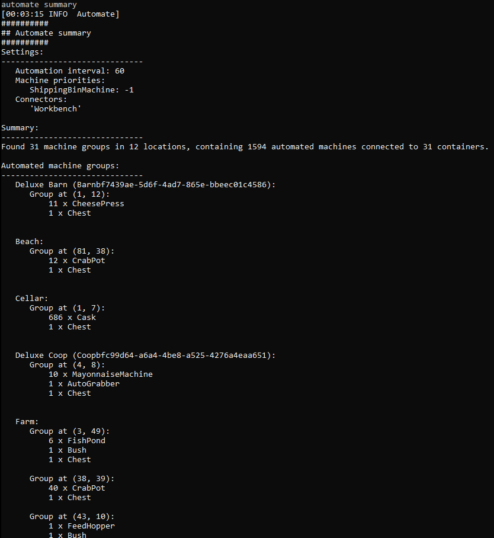

**Automate** is a [Stardew Valley](https://stardewvalley.net/) mod which lets you place a chest
next to machines (like a furnace, cheese press, bee house, etc), and the machines will
automatically pull raw items from the chest and push processed items into it.

## Contents
* [Install](#install)
* [Use](#use)
  * [Basic automation](#basic-automation)
  * [Examples](#examples)
* [Automation techniques](#automation-techniques)
  * [Connectors](#connectors)
  * [Machine pipelines](#machine-pipelines)
  * [Machine priority](#machine-priority)
  * [Junimo chests](#junimo-chests)
* [Configure](#configure)
  * [config.json](#configjson)
  * [In-game settings](#in-game-settings)
  * [Per-machine settings](#per-machine-settings)
* [Compatibility](#compatibility)
* [Troubleshooting](#troubleshooting)
  * [In-game overlay](#in-game-overlay)
  * [Console command](#console-command)
* [FAQs](#faqs)
* [See also](#see-also)

## Install
1. [Install the latest version of SMAPI](https://smapi.io/).
3. Install [this mod from Nexus mods](https://www.nexusmods.com/stardewvalley/mods/1063).
4. Run the game using SMAPI.

## Use
### Basic automation
Place a chest next to a crafting machine (in any direction including diagonal) to connect it.
Machines connected to a chest will push their output into it, and pull ingredients to process out
of it.

This can be used to automate...

* [auto-grabbers](https://stardewvalleywiki.com/Auto-Grabber);
* [bee houses](https://stardewvalleywiki.com/Bee_House);
* [bone mills](https://stardewvalleywiki.com/Bone_Mill);
* bushes (including [blackberry](https://stardewvalleywiki.com/Blackberry), [salmonberry](https://stardewvalleywiki.com/Salmonberry), and [tea](https://stardewvalleywiki.com/Tea_Bush) bushes);
* [casks](https://stardewvalleywiki.com/Cask) (even outside the cellar);
* [charcoal kilns](https://stardewvalleywiki.com/Charcoal_Kiln);
* [cheese presses](https://stardewvalleywiki.com/Cheese_Press);
* [coffee makers](https://stardewvalleywiki.com/Coffee_Maker);
* [crab pots](https://stardewvalleywiki.com/Crab_Pot);
* [crystalariums](https://stardewvalleywiki.com/Crystalarium) (once started with the gem/mineral you want);
* [deconstructors](https://stardewvalleywiki.com/Deconstructor);
* [fish ponds](https://stardewvalleywiki.com/Fish_Pond) (for output only);
* [trees](https://stardewvalleywiki.com/Fruit_Trees);
* [fruit trees](https://stardewvalleywiki.com/Fruit_Trees);
* [furnaces](https://stardewvalleywiki.com/Furnace) (don't forget they also need coal);
* [garbage cans](https://stardewvalleywiki.com/Garbage_Can);
* [geode crushers](https://stardewvalleywiki.com/Geode_Crusher)  (don't forget they also need coal);
* [hay hoppers](https://stardewvalleywiki.com/Hay_Hopper);
* [hoppers](https://stardewvalleywiki.com/Hopper) (these act just like chests, except they're output-only);
* [Junimo huts](https://stardewvalleywiki.com/Junimo_Hut);
* [incubators (for eggs)](https://stardewvalleywiki.com/Incubator);
* [kegs](https://stardewvalleywiki.com/Keg);
* [lightning rods](https://stardewvalleywiki.com/Lightning_Rod);
* [looms](https://stardewvalleywiki.com/Loom);
* [mayonnaise machines](https://stardewvalleywiki.com/Mayonnaise_Machine);
* [mills](https://stardewvalleywiki.com/Mill);
* [mini-shipping bins](https://stardewvalleywiki.com/Mini-Shipping_Bin);
* [mushroom boxes](https://stardewvalleywiki.com/The_Cave#Mushrooms);
* [oil makers](https://stardewvalleywiki.com/Oil_Maker);
* [preserves jars](https://stardewvalleywiki.com/Preserves_Jar);
* [recycling machines](https://stardewvalleywiki.com/Recycling_Machine);
* [seed makers](https://stardewvalleywiki.com/Seed_Maker);
* [shipping bins](https://stardewvalleywiki.com/Shipping) (can be disabled in `config.json`);
* [silos](https://stardewvalleywiki.com/Silo);
* [slime egg-presses](https://stardewvalleywiki.com/Slime_Egg);
* [slime incubators](https://stardewvalleywiki.com/Slime_Incubator);
* [soda machines](https://stardewvalleywiki.com/Soda_Machine);
* [solar panels](https://stardewvalleywiki.com/Solar_Panel);
* [statues of endless fortune](https://stardewvalleywiki.com/Statue_Of_Endless_Fortune);
* [statues of perfection](https://stardewvalleywiki.com/Statue_of_Perfection);
* [statues of true perfection](https://stardewvalleywiki.com/Statue_Of_True_Perfection);
* [tappers](https://stardewvalleywiki.com/Tapper);
* [wood chippers](https://stardewvalleywiki.com/Wood_Chipper);
* and [worm bins](https://stardewvalleywiki.com/Worm_Bin).

Automated machines will give you the same XP, achievements, and items you'd get for using them
directly. If multiple chests are part of a group, they'll all be used in the automation. Input
will be taken from all the chests, and output will be saved to chests in this order:
1. chests marked as output chests (see _[Configure](#configure));
2. chests which already contain an item of the same type;
3. any chest.

You can combine any number of chests and machines by placing them adjacent to each other, and you
can press `U` (configurable) to highlight connected machines.

### Examples
Here are some example machine group setups. You can increase production by just adding more machines.

* **Automatic crab pots**  
  A worm bin produces bait, which is fed into the crab pots, which harvest fish and recycle trash.
  The final products are stored in the chest.
  > 

* **Automatic refined quartz factory**  
  A crystalarium produces quartz, which is smelted into refined quartz, which is stored in the
  chest.
  > 

* **Automatic iridium mead factory**  
  A bee house produces honey, which is turned into mead, which is aged to iridium quality, which is
  stored in the chest.
  > 

* **Automatic iridium bar factory**  
  A statue of perfection produces iridium ore, which is smelted into bars, which are stored in the
  chest.
  > 

* **Semi-automatic iridium cheese factory**  
  Put your milk in the chest and it'll be turned into cheese, then aged to iridium quality, then
  put back in the chest.
  > 

## Automation techniques
### Connectors
You can optionally configure specific furniture/objects/paths as connectors, which link machines
together. For example, here are wooden paths used as connectors:

> 

Workbenches are the only connectors by default. You can edit the `config.json` to add connectors
(see _[configure](#configure)_ below).

### Machine pipelines
A _pipeline_ is the directional flow of items along a set of machines. For example, milk in the
chest gets processed in the cheese presses, then aged in the casks, then shipped:
```
 milk         cheese      aged 
 ----------> ----------> ---------->
┌──────────┐┌──────────┐┌──────────┐┌──────────┐
│  input   ││  cheese  ││   cask   ││ shipping │
│  chest   ││  press   ││          ││   bin    │
└──────────┘└──────────┘└──────────┘└──────────┘
            ┌──────────┐┌──────────┐
            │  cheese  ││   cask   │
            │  press   ││          │
            └──────────┘└──────────┘
                        ┌──────────┐
                        │   cask   │
                        │          │
                        └──────────┘
```

Automate doesn't _directly_ support pipelines: every machine (including the shipping bin) always
has access to every connected chest.

You can still have pipelines using [machine priorities](#machine-priority) though. The shipping bin
has the lowest priority by default, so milk in the chest will go into the cheese press first
automatically. The caveat is that **priority only matters when different machines are ready to take
items**. For example, the shipping bin will happily take any remaining items if your other machines
are all busy. There are two common solutions:

* Add enough machines to handle all your input, so you never have unused items for the shipping bin.
* Leave a space between the shipping bin and other machines, so it's not connected. When you're
  ready to ship all the output, put down a [path connector](#connectors) temporarily so it pulls
  all the available items.

### Machine priority
The default order that machines are processed is unpredictable and subject to change, except that
shipping bins are processed last by default.

For example, let's say you have this machine setup and you place two tomatoes in the chest:
```
┌──────────┐┌──────────┐┌──────────┐┌──────────┐┌──────────┐
│  chest   ││   keg    ││   keg    ││ shipping ││ preserves│
│          ││          ││          ││   bin    ││   jar    │
└──────────┘└──────────┘└──────────┘└──────────┘└──────────┘
```

By default, all of the tomatoes will go into the kegs or preserves jar (since the shipping bin has
a lower priority), but you won't know which ones will get them first. You can [change per-machine
settings](#per-machine-settings) to set the priority for individual machine types and make them
predictable.

Note that if all higher-priority machines are busy, any remaining items may go into lower-priority
machines.

### Junimo chests
Every machine and chest connected to a [Junimo chest](https://stardewvalleywiki.com/Junimo_Chest)
is part of a global machine group. This global group behaves just like a regular machine group
(including for [machine priority](#machine-priority)), even if it's spread across many locations.

For example, you can use this to distribute automation across the world:

1. Junimo huts on your farm collect crops;
2. kegs in a shed turn them into juice/wine;
3. cellar casks age the juice/wine;
4. the shipping bin collects the final output.

Caveats:
* Due to their special behaviour, you can't change input/output options for a Junimo chest. Junimo
  chests are always automated if at least one is connected to a machine.
 
  They have the highest priority for machine input, and the lowest priority for machine output.
  (That is, items are only pushed into a Junimo chest if no other chest is available. Items are
  still available to all machines in the global group either way.)

## Configure
### config.json
The mod creates a `config.json` file in its mod folder the first time you run it. You can open that
file in a text editor to configure the mod.

These are the available settings:

<table>
<tr>
  <th>setting</th>
  <th>what it affects</th>
</tr>
<tr>
<tr>
  <td><code>Controls</code></td>
  <td>

The configured controller, keyboard, and mouse buttons (see [key bindings](https://stardewvalleywiki.com/Modding:Key_bindings)).
The default value is `U` to toggle the automation overlay.

You can separate bindings with commas (like `U, LeftShoulder` for either one), and set multi-key
bindings with plus signs (like `LeftShift + U`).

  </td>
</tr>
<tr>
  <td><code>PullGemstonesFromJunimoHuts</code></td>
  <td>

Whether to pull gemstones out of Junimo huts. If true, you won't be able to change Junimo colors by
placing gemstones in their hut. Default `false`.

  </td>
</tr>
<tr>
  <td><code>AutomationInterval</code></td>
  <td>

The number of update ticks between each automation cycle (one second is ≈60 ticks). Default `60`.

  </td>
</tr>
<tr>
  <td><code>ConnectorNames</code></td>
  <td>

A list of placed item names to treat as [connectors](#connectors) which connect adjacent machines
together. You must specify the exact _English_ names for any in-game items to use. For example:

```js
"ConnectorNames": [
   "Wood Path",
   "Crystal Path"
]
```

Contains `Workbench` by default.

  </td>
</tr>
<tr>
  <td><code>MachineOverrides</code></td>
  <td>

The configuration to override for specific machine IDs. See [_per-machine settings_](#per-machine-settings)
for more info.

  </td>
</tr>
<tr>
  <td><code>ModCompatibility</code></td>
  <td>

Enables compatibility with other mods. All values are enabled by default.

field | result
----- | ------
`AutoGrabberMod` | If [Auto-Grabber Mod](https://www.nexusmods.com/stardewvalley/mods/2783) is installed, auto-grabbers won't output fertilizer and seeds.
`BetterJunimos` | If [Better Junimos](https://www.nexusmods.com/stardewvalley/mods/2221) is installed, Junimo huts won't output fertilizer and seeds.
`WarnForMissingBridgeMod` | Whether to log a warning if you install a custom-machine mod that requires a separate compatibility patch which isn't installed.

  </td>
</tr>
</table>

### In-game settings
Installing [Chests Anywhere](https://www.nexusmods.com/stardewvalley/mods/518) lets you set
per-chest options directly in-game:
> 

This adds two dropdowns for Automate:

* Put items:
  * **Put items in this chest** (default).
  * **Put items in this chest first:** Automate will push machine output into this chest first, and
    only try other chests if it's full.
  * **Never put items in this chest.**
* Take items:
  * **Take items from this chest** (default).
  * **Take items from this chest first:** Automate will take machine input from this chest first,
    and only try other chests if it doesn't have any input for a machine.
  * **Never take items from this chest.**

(To configure chest automation from another mod, see the [technical documentation](technical.md).)

### Per-machine settings
_This is advanced; most players won't need to configure Automate to this extent._

You can set some options for individual machine types by [editing the `config.json`](#configure),
and adding an entry to the `MachineOverrides` field. If a machine isn't listed in that field, it'll
use the default values defined in `assets/data.json`. This works for all automated machines,
including those added by other mods.

Each entry in `MachineOverrides` is identified by the internal machine type ID (_not_ the machine
name you see in-game). You can [run the `automate summary` command](#console-command) to see a list
of machines being automated; the names shown in the list are the machine type IDs.


For example:
```js
"MachineOverrides": {
    "ShippingBin": {
        "Enabled": true,
        "Priority": -1
    },
    "Tapper": {
        "Enabled": true,
        "Priority": 0
    },
}
```

Available options for each machine:

field | purpose
----- | -------
`Enabled` | Whether the machine type should be automated (default `true`).
`Priority` | The order in which this machine should be processed relative to other machines (default `0`). Higher values are processed first for both input and output.

## Compatibility
Automate is compatible with Stardew Valley 1.5+ on Linux/Mac/Windows, both single-player and
multiplayer. In multiplayer mode, only the main player can automate machines; other players can
keep it installed and use the overlay, their mod just won't automate anything.

Automate is compatible with...

* [Auto-Grabber Mod](https://www.nexusmods.com/stardewvalley/mods/2783) (seeds/fertilizer in
  auto-grabbers will be ignored).
* [Better Junimos](https://www.nexusmods.com/stardewvalley/mods/2221) (seeds/fertilizer in Junimo
  huts will be ignored).
* [Custom Farming Redux](https://www.nexusmods.com/stardewvalley/mods/991) (see its optional
  'CFAutomate' download to enable automation).
* [Producer Framework Mod](https://www.nexusmods.com/stardewvalley/mods/4970) (with the
  [PFMAutomate](https://www.nexusmods.com/stardewvalley/mods/5038) addon).

## Troubleshooting
### In-game overlay
Press `U` in-game ([configurable](#configure)) to toggle the automation overlay. This highlights
machines, containers, and connectors which are automated (green) or automateable but not currently
automated (red):

> 

### Console command
Enter `automate summary` directly in the SMAPI console to view a summary of your machine groups:

> 

## FAQs
### How many machines can I automate at once?
There's no strict limit, since Automate optimises machine connections internally. I've officially
tested with up to [630 machines in one group](https://community.playstarbound.com/threads/automate.131913/page-11#post-3238142)
(which didn't cause any issues), and some players have thousands of automated machines.

### Can I prevent a chest from being automated?
Yep; see _[in-game settings](#in-game-settings)_.

### Why did my chests/machines disappear?
Some common reasons:
* NPCs destroy items placed in their path. You can use [Non Destructive NPCs](https://www.nexusmods.com/stardewvalley/mods/5176)
  to prevent that, or use [path connectors](#connectors) to connect machines away from NPC paths.
* Festivals and the Night Market use temporary maps, so items placed there may disappear when the
  map is switched back to normal.

Automate doesn't remove placed objects, so it's never at fault for disappearing chests or machines.

### What's the order for chest/machine handling?
When storing items, Automate prefers chests which either have the "Put items in this chest first" option (see
[_in-game settings_ in the README](README.md#in-game-settings)) or already have an item of the
same type. The order when taking items is a bit more complicated. For more info, see the
[technical documentation](technical.md).

For machines, see [machine priority](#machine-priority).

### Can other mods extend Automate?
Yep. Automate provides APIs that let other mods add custom machines/containers/connectors or make
other changes. For more info, see the [technical documentation](technical.md).

## See also
* [Technical documentation](technical.md)
* [Release notes](release-notes.md)
* [Nexus mod](https://www.nexusmods.com/stardewvalley/mods/1063)
