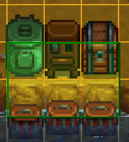
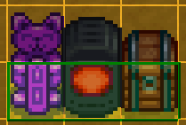
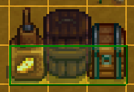
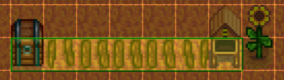
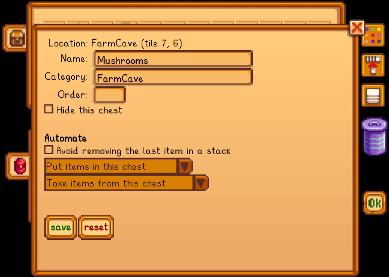
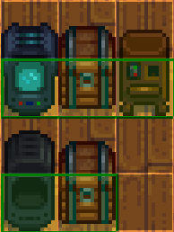

**Automate** is a [Stardew Valley](http://stardewvalley.net/) mod which lets you place a chest
next to machines (like a furnace, cheese press, bee house, etc), and the machines will
automatically pull raw items from the chest and push processed items into it.

## Contents
* [Install](#install)
* [Use](#use)
* [Configure](#configure)
* [Compatibility](#compatibility)
* [FAQs](#faqs)
* [Extensibility for modders](#extensibility-for-modders)
* [See also](#see-also)

## Install
1. [Install the latest version of SMAPI](https://smapi.io/).
3. Install [this mod from Nexus mods](http://www.nexusmods.com/stardewvalley/mods/1063).
4. Run the game using SMAPI.

## Use
### Basic automation
Place a chest next to a crafting machine (in any direction including diagonal) to connect it.
Machines connected to a chest will push their output into it, and pull ingredients to process out
of it. 

This can be used to automate...
* auto-grabbers;
* [bee houses](http://stardewvalleywiki.com/Bee_House);
* [casks](http://stardewvalleywiki.com/Cask) (including outside the cellar);
* [charcoal kilns](http://stardewvalleywiki.com/Charcoal_Kiln);
* [cheese presses](http://stardewvalleywiki.com/Cheese_Press);
* [crab pots](http://stardewvalleywiki.com/Crab_Pot);
* [crystalariums](http://stardewvalleywiki.com/Crystalarium);
* [fruit trees](http://stardewvalleywiki.com/Fruit_Trees);
* [furnaces](http://stardewvalleywiki.com/Furnace);
* [garbage cans](http://stardewvalleywiki.com/Garbage_Can);
* [hay hoppers](http://stardewvalleywiki.com/Hay_Hopper);
* [Junimo huts](http://stardewvalleywiki.com/Junimo_Hut);
* [incubators (for eggs)](https://stardewvalleywiki.com/Incubator);
* [kegs](http://stardewvalleywiki.com/Keg);
* [lightning rods](http://stardewvalleywiki.com/Lightning_Rod);
* [looms](http://stardewvalleywiki.com/Loom);
* [mayonnaise machines](http://stardewvalleywiki.com/Mayonnaise_Machine);
* [mills](http://stardewvalleywiki.com/Mill);
* [mushroom boxes](http://stardewvalleywiki.com/The_Cave#Mushrooms);
* [oil makers](http://stardewvalleywiki.com/Oil_Maker);
* [preserves jars](http://stardewvalleywiki.com/Preserves_Jar);
* [recycling machines](http://stardewvalleywiki.com/Recycling_Machine);
* [seed makers](http://stardewvalleywiki.com/Seed_Maker);
* shipping bins (can be disabled in `config.json`);
* [silos](http://stardewvalleywiki.com/Silo);
* [slime egg-presses](http://stardewvalleywiki.com/Slime_Egg);
* [slime incubators](https://stardewvalleywiki.com/Slime_Incubator);
* [soda machines](https://stardewvalleywiki.com/Soda_Machine);
* [statues of endless fortune](https://stardewvalleywiki.com/Statue_Of_Endless_Fortune);
* [statues of perfection](https://stardewvalleywiki.com/Statue_of_Perfection);
* [tappers](http://stardewvalleywiki.com/Tapper);
* and [worm bins](http://stardewvalleywiki.com/Worm_Bin).

Automated machines will give you the same XP, achievements, and items you'd get for using them
directly. If multiple chests are part of a group, they'll all be used in the automation. Input
will be taken from all the chests, and output will be saved to chests in this order:
1. chests marked as output chests (see _[Configure](#configure));
2. chests which already contain an item of the same type;
3. any chest.

You can combine any number of chests and machines by placing them adjacent to each other, and you
can press `U` (configurable) to highlight connected machines.

### Factories
A 'factory' is just a machine group which produces a certain output. Here are some example factories.
You can increase production by just adding more machines.

* **Automatic crab pots**  
  A worm bin produces bait, which is fed into the crab pots, which harvest fish and recycle trash.
  The final products are stored in the chest.
  > 

* **Automatic refined quartz factory**  
  A crystalarium produces quartz, which is smelted into refined quartz, which is stored in the
  chest.
  > 

* **Automatic iridium mead factory**  
  A bee house produces honey, which is turned into mead, which is aged to iridium quality, which is
  stored in the chest.
  > 

* **Automatic iridium bar factory**  
  A statue of perfection produces iridium ore, which is smelted into bars, which are stored in the
  chest.
  > 

* **Semi-automatic iridium cheese factory**  
  Put your milk in the chest and it'll be turned into cheese, then aged to iridium quality, then
  put back in the chest.
  > 

### Connectors
Connectors are placed objects or flooring which connect adjacent machines together. Automate doesn't
have any connectors by default, but you can edit the `config.json` to specify what should be treated
as connectors (see _[configure](#configure)_ below).

> 

## Configure
### config.json
The mod creates a `config.json` file in its mod folder the first time you run it. You can open that
file in a text editor to configure the mod.

These are the available settings:

<table>
<tr>
  <th>setting</th>
  <th>what it affects</th>
</tr>
<tr>
<tr>
  <td><code>Controls</code></td>
  <td>

The configured controller, keyboard, and mouse buttons (see [key bindings](https://stardewvalleywiki.com/Modding:Key_bindings)).
You can separate multiple buttons with commas. The default value is `U` to toggle the automation
overlay.

  </td>
</tr>
<tr>
  <td><code>AutomateShippingBin</code></td>
  <td>

Default `true`. Whether the shipping bin should automatically pull items out of connected chests.

  </td>
</tr>
<tr>
  <td><code>AutomationInterval</code></td>
  <td>

Default `60`. The number of update ticks between each automation cycle (one second is ≈60 ticks).

  </td>
</tr>
<tr>
  <td><code>Connectors</code></td>
  <td>

Default empty. A list of world object to treat as [connectors](#connectors), which connect adjacent
machines together. Automate has no connectors by default, but you can edit this field to configure
any object, craftable, or floor as a connector. Each one should be specified with a type (one of
`Floor`, `BigCraftable`, or `Object`) and ID.

For example, this adds the Wood and Crystal Paths as connectors:
```js
"Connectors": [
   { "Type": "Floor", "ID": 6 },
   { "Type": "Floor", "ID": 7 }
]
```

Valid IDs:
* [list of object IDs](https://stardewvalleywiki.com/Modding:Object_data#Raw_data);
* [list of craftable IDs](https://stardewvalleywiki.com/Modding:Big_Craftables_data#Raw_data);
* floor IDs: 0 (Wood Floor), 1 (Stone Floor), 2 (Weathered Floor), 3 (Crystal Floor), 4 (Straw
  Floor), 5 (Gravel Path), 6 (Wood Path), 7 (Crystal Path), 8 (Cobblestone Path), and 9 (Stepping
  Stone Path).

  </td>
</tr>
</table>

### In-game settings
Installing [Chests Anywhere](https://www.nexusmods.com/stardewvalley/mods/518) too lets you set
per-chest options directly in-game:
> 

This adds four options for automate:
* **Put items in this chest first:** Automate will only push machine output into this chest (until
  it's full).
* **Don't put items in this chest:** Automate won't push any machine output into this chest.
* **Don't take items from this chest:** Automate won't take machine input from this chest.
* **Don't use this chest for automation:** Automate will completely ignore the chest, so it won't
  be connected to any machines.

If you don't have Chests Anywhere installed, you can edit the chest names a different way and use
these substrings: `|automate:output|` (put items in this chest first) or `|automate:ignore|` (don't
use this chest in automation).

## Compatibility
Automate is compatible with Stardew Valley 1.3+ on Linux/Mac/Windows, both single-player and
multiplayer. In multiplayer mode, only the main player can automate machines; other players can
keep it installed and use the overlay, their mod just won't automate anything.

Automate is compatible with...

* [Auto-Grabber Mod](https://www.nexusmods.com/stardewvalley/mods/2783) (seeds/fertiliser in auto-grabbers will be ignored).
* [Better Junimos](https://www.nexusmods.com/stardewvalley/mods/2221) (seeds/fertiliser in Junimo huts will be ignored).
* [Custom Farming Redux](https://www.nexusmods.com/stardewvalley/mods/991) (see its optional 'CFAutomate' download to enable automation).

## FAQs
### What's the order of processed machines?
The order that machines are processed is essentially unpredictable for players. It depends on the
internal algorithm for finding machines, which is subject to change.

### What's the order of items taken from chests?
For each machine, the available chests are combined into one inventory (so items may be taken from
multiple chests simultaneously) and then scanned until Automate finds enough items to fill a recipe
for that machine. The order is difficult to predict with multiple chests, but fairly easy if there's
only one connected chest.

For example, let's say you have one chest containing these item stacks:  
`coal`  
`3× copper ore`  
`3× iron ore`  
`2× copper ore`  
`2× iron ore`

A furnace has two recipes with those ingredients: `coal` + `5× copper ore` = `copper bar`, and
`coal` + `5× iron ore` = `iron bar`. Automate will scan the items from left to right and top to bottom,
and collect items until it has a complete recipe. In this case, the furnace will start producing a
copper bar:

1. Add `coal` from first stack (two unfinished recipes):  
   ❑ `coal` + `0 of 5× copper ore` = `copper bar`  
   ❑ `coal` + `0 of 5× iron ore` = `iron bar`
2. Add `3× copper ore` from second stack (two unfinished recipes):  
   ❑ `coal` + `3 of 5× copper ore` = `copper bar`  
   ❑ `coal` + `0 of 5× iron ore` = `iron bar`
3. Add `3× iron ore` from third stack (two unfinished recipes):  
   ❑ `coal` + `3 of 5× copper ore` = `copper bar`  
   ❑ `coal` + `3 of 5× iron ore` = `iron bar`
4. Add `2× copper ore` from fourth stack (one recipe filled):  
   ✓ `coal` + `5× copper ore` = `copper bar`  
   ❑ ~~`coal` + `3 of 5× iron ore` = `iron bar`~~

### Which chest will machine output go into?
The available chests are sorted by discovery order (which isn't predictable), then prioritised in
this order:

1. chests with the "Put items in this chest first" option (see _[In-game settings](#in-game-settings)_);
2. chests which already contain an item of the same type;
3. any chest.

### Is there a limit to how many machines can be connected?
Automate optimises machine connections internally, so there's no upper limit. The most I've tried is
[630 machines in one group](https://community.playstarbound.com/threads/automate.131913/page-11#post-3238142);
that didn't cause any issues, so you can just keep adding more if you want.

### What if I don't want a specific chest to be connected?
See _[In-game settings](#in-game-settings)_.

## Extensibility for modders
Automate has a [mod-provided API](https://stardewvalleywiki.com/Modding:Modder_Guide/APIs/Integrations#Mod-provided_APIs)
you can use to add custom machines, containers, and connectors.

### Basic concepts
These basic concepts are core to the Automate API:

<dl>
<dt>Entity</dt>
<dd>A placed item, terrain feature, building, or other in-game thing.</dd>

<dt>Connector</dt>
<dd>Something which can be added to a machine group (thus extending its range), but otherwise has
no logic of its own. It has no state, input, or output.</dd>

<dt>Container</dt>
<dd>Something which stores and retrieves items (usually a chest).</dd>

<dt>Machine</dt>
<dd>Something which has a state (e.g. empty or processing) and accepts input, provides output, or
both. This doesn't need to be a 'machine' in the gameplay sense; Automate provides default machines
for shipping bins and fruit trees, for example.</dd>

<dt>Machine group</dt>
<dd>

A set of machines, containers, and connectors which are chained together. You can press `U` in-game
(configurable) to see machine groups highlighted in green. For example, these are two machine groups:  


</dd>
</dl>

### Access the API
To access the API:

1. Add a reference to the `Automate.dll` file. Make sure it's [_not_ copied to your build output](https://github.com/Pathoschild/SMAPI/blob/develop/docs/mod-build-config.md#ignore-files).
2. Hook into [SMAPI's `GameLoop.GameLaunched` event](https://stardewvalleywiki.com/Modding:Modder_Guide/APIs/Events#GameLoop.GameLaunched)
   and get a copy of the API:
   ```c#
   IAutomateAPI automate = this.Helper.Registry.GetApi<IAutomateAPI>("Pathoschild.Automate");
   ```
3. Use the API to extend Automate (see below).

### Add connectors, containers, and machines
You can add automatables by implementing an `IAutomationFactory`. Automate will handle the core
logic (like finding entities, linking automatables into groups, etc); you just need to return the
automatable for a given entity. You can't change the automation for an existing automatable though;
if Automate already has an automatable for an entity, it won't call your factory.

First, let's create a basic machine that transmutes an iron bar into gold in two hours:

```c#
using Microsoft.Xna.Framework;
using Pathoschild.Stardew.Automate.Framework;
using StardewValley;
using SObject = StardewValley.Object;

namespace YourModName
{
    /// <summary>A machine that turns iron bars into gold bars.</summary>
    public class TransmuterMachine : IMachine
    {
        /*********
        ** Fields
        *********/
        /// <summary>The underlying entity.</summary>
        private readonly SObject Entity;


        /*********
        ** Accessors
        *********/
        /// <summary>The location which contains the machine.</summary>
        public GameLocation Location { get; }

        /// <summary>The tile area covered by the machine.</summary>
        public Rectangle TileArea { get; }


        /*********
        ** Public methods
        *********/
        /// <summary>Construct an instance.</summary>
        /// <param name="entity">The underlying entity.</param>
        /// <param name="location">The location which contains the machine.</param>
        /// <param name="tile">The tile covered by the machine.</param>
        public TransmuterMachine(SObject entity, GameLocation location, in Vector2 tile)
        {
            this.Entity = entity;
            this.Location = location;
            this.TileArea = new Rectangle((int)tile.X, (int)tile.Y, 1, 1);
        }

        /// <summary>Get the machine's processing state.</summary>
        public MachineState GetState()
        {
            if (this.Entity.heldObject.Value == null)
                return MachineState.Empty;

            return this.Entity.readyForHarvest.Value
                ? MachineState.Done
                : MachineState.Processing;
        }

        /// <summary>Get the output item.</summary>
        public ITrackedStack GetOutput()
        {
            return new TrackedItem(this.Entity.heldObject.Value, onEmpty: item =>
            {
                this.Entity.heldObject.Value = null;
                this.Entity.readyForHarvest.Value = false;
            });
        }

        /// <summary>Provide input to the machine.</summary>
        /// <param name="input">The available items.</param>
        /// <returns>Returns whether the machine started processing an item.</returns>
        public bool SetInput(IStorage input)
        {
            if (input.TryGetIngredient(SObject.ironBar, 1, out IConsumable ingredient))
            {
                ingredient.Take();
                this.Entity.heldObject.Value = new SObject(SObject.goldBar, 1);
                this.Entity.MinutesUntilReady = 120;
                return true;
            }

            return false;
        }
    }
}
```

Next, let's create a factory which returns the new machine. This example assumes you've added an
in-game object with ID 2000 that you want to automate.

```c#
using Microsoft.Xna.Framework;
using StardewValley;
using StardewValley.Buildings;
using StardewValley.Locations;
using StardewValley.TerrainFeatures;
using SObject = StardewValley.Object;

namespace YourModName
{
    public class MyAutomationFactory : IAutomationFactory
    {
        /// <summary>Get a machine, container, or connector instance for a given object.</summary>
        /// <param name="obj">The in-game object.</param>
        /// <param name="location">The location to check.</param>
        /// <param name="tile">The tile position to check.</param>
        /// <returns>Returns an instance or <c>null</c>.</returns>
        public IAutomatable GetFor(SObject obj, GameLocation location, in Vector2 tile)
        {
            if (obj.ParentSheetIndex == 2000)
                return new TransmuterMachine(obj, location, tile);

            return null;
        }

        /// <summary>Get a machine, container, or connector instance for a given terrain feature.</summary>
        /// <param name="feature">The terrain feature.</param>
        /// <param name="location">The location to check.</param>
        /// <param name="tile">The tile position to check.</param>
        /// <returns>Returns an instance or <c>null</c>.</returns>
        public IAutomatable GetFor(TerrainFeature feature, GameLocation location, in Vector2 tile)
        {
            return null;
        }

        /// <summary>Get a machine, container, or connector instance for a given building.</summary>
        /// <param name="building">The building.</param>
        /// <param name="location">The location to check.</param>
        /// <param name="tile">The tile position to check.</param>
        /// <returns>Returns an instance or <c>null</c>.</returns>
        public IAutomatable GetFor(Building building, BuildableGameLocation location, in Vector2 tile)
        {
            return null;
        }

        /// <summary>Get a machine, container, or connector instance for a given tile position.</summary>
        /// <param name="location">The location to check.</param>
        /// <param name="tile">The tile position to check.</param>
        /// <returns>Returns an instance or <c>null</c>.</returns>
        /// <remarks>Shipping bin logic from <see cref="Farm.leftClick"/>, garbage can logic from <see cref="Town.checkAction"/>.</remarks>
        public IAutomatable GetForTile(GameLocation location, in Vector2 tile)
        {
            return null;
        }
    }
}
```

And finally, add your factory to the automate API (see [_access the API_](#access-the-api) above):

```c#
IAutomateAPI automate = ...;
automate.AddFactory(new MyAutomationFactory());
```

That's it! When Automate scans a location for automatables, it'll call your `GetFor` method and add
your custom machine to its normal automation.

## See also
* [Release notes](release-notes.md)
* [Nexus mod](http://www.nexusmods.com/stardewvalley/mods/1063)
* [Discussion thread](http://community.playstarbound.com/threads/automate.131913)
