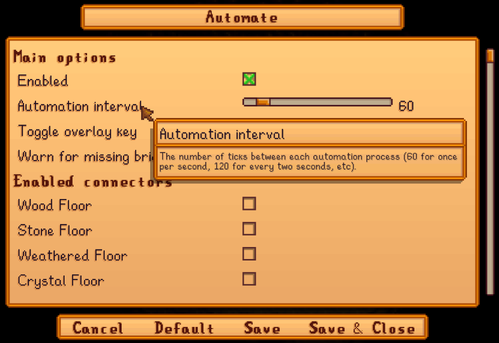

**Automate** is a [Stardew Valley](https://stardewvalley.net/) mod which lets you place a chest
next to machines (like a furnace, cheese press, bee house, etc), and the machines will
automatically pull raw items from the chest and push processed items into it.

## Contents
* [Install](#install)
* [Use](#use)
  * [Basic automation](#basic-automation)
  * [Examples](#examples)
* [Automation techniques](#automation-techniques)
  * [Connectors](#connectors)
  * [Junimo chests](#junimo-chests)
  * [Machine priority](#machine-priority)
  * [Machine pipelines](#machine-pipelines)
* [Configure](#configure)
  * [config.json](#configjson)
  * [In-game settings](#in-game-settings)
  * [Per-machine settings](#per-machine-settings)
* [Compatibility](#compatibility)
* [Troubleshooting](#troubleshooting)
  * [In-game overlay](#in-game-overlay)
  * [Console commands](#console-commands)
* [FAQs](#faqs)
* [See also](#see-also)

## Install
1. [Install the latest version of SMAPI](https://smapi.io/).
3. Install [this mod from Nexus mods](https://www.nexusmods.com/stardewvalley/mods/1063).
4. Run the game using SMAPI.

## Use
### Basic automation
Place a chest next to a crafting machine (in any direction including diagonal) to connect it.
Machines connected to a chest will push their output into it, and pull ingredients to process out
of it.

By default, Automate supports these machines:

* [auto-grabbers](https://stardewvalleywiki.com/Auto-Grabber);
* [bee houses](https://stardewvalleywiki.com/Bee_House);
* [bone mills](https://stardewvalleywiki.com/Bone_Mill);
* bushes (including [blackberry](https://stardewvalleywiki.com/Blackberry), [salmonberry](https://stardewvalleywiki.com/Salmonberry), and [tea](https://stardewvalleywiki.com/Tea_Bush) bushes);
* [casks](https://stardewvalleywiki.com/Cask) (even outside the cellar);
* [charcoal kilns](https://stardewvalleywiki.com/Charcoal_Kiln);
* [cheese presses](https://stardewvalleywiki.com/Cheese_Press);
* [coffee makers](https://stardewvalleywiki.com/Coffee_Maker);
* [crab pots](https://stardewvalleywiki.com/Crab_Pot);
* [crystalariums](https://stardewvalleywiki.com/Crystalarium) (once started with the gem/mineral you want);
* [deconstructors](https://stardewvalleywiki.com/Deconstructor);
* [fish ponds](https://stardewvalleywiki.com/Fish_Pond) (for output only);
* [fruit trees](https://stardewvalleywiki.com/Fruit_Trees);
* [furnaces](https://stardewvalleywiki.com/Furnace) (don't forget they also need coal);
* [garbage cans](https://stardewvalleywiki.com/Garbage_Can);
* [geode crushers](https://stardewvalleywiki.com/Geode_Crusher)  (don't forget they also need coal);
* [hay hoppers](https://stardewvalleywiki.com/Hay_Hopper);
* [incubators (for eggs)](https://stardewvalleywiki.com/Incubator);
* [Junimo huts](https://stardewvalleywiki.com/Junimo_Hut);
* [kegs](https://stardewvalleywiki.com/Keg);
* [lightning rods](https://stardewvalleywiki.com/Lightning_Rod);
* [looms](https://stardewvalleywiki.com/Loom);
* [mayonnaise machines](https://stardewvalleywiki.com/Mayonnaise_Machine);
* [mills](https://stardewvalleywiki.com/Mill);
* [mini-shipping bins](https://stardewvalleywiki.com/Mini-Shipping_Bin);
* [mushroom boxes](https://stardewvalleywiki.com/The_Cave#Mushrooms);
* [oil makers](https://stardewvalleywiki.com/Oil_Maker);
* [preserves jars](https://stardewvalleywiki.com/Preserves_Jar);
* [recycling machines](https://stardewvalleywiki.com/Recycling_Machine);
* [seed makers](https://stardewvalleywiki.com/Seed_Maker);
* [shipping bins](https://stardewvalleywiki.com/Shipping) (can be disabled in `config.json`);
* [silos](https://stardewvalleywiki.com/Silo);
* [slime egg-presses](https://stardewvalleywiki.com/Slime_Egg);
* [slime incubators](https://stardewvalleywiki.com/Slime_Incubator);
* [soda machines](https://stardewvalleywiki.com/Soda_Machine);
* [solar panels](https://stardewvalleywiki.com/Solar_Panel);
* [statues of endless fortune](https://stardewvalleywiki.com/Statue_Of_Endless_Fortune);
* [statues of perfection](https://stardewvalleywiki.com/Statue_of_Perfection);
* [statues of true perfection](https://stardewvalleywiki.com/Statue_Of_True_Perfection);
* [tappers](https://stardewvalleywiki.com/Tapper);
* [trees](https://stardewvalleywiki.com/Trees);
* [wood chippers](https://stardewvalleywiki.com/Wood_Chipper);
* and [worm bins](https://stardewvalleywiki.com/Worm_Bin).

And these containers:

* [chests](https://stardewvalleywiki.com/Chest) and [stone chests](https://stardewvalleywiki.com/Stone_Chest);
* farmhouse/cabin fridges;
* [hoppers](https://stardewvalleywiki.com/Hopper) (these act just like chests, except they're output-only);
* [Junimo chests](https://stardewvalleywiki.com/Junimo_Chest);
* [mini-fridges](https://stardewvalleywiki.com/Mini-Fridge);
* and [mini-shipping bins](https://stardewvalleywiki.com/Mini-Shipping_Bin).

Automated machines will give you the same XP, achievements, and items you'd get for using them
directly. If multiple chests are part of a group, they'll all be used in the automation. Input
will be taken from all the chests, and output will be saved to chests in this order:
1. chests marked as output chests (see _[Configure](#configure));
2. chests which already contain an item of the same type;
3. any chest.

You can combine any number of chests and machines by placing them adjacent to each other, and you
can press `U` (configurable) to highlight connected machines.

### Examples
Here are some example machine group setups. You can increase production by just adding more machines.

* **Automatic crab pots**  
  A worm bin produces bait, which is fed into the crab pots, which harvest fish and recycle trash.
  The final products are stored in the chest.
  > 

* **Automatic refined quartz factory**  
  A crystalarium produces quartz, which is smelted into refined quartz, which is stored in the
  chest.
  > 

* **Automatic iridium mead factory**  
  A bee house produces honey, which is turned into mead, which is aged to iridium quality, which is
  stored in the chest.
  > 

* **Automatic iridium bar factory**  
  A statue of perfection produces iridium ore, which is smelted into bars, which are stored in the
  chest.
  > 

* **Semi-automatic iridium cheese factory**  
  Put your milk in the chest and it'll be turned into cheese, then aged to iridium quality, then
  put back in the chest.
  > 

## Automation techniques
### Connectors
You can optionally configure specific furniture/objects/paths as connectors, which link machines
together. For example, here are wooden paths used as connectors:

> 

Workbenches are the only connectors by default. You can edit the `config.json` to add connectors
(see _[configure](#configure)_ below).

### Junimo chests
Every machine and chest connected to a [Junimo chest](https://stardewvalleywiki.com/Junimo_Chest)
is part of a global machine group. This global group behaves just like a regular machine group
(including for [machine priority](#machine-priority)), even if it's spread across many locations.

Due to their special behaviour:
* You can't change input/output options for a Junimo chest. Junimo chests are always automated if
  at least one is connected to a machine.
* Machines always take items out of a Junimo chest first, and only push items into one if no other
  chest is available. Items are still available to all machines in the global group either way.

### Machine priority
The default order that machines are processed is unpredictable and subject to change, except that
shipping bins are processed last by default.

For example, let's say you have this machine setup and you place two tomatoes in the chest:
```
┌──────────┐┌──────────┐┌──────────┐┌──────────┐┌──────────┐
│  chest   ││   keg    ││   keg    ││ shipping ││ preserves│
│          ││          ││          ││   bin    ││   jar    │
└──────────┘└──────────┘└──────────┘└──────────┘└──────────┘
```

By default, all of the tomatoes will go into the kegs or preserves jar (since the shipping bin has
a lower priority), but you won't know which ones will get them first. You can [change per-machine
settings](#per-machine-settings) to set the priority for individual machine types and make them
predictable.

Note that if all higher-priority machines are busy, any remaining items may go into lower-priority
machines.

### Machine pipelines
A _pipeline_ pushes an item through a multi-step process. For example, milk in the chest gets
processed in the cheese presses, then aged in the casks, then shipped:
```
 milk         cheese      aged
 ──────────> ──────────> ──────────> shipped
┌──────────┐┌──────────┐┌──────────┐┌──────────┐
│  chest   ││  cheese  ││   cask   ││ shipping │
│          ││  press   ││          ││   bin    │
└──────────┘├──────────┤├──────────┤└──────────┘
            │  cheese  ││   cask   │
            │  press   ││          │
            └──────────┘└──────────┘
```

There's two caveats though:

1. The machine positions don't decide which will process an item. Every connected machine has
   direct access to all of the connected chests, the items don't 'flow' across game tiles.
2. The shipping bin is lower-priority, but it'll still empty the connected chest if all the other
   machines are busy.

So there are three common ways to implement a pipeline:

<dl>
<dt>Simple pipeline with machine priorities</dt>
<dd>

If you have enough machines to process every input item, that pipeline will work fine even if
there's a shipping bin. The shipping bin will only take items from the chest if every other machine
is full. If needed, you can set [custom machine priorities](#machine-priorities) to do the same
with other machine types.

</dd>

<dt>Simple pipeline with air gap</dt>
<dd>

Another approach is to keep the shipping bin separate from the rest of the machines:

```
                 back to chest <───┐
                                   │
 milk         cheese      aged     │
 ──────────> ──────────> ──────────┘
┌──────────┐┌──────────┐┌──────────┐            ┌──────────┐
│  chest   ││  cheese  ││   cask   │            │ shipping │
│          ││  press   ││          │            │   bin    │
└──────────┘├──────────┤├──────────┤            └──────────┘
            │  cheese  ││   cask   │
            │  press   ││          │
            └──────────┘└──────────┘
```

All the processed items will be put back into the chest when they're done. Occasionally you can
manually connect the shipping bin (e.g. using a [path connector](#connectors)) to empty out all the
processed items.

</dd>

<dt>Advanced pipeline with Super Hopper</dt>
<dd>

[Super Hopper](https://www.nexusmods.com/stardewvalley/mods/9418) is a mod which lets hoppers
transfer items from the chest above them to the one below. These are ignored by Automate, so you
can use them to create a chain of machine groups. That lets you support any number of input items
without sending unprocessed items to the shipping bin or wrong machine.

The trick is:

1. Put each machine type is in its own group, not connected to the other machine types.
2. Give each group an 'input chest' (which receives items to process) and 'output chest' (which
   receives items processed by the connected machines). [Use Chests Anywhere to set the chests'
   automation options](#Configure) to "_never put items in this chest_" and "_never take items from
   this chest_" respectively.
3. Add a super hopper below the 'output chest' of one group, and the 'input chest' of the next.

Here's the same example using super hoppers:
```
                   1. milk turned into cheese
                   ────────────────────────────────────────────────────>
                 ┌──────────┐┌──────────┐┌──────────┐┌──────────┐┌──────────┐
                 │  input   ││  cheese  ││  cheese  ││  cheese  ││  output  │  │
                 │  chest   ││  press   ││  press   ││  press   ││  chest   │  │
                 └──────────┘└──────────┘└──────────┘└──────────┘└──────────┘  │
                                                                 ┌──────────┐  │ 2.
                                                                 │  super   │  │ Super Hopper
                                                                 │  hopper  │  │ transfers item
                                                                 └──────────┘  │ to next group
                 ┌──────────┐┌──────────┐┌──────────┐┌──────────┐┌──────────┐  │
               │ │  output  ││   cask   ││   cask   ││   cask   ││  input   │  v
               │ │  chest   ││          ││          ││          ││  chest   │
4.             │ └──────────┘└──────────┘└──────────┘└──────────┘└──────────┘
Super Hopper   │ ┌──────────┐  <────────────────────────────────────────────
transfers item │ │  super   │               3. cheese aged to iridum quality
to next group  │ │  hopper  │
               │ └──────────┘
               │ ┌──────────┐┌──────────┐┌──────────┐┌──────────┐┌──────────┐
               v │  input   ││ mini     ││ mini     ││ mini     ││ mini     │
                 │  chest   ││ ship bin ││ ship bin ││ ship bin ││ ship bin │
                 └──────────┘└──────────┘└──────────┘└──────────┘└──────────┘
                   ────────────────────────────────────────────────────>
                   5. item shipped
```

</dd>
</dl>

## Configure
### In-game settings
If you have [Generic Mod Config Menu](https://www.nexusmods.com/stardewvalley/mods/5098) installed,
you can click the cog button (⚙) on the title screen or the "mod options" button at the bottom of
the in-game menu to configure the mod. Hover the cursor over a field for details, or see the next
section.



Installing [Chests Anywhere](https://www.nexusmods.com/stardewvalley/mods/518) also lets you set
per-chest options directly in-game:
> 

This adds three options for Automate:

* Avoid removing the last item in a stack.
* Whether to put items in this chest. Possible values:
  * _Put items in this chest_ (default).
  * _Put items in this chest first_: Automate will push machine output into this chest first, and
    only try other chests if it's full.
  * _Never put items in this chest._
* Whether to take items out of this chest. Possible values:
  * _Take items from this chest_ (default).
  * _Take items from this chest first_: Automate will take machine input from this chest first,
    and only try other chests if it doesn't have any input for a machine.
  * _Never take items from this chest._

(To configure chest automation from another mod, see the [technical documentation](technical.md#can-i-change-in-game-settings-without-chests-anywhere).)

### config.json
The mod creates a `config.json` file in its mod folder the first time you run it. You can open that
file in a text editor to configure the mod.

These are the available settings:

<table>
<tr>
  <th>setting</th>
  <th>what it affects</th>
</tr>
<tr>
<tr>
  <td><code>Enabled</code></td>
  <td>

Whether Automate features are enabled. If this is `false`, no machines will be automated and the overlay won't appear.

  </td>
</tr>
<tr>
  <td><code>Controls</code></td>
  <td>

The configured controller, keyboard, and mouse buttons (see [key bindings](https://stardewvalleywiki.com/Modding:Key_bindings)).
The default value is `U` to toggle the automation overlay.

You can separate bindings with commas (like `U, LeftShoulder` for either one), and set multi-key
bindings with plus signs (like `LeftShift + U`).

  </td>
</tr>
<tr>
  <td><code>PullGemstonesFromJunimoHuts</code></td>
  <td>

Whether to pull gemstones out of Junimo huts. If true, you won't be able to change Junimo colors by
placing gemstones in their hut. Default `false`.

  </td>
</tr>
<tr>
  <td><code>AutomationInterval</code></td>
  <td>

The number of update ticks between each automation cycle (one second is ≈60 ticks). Default `60`.

  </td>
</tr>
<tr>
  <td><code>ConnectorNames</code></td>
  <td>

A list of placed item names to treat as [connectors](#connectors) which connect adjacent machines
together. You must specify the exact _English_ names for any in-game items to use. For example:

```js
"ConnectorNames": [
   "Wood Path",
   "Crystal Path"
]
```

Contains `Workbench` by default.

  </td>
</tr>
<tr>
  <td><code>MachineOverrides</code></td>
  <td>

The configuration to override for specific machine IDs. See [_per-machine settings_](#per-machine-settings)
for more info.

  </td>
</tr>
<tr>
  <td><code>ModCompatibility</code></td>
  <td>

Enables compatibility with other mods. All values are enabled by default.

field | result
----- | ------
`AutoGrabberMod` | If [Auto-Grabber Mod](https://www.nexusmods.com/stardewvalley/mods/2783) is installed, auto-grabbers won't output fertilizer and seeds.
`BetterJunimos` | If [Better Junimos](https://www.nexusmods.com/stardewvalley/mods/2221) is installed, Junimo huts won't output fertilizer and seeds.
`WarnForMissingBridgeMod` | Whether to log a warning if you install a custom-machine mod that requires a separate compatibility patch which isn't installed.

  </td>
</tr>
</table>

### Per-machine settings
_This is advanced; most players won't need to configure Automate to this extent._

You can set some options for individual machine types by [editing the `config.json`](#configure),
and adding an entry to the `MachineOverrides` field. If a machine isn't listed in that field, it'll
use the default values defined in `assets/data.json`. This works for all automated machines,
including those added by other mods.

Each entry in `MachineOverrides` is identified by the internal machine type ID (_not_ the machine
name you see in-game). You can [run the `automate summary` command](#console-commands) to see a list
of machines being automated; the names shown in the list are the machine type IDs.


For example:
```js
"MachineOverrides": {
    "ShippingBin": {
        "Enabled": true,
        "Priority": -1
    },
    "Tapper": {
        "Enabled": true,
        "Priority": 0
    },
}
```

Available options for each machine:

field | purpose
----- | -------
`Enabled` | Whether the machine type should be automated (default `true`).
`Priority` | The order in which this machine should be processed relative to other machines (default `0`). Higher values are processed first for both input and output.

## Compatibility
Automate is compatible with Stardew Valley 1.5+ on Linux/Mac/Windows, both single-player and
multiplayer. In multiplayer mode, only the main player can automate machines; other players can
keep it installed and use the overlay, their mod just won't automate anything.

Pairs well with...

* [Better Junimos](https://www.nexusmods.com/stardewvalley/mods/2221) adds more crop automation
  (like replanting) and other improvements. Automate will automaticall ignore seeds/fertilizer in
  Junimo huts if it's installed.
* [Deluxe Grabber Redux](https://www.nexusmods.com/stardewvalley/mods/7920) makes auto-grabbers
  collect nearby animal products, forage, crops, and indoor pot crops too.
* [Non-Destructive NPCs](https://www.nexusmods.com/stardewvalley/mods/5176) prevents NPCs from
  destroying chests and machines.

## Troubleshooting
### In-game overlay
Press `U` in-game ([configurable](#configure)) to toggle the automation overlay. This highlights
machines, containers, and connectors which are automated (green) or automateable but not currently
automated (red):

> 

### Console commands
#### `automate summary`
Enter `automate summary` directly in the SMAPI console to view a summary of your machine groups:

> 

#### `automate reset`
Enter `automate summary` directly in the SMAPI console to reset all cached data and rescan the
world for machines. Automate normally detects changes automatically, so this isn't usually needed.

## FAQs
### How many machines can I automate at once?
There's no strict limit, since Automate optimises machine connections internally. I've officially
tested with up to [630 machines in one group](https://community.playstarbound.com/threads/automate.131913/page-11#post-3238142)
(which worked fine). The most I've seen is [21,134 automated machines in one save](https://smapi.io/log/24Q970ju).

### Does Automate support custom machines?
Yes, but some custom machines need a separate mod which tells Automate how they work:

* For Custom Farming Redux machines, install [CFAutomate](https://www.nexusmods.com/stardewvalley/mods/991?tab=files) 
  from its optional downloads.
* For Producer Framework Mod machines (including PPJA Artisan Valley), install [PFMAutomate](https://www.nexusmods.com/stardewvalley/mods/5038).

(For mod authors: you can [use the Automate API](https://github.com/Pathoschild/StardewMods/blob/develop/Automate/technical.md#extensibility-for-modders)
to add custom machines to Automate.)

### How do I use path connectors?
Path connectors aren't enabled by default. See the "Enable path connectors (config.json)" download
on [the mod page's Files tab](https://www.nexusmods.com/stardewvalley/mods/1063/?tab=files) which
enables some for you, or see [_connectors_ above](#connectors) for more info.

### Why aren't my crystalariums starting automatically?
Once a crystalarium is started, it continues producing the initial gem forever. So you need to
start them with the gem you want manually, then Automate will collect their output automatically.
(You can check the machine list in the mod description, it has notes about how some machines work.)

### In multiplayer, who gets XP and whose professions apply?
A few machines give XP, update player stats, or check player skills based on the player who uses
them. Since there's no player when they're automated, Automate uses the machine owner (i.e. who
placed or built the machine) if possible, and defaults to the main player if not.<sup>1</sup>

More specifically:

machine        | player effects
:------------- | :-------------
bushes         | The main player's foraging level and [botanist](https://stardewvalleywiki.com/Skills#Foraging) profession applies.
crab pots      | The machine owner's [luremaster](https://stardewvalleywiki.com/Skills#Fishing) profession applies, and their `caughtFish` stat is updated.
fish ponds     | The machine owner gets XP for collected items.
egg incubators,<br />slime incubators | The main player's [coopmaster](https://stardewvalleywiki.com/Skills#Farming) profession applies.
shipping bin   | Prices are set by the _online_ player whose professions would most increase it (see [multiplayer](https://stardewvalleywiki.com/Multiplayer#Money) on the wiki).
trees          | The main player's foraging level applies.
custom machines | The logic for machines added by other mods is decided by those mods, not Automate.

<small><sup>1</sup> Due to a bug in the game code, the owner is only tracked correctly for crab pots
and fish ponds.</small>

### Can I prevent a chest from being automated?
Yep; see _[in-game settings](#in-game-settings)_.

### Can I disable the shipping bin automation?
Yep, you can disable it using [per-machine settings](#per-machine-settings). More specifically,
replace the `"MachineOverrides": {}` line in to your `config.json` file with this:
```js
"MachineOverrides": {
    "ShippingBin": {
        "Enabled": false
    }
}
```

### Why did my chests/machines disappear?
Some common reasons:
* NPCs destroy items placed in their path. You can use [Non Destructive NPCs](https://www.nexusmods.com/stardewvalley/mods/5176)
  to prevent that, or use [path connectors](#connectors) to connect machines away from NPC paths.
* Festivals and the Night Market use temporary maps, so items placed there may disappear when the
  map is switched back to normal.

Automate doesn't remove placed objects, so it's never at fault for disappearing chests or machines.

### What's the order for chest/machine handling?
When storing items, Automate prefers chests which either have the "Put items in this chest first" option (see
[_in-game settings_ in the README](README.md#in-game-settings)) or already have an item of the
same type. The order when taking items is a bit more complicated. For more info, see the
[technical documentation](technical.md).

For machines, see [machine priority](#machine-priority).

### Can other mods extend Automate?
Yep. Automate provides APIs that let other mods add custom machines/containers/connectors or make
other changes. For more info, see the [technical documentation](technical.md).

## See also
* [Technical documentation](technical.md)
* [Release notes](release-notes.md)
* [Nexus mod](https://www.nexusmods.com/stardewvalley/mods/1063)
