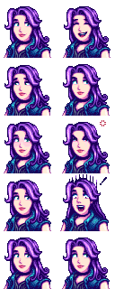

← [README](README.md)

This document helps mod authors create a content pack for Content Patcher.

**See the [main README](README.md) for other info**.

## Contents
* [Introduction](#introduction)
  * [What is Content Patcher?](#what-is-content-patcher)
  * [What does a content pack look like?](#what-does-a-content-pack-look-like)
  * [What is an asset?](#what-is-an-asset)
* [Get started](#get-started)
  * [Create the content pack](#create-the-content-pack)
  * [Format version](#format-version)
  * [Changes](#changes)
* [Features](#features)
  * [Actions](#actions)
  * [Custom locations](#custom-locations)
  * [Tokens & conditions](#tokens)
  * [Player config](#player-config)
  * [Translations](#translations)
  * [Text operations](#text-operations)
  * [Trigger actions](#trigger-actions)
* [Troubleshoot](#troubleshoot)
* [FAQs](#faqs)
  * [How often are patch changes applied?](#update-rate)
  * [Are Content Patcher updates backwards-compatible?](#are-content-patcher-updates-backwards-compatible)
  * [How do I change assets in another language?](#how-do-i-change-assets-in-another-language)
  * [How do multiple patches interact?](#how-do-multiple-patches-interact)
  * [Known limitations](#known-limitations)
* [See also](#see-also)

## Introduction
### What is Content Patcher?
Content Patcher lets you change the game content using only JSON files. JSON is just a text format,
so no programming experience is needed.

You can make a wide range of changes to the game:

* change images, dialogue, maps, etc;
* add custom items, fruit trees, locations, etc;
* change shop inventory;
* and much more.

You can also make very dynamic changes to the game. For example, raise the price of coffee on
winter weekend evenings when it's snowing unless the player married Abigail.

The [modding documentation on the wiki](https://stardewvalleywiki.com/Modding:Index#Advanced_topics)
is often written for Content Patcher pack authors, so you can find many specific examples there.

### What does a content pack look like?
A content pack is just a folder with two text files in it: `manifest.json` (which has info like
your mod name) and `content.json` (which tells Content Patcher what you want to change). Your
folder might also have images or other files, which are usually in an `assets` subfolder by
convention:
```
📁 Mods/
   📁 [CP] YourModName/
      🗎 content.json
      🗎 manifest.json
      📁 assets/
         🗎 example.png
```

For example, here's a `content.json` which replaces Abigail's portraits with your own image:

```js
{
    "Format": "1.29.0",
    "Changes": [
        {
            "Action": "Load",
            "Target": "Portraits/Abigail",
            "FromFile": "assets/abigail.png"
        }
    ]
}
```

You can do _much_ more with Content Patcher using features like actions, tokens, conditions, and
more. This guide goes into more detail below.

### What is an asset?
An _asset_ is an image, data model, or map which the game loads from its `Content` folder (or from
mods). These are what Content Patcher lets you change.

The asset name never includes "Content", the [language code](#how-do-i-change-assets-in-another-language),
or the file extension. For example, both `Content/Maps/spring_beach.xnb` and
`Content/Maps/spring_beach.fr-FR.xnb` are the same `Maps/spring_beach` asset.

You can [unpack the game's content files](https://stardewvalleywiki.com/Modding:Editing_XNB_files#unpacking)
to see what they contain. Here's what `Portraits/Abigail` contains:



So if you wanted to change Abigail's portraits, you would use Content Patcher to load or edit
`Portraits/Abigail` and change that image like in the previous example code.

## Get started
### Create the content pack
1. Install [SMAPI](https://www.nexusmods.com/stardewvalley/mods/2400) and [Content
   Patcher](https://www.nexusmods.com/stardewvalley/mods/1915).
2. Create an empty folder in your `Mods` folder, and name it `[CP] YourModName`. Replace
   `YourModName` with a unique name for your mod.
3. Create a `manifest.json` file with this content:
   ```js
   {
       "Name": "Your Mod Name",
       "Author": "Your Name",
       "Version": "1.0.0",
       "Description": "One or two sentences about the mod.",
       "UniqueID": "YourName.YourModName",
       "UpdateKeys": [], // when you release the mod, see https://stardewvalleywiki.com/Modding:Modder_Guide/APIs/Update_checks
       "ContentPackFor": {
           "UniqueID": "Pathoschild.ContentPatcher"
       }
   }
   ```
4. Change the `Name`, `Author`, `Description`, and `UniqueID` values to describe your mod. (Don't
   change the `UniqueID` under `ContentPackFor`!)
5. Create a `content.json` file with this content:
   ```js
   {
       "Format": "1.29.0",
       "Changes": [
           // your changes will go here
       ]
   }
   ```

That's it! You now have a working Content Patcher pack, though it doesn't do anything yet.

### Format version
That `Format` field is the version of Content Patcher for which you designed the content pack. This
is used to keep your content pack compatible with future versions.

You should always use the latest format version (currently `1.29.0`) to enable the latest features,
avoid obsolete behavior, and reduce startup time.

### Changes
The `Changes` field describes what you want to change in the game. Each entry in the list is called
a **patch**, and describes a specific action to perform: edit this image, change this dialogue, etc.
You can list any number of patches, and you can apply multiple patches to the same file (they'll be
applied one after another in the order listed).

## Features
**Note:** these are ordered by how often content packs use them. You don't need to know or use all
of these features.

### Actions
Every patch has an `Action` field, which is the type of change you want to make. See the
documentation page for each action (linked below) for more info on each one.

<table>
<tr>
<th>action</th>
<th>overview</th>
</tr>
<tr>
<td><code>Load</code></td>
<td>

`Load` replaces an entire asset with a version you provide.

For example, if you have an `assets/abigail.png` image with custom portraits for Abigail, this
would change her portraits in-game:

```js
{
   "Format": "1.29.0",
   "Changes": [
      {
         "Action": "Load",
         "Target": "Portraits/Abigail",
         "FromFile": "assets/abigail.png"
      }
   ]
}
```

This isn't recommended if you can use one of the `Edit*` actions instead.

See the [`Action: Load` documentation](author-guide/action-load.md) for more info.

</td>
</tr>
<tr>
<td><code>EditData</code></td>
<td>

`EditData` changes the data read from a data asset. This supports simple lookup assets like
`Data/ObjectInformation`, or full data model assets like `Data/WildTrees`. Any number of content
packs can edit the same asset.

This lets you...
* add, edit, or delete entries;
* reorder entries in a list;
* or edit individual fields within an entry.

For example, this doubles the price of coffee (see [object fields](https://stardewvalleywiki.com/Modding:Object_data)):

```js
{
    "Format": "1.29.0",
    "Changes": [
        {
            "Action": "EditData",
            "Target": "Data/ObjectInformation",
            "Fields": {
                "395": {   // item #395 (coffee)
                    1: 300 // set field 1 (price) to 300g
                }
            }
        }
    ]
}
```

You can do much more using `EditData`, including add completely custom items, fruit trees, etc.
See the [`Action: EditData` documentation](author-guide/action-editdata.md) for more info.

</td>
</tr>
<tr>
<td><code>EditImage</code></td>
<td>

`EditImage` edits one of the game's image assets. Any number of content packs can edit the same
image.

This lets you...
* edit or replace any portion of the image;
* overlay a new image onto the existing one with transparency support;
* or extend the image size (e.g. to add more sprites to a spritesheet).

For example, if your content pack has an `assets/tuna.png` image with a custom
[tuna](https://stardewvalleywiki.com/Tuna) sprite, this would replace tuna sprites in-game:

```js
{
   "Format": "1.29.0",
   "Changes": [
      {
         "Action": "EditImage",
         "Target": "Maps/springobjects",
         "FromFile": "assets/fish-object.png",
         "ToArea": { "X": 160, "Y": 80, "Width": 16, "Height": 16 }
      }
   ]
}
```

See the [`Action: EditImage` documentation](author-guide/action-editimage.md) for more info.

</td>
</tr>
<tr>
<td><code>EditMap</code></td>
<td>

`EditMap` changes part of an in-game map. Any number of content packs can edit the same map.

This lets you...
* change map properties, tile properties, and tiles;
* paste a local map into part of the target map (with various merge options);
* add custom tilesheets;
* or resize the map (e.g. to add more content to an existing game location).

For example, this replaces the town square with a custom version in your content folder:
```js
{
    "Format": "1.29.0",
    "Changes": [
        {
            "Action": "EditMap",
            "Target": "Maps/Town",
            "FromFile": "assets/town.tmx",
            "ToArea": { "X": 22, "Y": 61, "Width": 16, "Height": 13 }
        }
    ]
}
```

See the [`Action: EditMap` documentation](author-guide/action-editmap.md) for more info.

</td>
</tr>
<tr>
<td><code>Include</code></td>
<td>

`Include` adds patches from another file. This is just a way to organize your content pack into
multiple files, instead of having everything in one `content.json`. The included patches work
exactly as if they were directly in `content.json`.

For example, you can combine this with [tokens and condition](#tokens) to load a dynamic file:
```js
{
    "Format": "1.29.0",
    "Changes": [
        {
            "Action": "Include",
            "FromFile": "assets/john_{{season}}.json"
        }
    ]
}
```

See the [`Action: Include` documentation](author-guide/action-include.md) for more info.

</td>
</tr>
</table>

### Custom locations
The `CustomLocations` feature lets you add new in-game locations, complete with their own maps and
warps. Content Patcher automatically handles NPC pathfinding, object persistence, etc.

See the [custom location documentation](author-guide/custom-locations.md) for more info.

### Tokens & conditions<span id="tokens"></span><span id="conditions"></span>
The previous sections explain how to make static changes, but you can use tokens & conditions to
make _dynamic_ changes.

For example, you can...
* change patches based on wide range of factors like the season, answered dialogue questions,
  in-game progress, etc.
* use randomization, arithmetic, and dynamic queries;
* and more.

For example, this gives Abigail a different portrait for each season:

```js
{
    "Format": "1.29.0",
    "Changes": [
        {
            "Action": "Load",
            "Target": "Portraits/Abigail",
            "FromFile": "assets/abigail-{{season}}.png"
        }
    ]
}
```

Or this gives her different seasonal portraits if you're married to her:

```js
{
    "Format": "1.29.0",
    "Changes": [
        {
            "Action": "Load",
            "Target": "Portraits/Abigail",
            "FromFile": "assets/abigail-married.png",
            "When": {
                "Spouse": "Abigail"
            }
        }
    ]
}
```

See the [conditions & tokens guide](author-guide/tokens.md) for more info.

### Player config
You can let players configure your mod using a `config.json` file. If the player has [Generic Mod
Config Menu](https://www.nexusmods.com/stardewvalley/mods/5098) installed, they'll also be able to
configure the mod through an in-game options menu.

For example, you can use config values as [tokens and conditions](#tokens):

```js
{
    "Format": "1.29.0",
    "ConfigSchema": {
        "EnableJohn": {
            "AllowValues": "true, false",
            "Default": true
        }
    },
    "Changes": [
        {
            "Action": "Include",
            "FromFile": "assets/john.json",
            "When": {
                "EnableJohn": true
            }
        }
    ]
}
```

See the [player config documentation](author-guide/config.md) for more info.

### Translations
You can add translation files to your mod and access them through the `i18n` token. Content Patcher
will automatically handle showing the default text if something isn't translated into the current
language.

For example, if your `i18n` files contain a translation with the key `rainy-day`, you can access it
in any Content Patcher field that allows [tokens](#tokens):

```js
{
    "Format": "1.29.0",
    "Changes": [
        {
            "Action": "EditData",
            "Target": "Characters/Dialogue/MarriageDialogueAbigail",
            "Entries": {
                "Rainy_Day_4": "{{i18n: rainy-day}}"
            }
        }
    ]
}
```

See the [translation documentation](author-guide/translations.md) for more info.

### Text operations
Text operations let you change a text field based on its current value, instead of just setting the
new value. For example, you can append or prepend text to the current value.

For example, this adds pufferfish as a universally loved gift:

```js
{
    "Action": "EditData",
    "Target": "Data/NPCGiftTastes",
    "TextOperations": [
        {
            "Operation": "Append",
            "Target": ["Entries", "Universal_Love"],
            "Value": "127",
            "Delimiter": " "
        }
    ]
}
```

See the [text operations documentation](author-guide/text-operations.md) for more info.

### Trigger actions
Content Patcher adds custom [trigger actions](https://stardewvalleywiki.com/Modding:Trigger_actions) for specialized
cases like updating pre-existing saves for renamed content IDs.

See [Content Patcher's trigger action documentation](author-guide/trigger-actions.md) for more info.

## Troubleshoot
See the [troubleshooting guide](author-guide/troubleshooting.md) for more info.

## FAQs
## How often are patch changes applied?<span id="update-rate"></span>
Your patches are **applied to data assets** every time the asset is loaded, but they **update their
fields** when the day starts by default. For example, let's say you have this patch:
```js
{
    "Action": "EditMap",
    "Target": "Maps/Town",
    "SetProperties": {
        "CurrentTime": "{{Time}}"
    }
}
```

When the day starts, Content Patcher updates the patch so it contains `"CurrentTime": "600"`. It
doesn't matter if you reload the map it's applied to later in the day, the patch still contains
`"CurrentTime": "600"` until its fields are updated.

You can add the `Update` field to update more often if needed. The possible values are:

update rate        | effect
------------------ | ------
`OnDayStart`       | _(default)_ Update when the in-game day starts. This is always enabled even if you omit it.
`OnLocationChange` | update when the player warps to a new location.
`OnTimeChange`     | Update when the in-game clock changes.
_multiple_         | You can specify multiple values separated by commas, like `"Update": "OnLocationChange, OnTimeChange"`.

For example, this will update and reapply the patch when the in-game time changes:
```js
{
    "Action": "EditMap",
    "Target": "Maps/Town",
    "SetProperties": {
        "CurrentTime": "{{Time}}"
    },
    "Update": "OnTimeChange"
}
```

### Are Content Patcher updates backwards-compatible?
Yep. See the [author migration guide](author-migration-guide.md) for more info.

### How do I change assets in another language?
**Your patches affect every language by default.**

The asset name in the `Target` field doesn't include the language. For example,
`"Target": "Dialogue/Abigail"` (the asset name) will change the content loaded from
`Content/Dialogue/Abigail.de-DE.xnb` (the file path) when playing in German. If you want
to make the same change in every language, you don't need to do anything else.

To target a specific language, you can add a language condition:
```js
{
   "Action": "EditImage",
   "Target": "LooseSprites/Cursors",
   "FromFile": "assets/cursors.de.png",
   "When": {
      "Language": "de"
   }
}
```

You can also load the translated version automatically if it exists. That way you can just add
translated files to your content pack, and it'll default to the untranslated version if no
translation exists:

```js
// use translated version if it exists in the content pack
{
   "Action": "EditImage",
   "Target": "LooseSprites/Cursors",
   "FromFile": "assets/cursors.{{language}}.png",
   "When": {
      "HasFile:{{FromFile}}": true
   }
},

// otherwise use untranslated version
{
   "Action": "EditImage",
   "Target": "LooseSprites/Cursors",
   "FromFile": "assets/cursors.png",
   "When": {
      "HasFile: assets/cursors.{{language}}.png": false
   }
},
```

### How do multiple patches interact?
Any number of patches can be applied to the same file. `Action: Load` always happens before other
action types, but otherwise each patch is applied sequentially. After each patch is done, the next
patch will see the combined asset as the input.

Within one content pack, patches are applied in the order they're listed in `content.json`. When
you have multiple content packs, each one is applied in the order they're loaded by SMAPI; if you
need to explicitly patch after another content pack, see [manifest dependencies](https://stardewvalleywiki.com/Modding:Modder_Guide/APIs/Integrations#Dependencies).

### Known limitations
Some game assets have special logic. This isn't specific to Content Patcher, but they're documented
here for convenience.

asset | notes
----- | -----
`Characters/Dialogue/*` | Dialogue is set when the day starts, so setting a [custom update rate](#update-rate) won't affect dialogue after the day starts. (You can use [location-specific dialogue keys](https://stardewvalleywiki.com/Modding:Dialogue#Location_dialogue) to circumvent that though.)
`Characters/Farmer/accessories` | The number of accessories is hardcoded, so custom accessories need to replace an existing one.
`Characters/Farmer/skinColors` | The number of skin colors is hardcoded, so custom colors need to replace an existing one.
`Data/SpecialOrders` | The game caches a copy of this asset _before_ the game saves, and loads a separate copy the first time you open the special orders board for the session. Be very careful adding/removing special orders conditionally, which may cause a crash when the player tries to accepts a special order from the new list which doesn't exist in the cached one.
`Maps/*` | See [Modding:Maps#Potential issues](https://stardewvalleywiki.com/Modding:Maps#Potential_issues) on the wiki.

## See also
* [README](README.md) for other info
* [Ask for help](https://stardewvalleywiki.com/Modding:Help)
