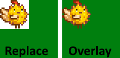

← [README](../README.md)

This document helps mod authors create a content pack for Content Patcher.

**See the [main README](../README.md) for other info**.

## Contents
* [Intro](#intro)
  * [What is Content Patcher?](#what-is-content-patcher)
  * [Content Patcher vs XNB mods](#content-patcher-vs-xnb-mods)
  * [Content Patcher vs other mods](#content-patcher-vs-other-mods)
* [Format](#format)
  * [Overview](#overview)
  * [Common fields](#common-fields)
* [Update rate](#update-rate)
* [Actions](#actions)
  * [`Load`](#load)
  * [`EditImage`](#editimage)
  * [`EditData`](#editdata)
    * [Definitions](#data-definitions)
    * [Basic changes](#data-basic-changes)
    * [Load changes from a file](#data-load-changes-from-a-file)
    * [Edit data model assets](#data-edit-data-model-assets)
    * [Edit list assets](#data-edit-list-assets)
  * [`EditMap`](#editmap)
    * [Map overlay](#map-overlay)
    * [Map properties](#map-properties)
    * [Tiles and tile properties](#tiles-and-tile-properties)
    * [Known limitations](#map-known-limitations)
  * [`Include`](#include)
* [Advanced: conditions & tokens](#advanced)
* [Release a content pack](#release-a-content-pack)
* [Troubleshoot](#troubleshoot)
  * [Schema validator](#schema-validator)
  * [Patch commands](#patch-commands)
  * [Debug mode](#debug-mode)
  * [Verbose log](#verbose-log)
* [FAQs](#faqs)
  * [Are Content Patcher updates backwards-compatible?](#are-content-patcher-updates-backwards-compatible)
  * [How multiple patches interact](#how-multiple-patches-interact)
  * [Known limitations](#known-limitations)
* [Configure](#configure)
* [See also](#see-also)

## Intro
### What is Content Patcher?
Content Patcher lets you create a [standard content pack](https://stardewvalleywiki.com/Modding:Content_packs)
which changes the game's data and images, no programming needed. Players can install it by
unzipping it into `Mods`, just like a SMAPI mod.

Just by editing a JSON file, you can make very simple changes to the game (like replace one image
file), or more interesting changes (like things that look different in each season), or very
specific changes (like coffee is more expensive in winter when it's snowing on the weekend).

### Content Patcher vs XNB mods
If you're familiar with creating XNB mods, Content Patcher supports everything XNB mods supported.
Here's a quick comparison:

&nbsp;               | XNB mod                         | Content Patcher
-------------------- | ------------------------------- | ---------------
easy to create       | ✘ need to unpack/repack files  | ✓ edit JSON files
easy to install      | ✘ different for every mod      | ✓ drop into `Mods`
easy to uninstall    | ✘ manually restore files       | ✓ remove from `Mods`
update checks        | ✘ no                           | ✓ yes (via SMAPI)
compatibility checks | ✘ no                           | ✓ yes (via SMAPI DB)
mod compatibility    | ✘ very poor<br /><small>(each file can only be changed by one mod)</small> | ✓ high<br /><small>(mods only conflict if they edit the same part of a file)</small>
game compatibility   | ✘ break in most updates        | ✓ only affected if the part they edited changes
easy to troubleshoot | ✘ no record of changes         | ✓ SMAPI log + Content Patcher validation

### Content Patcher vs other mods
Content Patcher supports all game assets with some very powerful features, but it's a generalist
framework. More specialized frameworks might be better for specific things. You should consider
whether one of these would work for you:

  * [TMXL Map Toolkit](https://www.nexusmods.com/stardewvalley/mods/1820) for complex changes to maps. (For simple changes, see _[edit part of a map](#editmap)_ below.)
  * [Producer Framework Mod](https://www.nexusmods.com/stardewvalley/mods/4970) to add machines.
  * [Custom Furniture](https://www.nexusmods.com/stardewvalley/mods/1254) to add furniture.
  * [Json Assets](https://www.nexusmods.com/stardewvalley/mods/1720) to add many things like items, crafting recipes, crops, fruit trees, hats, and weapons.

## Format
### Overview
A content pack is a folder with these files:
* a `manifest.json` for SMAPI to read (see [content packs](https://stardewvalleywiki.com/Modding:Content_packs) on the wiki);
* a `content.json` which describes the changes you want to make;
* and any images or files you want to use.

The `content.json` file has three main fields:

field          | purpose
-------------- | -------
`Format`       | The format version. You should always use the latest version (currently `1.17.0`) to use the latest features and avoid obsolete behavior.<br />(**Note:** this is not the Content Patcher version!)
`Changes`      | The changes you want to make. Each entry is called a **patch**, and describes a specific action to perform: replace this file, copy this image into the file, etc. You can list any number of patches.
`ConfigSchema` | _(optional)_ Defines the `config.json` format, to support more complex mods. See [_player config_ in the token guide](#advanced).

You can list any number of patches (surrounded by `{` and `}` in the `Changes` field). See the next
few sections for more info about the format. For example:
```js
{
   "Format": "1.17.0",
   "Changes": [
      {
         "Action": "Load",
         "Target": "Animals/Dinosaur",
         "FromFile": "assets/dinosaur.png"
      },

      {
         "Action": "EditImage",
         "Target": "Maps/springobjects",
         "FromFile": "assets/fish-object.png"
      },
   ]
}
```

### Common fields
All patches support these common fields:

<table>
<tr>
<th>field</th>
<th>purpose</th>
</tr>

<tr>
<td><code>Action</code></td>
<td>

The kind of change to make (`Load`, `EditImage`, `EditData`, `EditMap`, `Include`); explained in
the next section.

</td>
</tr>

<tr>
<td><code>Target</code></td>
<td>

The game asset you want to patch (or multiple comma-delimited assets). This is the file path inside
your game's `Content` folder, without the file extension or language (like `Animals/Dinosaur` to
edit `Content/Animals/Dinosaur.xnb`). Your changes are applied in all languages unless you specify a language
[condition](#advanced).

This field supports [tokens](#advanced) and capitalisation doesn't matter.

</td>
</tr>

<tr>
<td><code>When</code></td>
<td>

_(optional)_ Only apply the patch if the given conditions match (see [_conditions_](#advanced)).

</td>
</tr>

<tr>
<td><code>LogName</code></td>
<td>

_(optional)_ A name for this patch shown in log messages. This is very useful for understanding
errors; if not specified, will default to a name like `entry #14 (EditImage Animals/Dinosaurs)`.

</td>
</tr>

<tr>
<td><code>Enabled</code></td>
<td>

_(optional)_ Whether to apply this patch. Default true. This fields supports immutable
[tokens](#advanced) (e.g. config tokens) if they return true/false.

</td>
</tr>

<tr>
<td><code>Update</code></td>
<td>

_(optional)_ When the patch should update if it changed. The possible values are...
* `OnDayStart` (default): when the in-game day starts;
* `OnLocationChange`: when the current player warps to a new location (includes day start).

Note that dialogue ignores changes after the day starts (see [known limitations](#known-limitations)).

</td>
</tr>
</table>

## Update rate
Your changes apply at the start of each day by default. For example, if you change the house
texture depending on your friendship level with your spouse, it'll use the friendship level at the
start of the current day.

You can optionally use the [`Update` field](#common-fields) to update patches each time the
current player changes location (`OnLocationChange`), in which case they'll use the token values as
of the last location change.

## Actions
### `Load`
`"Action": "Load"` replaces the entire file with your version. This is useful for mods which
change the whole file (like pet replacement mods).

Avoid this if you don't need to change the whole file though — each file can only be replaced by one
patch, so your content pack won't be compatible with other content packs that replace the same file.
(It'll work fine with content packs that only edit the file, though.)

field      | purpose
---------- | -------
&nbsp;     | See _[common fields](#common-fields)_ above.
`FromFile` | The relative file path in your content pack folder to load instead (like `assets/dinosaur.png`). This can be a `.json` (data), `.png` (image), `.tbin` or `.tmx` (map), or `.xnb` file. This field supports [tokens](#advanced) and capitalisation doesn't matter.

Required fields: `FromFile`.

For example, this replaces the dinosaur sprite with your own image:
```js
{
   "Format": "1.17.0",
   "Changes": [
      {
         "Action": "Load",
         "Target": "Animals/Dinosaur",
         "FromFile": "assets/dinosaur.png"
      },
   ]
}
```

### `EditImage`
`"Action": "EditImage"` changes one part of an image. For example, you can change one area in a
spritesheet, or overlay an image onto the existing one.

Any number of content packs can edit the same file. You can extend an image downwards by just
patching past the bottom (Content Patcher will expand the image to fit).

field      | purpose
---------- | -------
&nbsp;     | See _[common fields](#common-fields)_ above.
`FromFile` | The relative path to the image in your content pack folder to patch into the target (like `assets/dinosaur.png`). This can be a `.png` or `.xnb` file. This field supports [tokens](#advanced) and capitalisation doesn't matter.
`FromArea` | The part of the source image to copy. Defaults to the whole source image. This is specified as an object with the X and Y pixel coordinates of the top-left corner, and the pixel width and height of the area. Its fields may contain tokens.
`ToArea`   | The part of the target image to replace. Defaults to the `FromArea` size starting from the top-left corner. This is specified as an object with the X and Y pixel coordinates of the top-left corner, and the pixel width and height of the area. If you specify an area past the bottom or right edges of the image, the image will be resized automatically to fit. Its fields may contain tokens.
`PatchMode`| How to apply `FromArea` to `ToArea`. Defaults to `Replace`. Possible values: <ul><li><code>Replace</code>: replace every pixel in the target area with your source image. If the source image has transparent pixels, the target image will become transparent there.</li><li><code>Overlay</code>: draw your source image over the target area. If the source image has transparent pixels, the target image will 'show through' those pixels. Semi-transparent or opaque pixels will replace the target pixels.</li></ul>For example, let's say your source image is a pufferchick with a transparent background, and the target image is a solid green square. Here's how they'll be combined with different `PatchMode` values:<br />

Required fields: `FromFile`.

For example, this changes one object sprite:
```js
{
   "Format": "1.17.0",
   "Changes": [
      {
         "Action": "EditImage",
         "Target": "Maps/springobjects",
         "FromFile": "assets/fish-object.png",
         "FromArea": { "X": 0, "Y": 0, "Width": 16, "Height": 16 }, // optional, defaults to entire FromFile
         "ToArea": { "X": 256, "Y": 96, "Width": 16, "Height": 16 } // optional, defaults to source size from top-left
      },
   ]
}
```

### `EditData`
`"Action": "EditData"` lets you edit fields or add/remove/edit entries inside a data file.

field      | purpose
---------- | -------
&nbsp;     | See _[common fields](#common-fields)_ above.
`Fields`   | The individual fields you want to change for existing entries. This field supports [tokens](#advanced) in field keys and values. The key for each field is the field index (starting at zero) for a slash-delimited string, or the field name for an object.
`Entries`  | The entries in the data file you want to add, replace, or delete. If you only want to change a few fields, use `Fields` instead for best compatibility with other mods. To add an entry, just specify a key that doesn't exist; to delete an entry, set the value to `null` (like `"some key": null`). This field supports [tokens](#advanced) in entry keys and values.<br />**Caution:** some XNB files have extra fields at the end for translations; when adding or replacing an entry for all locales, make sure you include the extra fields to avoid errors for non-English players.
`MoveEntries` | Change the entry order in a list asset like `Data/MoviesReactions`. (Using this with a non-list asset will cause an error, since those have no order.)
`FromFile` | **This field was deprecated in Content Patcher 1.16. New content packs should use [`Action: Include`](#include) instead.**<br />~~The relative path to a JSON file in your content pack folder containing the `Fields`, `Entries`, and `MoveEntries`. The field and file contents can contain [tokens](#advanced). Mutually exclusive with `Fields`, `Entries`, and `MoveEntries`. See _load changes from a file_ below for an example.~~

Required fields: at least one of `Fields`, `Entries`, `MoveEntries`, or `FromFile`.

You can have any combination of those fields within one patch. They'll be applied in this order:
`Entries`, `FromFile`, `Fields`, `MoveEntries`.

<dl>
<dt id="data-definitions">Definitions</dt>
<dd>

Consider this line in `Data/ObjectInformation`:
```js
   "70": "Jade/200/-300/Minerals -2/Jade/A pale green ornamental stone."
```

The whole line is one **entry** with a key (`"70"`) and value (`"Jade/200/-300/Minerals -2/Jade/A
pale green ornamental stone."`). The value contains six **fields** counting from zero, from field 0
(`Jade`) to field 5 (`A pale green ornamental stone.`).

</dd>

<dt id="data-basic-changes">Basic changes</dt>
<dd>

This example patch creates a new in-game item (i.e. adds a new entry), and edits the name and
description fields for an existing entry (item #70):

```js
{
   "Format": "1.17.0",
   "Changes": [
      {
         "Action": "EditData",
         "Target": "Data/ObjectInformation",
         "Entries": {
            "900": "Crimson Jade/400/-300/Minerals -2/Crimson Jade/A pale green ornamental stone with a strange crimson sheen."
         },
         "Fields": {
            "70": {
               4: "Normal Jade",
               5: "A pale green ornamental stone with no sheen."
            }
         }
       }
   ]
}
```

You can also delete entries entirely by setting their value to `null`. For example, that can be
used to change event conditions:
```js
{
   "Format": "1.17.0",
   "Changes": [
      {
         "Action": "EditData",
         "Target": "Data/Events/Beach",
         "Entries": {
            "733330/f Sam 750/w sunny/t 700 1500/z winter/y 1": null,
            "733330/f Sam 750/w sunny/t 700 1500/z winter": "[snipped: long event script here]"
         }
      }
   ]
}
```

</dd>

<dt id="data-load-changes-from-a-file"><s>Load changes from a file</s></dt>
<dd>

**This was deprecated in Content Patcher 1.16. New content packs should use [`Action: Include`](#include) instead.**

~~You can optionally load changes from a separate JSON file in your content pack. The file can contain
`Entries`, `Fields`, and `MoveEntries`. It can use any tokens that would work if used directly in
the patch.~~

~~For example, this patch in `content.json`:~~
```js
{
   "Format": "1.17.0",
   "Changes": [
      {
         "Action": "EditData",
         "Target": "Data/ObjectInformation",
         "FromFile": "assets/jade.json"
      }
   ]
}
```

~~Loads changes from this `assets/jade.json` file:~~
```js
{
   "Entries": {
      "900": "Crimson Jade/400/-300/Minerals -2/Crimson Jade/A pale green ornamental stone with a strange crimson sheen."
   },
   "Fields": {
      "70": {
         4: "Normal Jade",
         5: "A pale green ornamental stone with no sheen."
      }
   }
}
```

~~The `FromFile` field can contain tokens, so you can dynamically load a different file. For example,
this single patch loads a dialogue file for multiple NPCs:~~
```js
{
   "Format": "1.17.0",
   "Changes": [
      {
         "Action": "EditData",
         "Target": "Characters/Dialogue/Abigail, Characters/Dialogue/Alex, Characters/Dialogue/Caroline",
         "FromFile": "assets/dialogue/{{TargetWithoutPath}}.json"
      }
   ]
}
```

</dd>

<dt id="data-edit-data-model-assets">Edit data model assets</dt>
<dd>

A few assets like `Data/Movies` contain data models, not strings like above. You can edit those
the same way, with two differences: fields have names instead of indexes, and entry values are
structures instead of strings.

For example, this renames a movie to _The Brave Little Pikmin_ and adds a new movie:
```js
{
   "Format": "1.17.0",
   "Changes": [
      {
         "Action": "EditData",
         "Target": "Data/Movies",
         "Fields": {
            "spring_movie_0": {
               "Title": "The Brave Little Pikmin"
            }
         },
         "Entries": {
            "spring_movie_3": {
               "ID": "spring_movie_3",
               "Title": "The Brave Little Pikmin II: Now I'm a Piktree",
               "Description": "Follow the continuing adventures of our pikmin hero as he absorbs nutrients from the soil!",
               "SheetIndex": 6,
               "Tags": [ "documentary", "family" ],
               "Scenes": [
                  {
                     "Image": 0,
                     "MessageDelay": 500,
                     "Music": "movie_nature",
                     "Text": "'The Brave Little Pikmin II: Now I'm a Piktree', sponsored by Joja Cola"
                  }
               ]
            }
         }
      }
   ]
}
```

</dd>

<dt id="data-edit-list-assets">Edit list assets</dt>
<dd>

A few assets like `Data/MoviesReactions` contain a list of entries (meaning they don't have a key).
Content Patcher will automatically select one field to treat as the key, so you can edit them the
same way as usual:

asset | field used
----- | ----------
_default_ | `ID` if it exists.
`Data/ConcessionTastes` | `Name`
`Data/FishPondData` | The `RequiredTags` field with comma-separated tags (like `fish_ocean,fish_crab_pot`). The key is space-sensitive.
`Data/MoviesReactions` | `NPCName`
`Data/TailoringRecipes` | `FirstItemTags` and `SecondItemTags`, with comma-separated tags and a pipe between them (like <code>item_cloth&#124;category_fish,fish_semi_rare</code>). The key is space-sensitive.

List assets also have an order which can affect game logic (e.g. the first entry in
`Data\MoviesReactions` matching the NPC is used). You can move an entry within that order using the
`MoveEntries` field.

Here's an example showing all possible reorder options. (If you specify a `BeforeID` or `AfterID`
that doesn't match any entry, a warning will be shown.)
```js
{
   "Format": "1.17.0",
   "Changes": [
      {
         "Action": "EditData",
         "Target": "Data/MoviesReactions",
         "MoveEntries": [
            { "ID": "Abigail", "BeforeID": "Leah" }, // move entry so it's right before Leah
            { "ID": "Abigail", "AfterID": "Leah" }, // move entry so it's right after Leah
            { "ID": "Abigail", "ToPosition": "Top" }, // move entry to the top of the list
            { "ID": "Abigail", "ToPosition": "Bottom" }, // move entry to the bottom of the list
         ]
      }
   ]
}
```

New entries are added at the bottom of the list by default.

</dd>
</dl>

### `EditMap`
`"Action": "EditMap"` changes part of an in-game map. This consists of three separate features:

* copy tiles, properties, and tilesheets from a source map into the target;
* add/edit/remove map properties;
* add/edit/remove individual tiles and tile properties.

Each patch can use any combination of these features, but must set the required fields for at least
one of them: map overlay (`FromFile` and `ToArea`), map properties (`MapProperties`), or tiles
(`MapTiles`). When combined into one patch, the changes are applied in this order: overlay, then
map properties, then map tiles.

Any number of content packs can edit the same map. If two patches conflict, whichever one is applied
last will take effect for the overlapping portions.

<dl>
<dt id="map-overlay">Map overlay</dt>
<dd>

A 'map overlay' copies tiles, properties, and tilesheets from a source map into the target. The
target area will be fully overwritten with the source area.

<table>
<tr>
<th>field</th>
<th>purpose</th>
</tr>
<tr>
<td>&nbsp;</td>
<td>

See _[common fields](#common-fields)_ above.

</td>
</tr>
<tr>
<td>

`FromFile`

</td>
<td>

The relative path to the map in your content pack folder from which to copy (like
`assets/town.tmx`). This can be a `.tbin`, `.tmx`, or `.xnb` file. This field supports [tokens](#advanced)
and capitalisation doesn't matter.

Content Patcher will handle tilesheets referenced by the `FromFile` map for you:
* If a tilesheet isn't referenced by the target map, Content Patcher will add it for you (with a
  `z_` ID prefix to avoid conflicts with hardcoded game logic). If the source map has a custom
  version of a tilesheet that's already referenced, it'll be added as a separate tilesheet only
  used by your tiles.
* If you include the tilesheet file in your mod folder, Content Patcher will use that one
  automatically; otherwise it will be loaded from the game's `Content/Maps` folder.

</td>
</tr>
<tr>
<td>

`FromArea`

</td>
<td>

The part of the source map to copy. Defaults to the whole source map. This is specified as an
object with the X and Y tile coordinates of the top-left corner, and the tile width and height of
the area. Its fields may contain tokens.

</td>
</tr>
<tr>
<td>

`ToArea`

</td>
<td>

The part of the target map to replace. This is specified as an object with the X and Y tile
coordinates of the top-left corner, and the tile width and height of the area. If you specify an
area past the bottom or right edges of the map, the map will be resized automatically to fit.
Its fields may contain tokens.

</td>
</tr>
</table>

For example, this replaces the town square with the one in another map:
```js
{
   "Format": "1.17.0",
   "Changes": [
      {
         "Action": "EditMap",
         "Target": "Maps/Town",
         "FromFile": "assets/town.tmx",
         "FromArea": { "X": 22, "Y": 61, "Width": 16, "Height": 13 },
         "ToArea": { "X": 22, "Y": 61, "Width": 16, "Height": 13 }
      },
   ]
}
```

</dd>

<dt id="map-properties">Map properties</dt>
<dd>

The `MapProperties` field lets you add, replace, or remove map-level properties.

<table>
<tr>
<th>field</th>
<th>purpose</th>
</tr>
<tr>
<td>&nbsp;</td>
<td>

See _[common fields](#common-fields)_ above.

</td>
</tr>

<tr>
<td>

`MapProperties`

</td>
<td>

The map properties (not tile properties) to add, replace, or delete. To add an property, just
specify a key that doesn't exist; to delete an entry, set the value to `null` (like
`"some key": null`). This field supports [tokens](#advanced) in property keys
and values.

</td>
</tr>
</table>

For example, This changes the warp map property for the farm cave:
```js
{
   "Format": "1.17.0",
   "Changes": [
      {
         "Action": "EditMap",
         "Target": "Maps/FarmCave",
         "MapProperties": {
            "Warp": "8 12 Farm 34 6"
         }
      },
   ]
}
```

</dd>
<dt id="tiles-and-tile-properties">Tiles and tile properties</dt>
<dd>

The `MapTiles` field lets you add, edit, or remove the map's individual tiles and tile
properties.

<table>
<tr>
<th>field</th>
<th>purpose</th>
</tr>
<tr>
<td>&nbsp;</td>
<td>

See _[common fields](#common-fields)_ above.

</td>
</tr>

<tr>
<td>

`MapTiles`

</td>
<td>

The tiles to add, edit, or delete. All of the subfields below support
[tokens](#advanced).

This consists of an array of tiles (see examples below) with these properties:

field | purpose
----- | -------
`Layer` | (Required.) The [map layer](https://stardewvalleywiki.com/Modding:Maps#Basic_concepts) to change.
`Position` | (Required.) The [tile coordinates](https://stardewvalleywiki.com/Modding:Maps#Tile_coordinates) to change. You can use [Debug Mode](https://www.nexusmods.com/stardewvalley/mods/679) to see tile coordinates in-game.
`SetTilesheet` | (Required when adding a tile, else optional.) Sets the tilesheet ID for the tile index.
`SetIndex` | (Required when adding a tile, else optional.) Sets the tile index in the tilesheet.
`SetProperties` | The properties to set or remove. This is merged into the existing tile properties, if any. To remove a property, set its value to `null` (not `"null"`!).
`Remove` | (Optional, default false.) `true` to remove the current tile and all its properties on that layer. If combined with the other fields, a new tile is created from the other fields as if the tile didn't previously exist.

</td>
</tr>
</table>

For example, this extends the farm path one extra tile to the shipping bin:
```js
{
   "Format": "1.17.0",
   "Changes": [
      {
         "Action": "EditMap",
         "Target": "Maps/Farm",
         "MapTiles": [
            {
               "Position": { "X": 72, "Y": 15 },
               "Layer": "Back",
               "SetIndex": "622"
            }
         ]
      },
   ]
}
```

You can use tokens in all of the fields. For example, this adds a warp in front of the shipping bin
that leads to a different location each day:
```js
{
   "Format": "1.17.0",
   "Changes": [
      {
         "Action": "EditMap",
         "Target": "Maps/Farm",
         "MapTiles": [
            {
               "Position": { "X": 72, "Y": 15 },
               "Layer": "Back",
               "SetProperties": {
                  "TouchAction": "MagicWarp {{Random:BusStop, Farm, Town, Mountain}} 10 11"
               }
            }
         ]
      },
   ]
}
```

</dd>

<dt id="map-known-limitations">Known limitations</dt>
<dd>

* Patching the farmhouse's `Back` layer may fail or cause strange effects, due to the game's floor
  decorating logic. This is a limitation in the game itself, not Content Patcher.

</dd>
</dl>

### `Include`
`"Action": "Include"` reads patches from another JSON file, and adds them in the current position.
The included patches work just as if you'd pasted them into that position yourself; for example,
they have full access to all the tokens and conditions (including dynamic tokens) available in your
`content.json`.

You can have any number of `Include` patches, and files can be included recursively (i.e. include a
file which includes another file).

<table>
<tr>
<th>field</th>
<th>purpose</th>
</tr>

<tr>
<td>&nbsp;</td>
<td>

See _[common fields](#common-fields)_ above.

</td>
</tr>

<tr>
<td><code>FromFile</code></td>
<td>

The relative path to the JSON file containing patches in your content pack folder. The loaded JSON
file uses the same format as `content.json`, except that _only_ the `Changes` field is allowed.
This field supports [tokens](#advanced) and capitalisation doesn't matter.

When including a file into an included file, the `FromFile` path is always **relative to your
`content.json`**. For example, if `assets/A.json` includes `assets/B.json`, it would specify
`"FromFile": "assets/B.json"` (_not_ `"FromFile": "B.json"`).

</td>
</tr>
</table>

In the simplest case, you can use this to organize your patches into subfiles:

```js
{
   "Format": "1.17.0",
   "Changes": [
      {
         "Action": "Include",
         "FromFile": "assets/John NPC.json"
      },
      {
         "Action": "Include",
         "FromFile": "assets/Jane NPC.json"
      },
   ]
}
```

You can combine this with tokens and conditions to load files dynamically:

```js
{
   "Format": "1.17.0",
   "Changes": [
      {
         "Action": "Include",
         "FromFile": "assets/John_{{season}}.json",
         "When": {
            "EnableJohn": true
         }
      }
   ]
}
```

There's no restriction against including the same file multiple times (as long as there's no
circular include loop). In that case the patches are duplicated for each inclusion, as if you
copied & pasted them into each place. This may negatively impact performance though, since each
patch will be reapplied multiple times.

## <span id="advanced"></span>Advanced: conditions & tokens
The previous sections explain how to make static changes, but that's only scratching the surface of
what you can do with Content Patcher. You can use conditions and tokens to make _dynamic_ changes.

For example, you can...
* change patches with a wide variety of factors (e.g. use a different image each season, change
  dialogue depending on story progression or previous answers, etc);
* let players configure your content pack;
* use randomization and arithmetic;
* and more.

See the [conditions & tokens guide](author-tokens-guide.md) for more info.

## Release a content pack
See [content packs](https://stardewvalleywiki.com/Modding:Content_packs) on the wiki for general
info. Suggestions:

1. Add specific install steps in your mod description to help players:
   ```
   [size=5]Install[/size]
   [list=1]
   [*][url=https://smapi.io]Install the latest version of SMAPI[/url].
   [*][url=https://www.nexusmods.com/stardewvalley/mods/1915]Install Content Patcher[/url].
   [*]Download this mod and unzip it into [font=Courier New]Stardew Valley/Mods[/font].
   [*]Run the game using SMAPI.
   [/list]
   ```
2. When editing the Nexus page, add Content Patcher under 'Requirements'. Besides reminding players
   to install it first, it'll also add your content pack to the list on the Content Patcher page.
3. Including `config.json` (if created) in your release download is not recommended. That will
   cause players to lose their settings every time they update. Instead leave it out and it'll
   generate when the game is launched, just like a SMAPI mod's `content.json`.

## Troubleshoot
### Schema validator
You can validate your `content.json` and `manifest.json` automatically to detect some common issues.
(You should still test your content pack in-game before releasing it, since the validator won't
detect all issues.)

To validate online:
1. Go to [smapi.io/json](https://smapi.io/json).
2. Set the format to 'Manifest' (for `manifest.json`) or 'Content Patcher' (for `content.json`).
3. Drag & drop the JSON file onto the textbox, or paste in the text.
4. Click the button to view the validation summary. You can optionally share the URL to let someone
   else see the result.

To validate in a text editor that supports JSON Schema, see
[_Using a schema file directly_](https://github.com/Pathoschild/SMAPI/blob/develop/docs/technical/web.md#using-a-schema-file-directly)
in the JSON validator documentation.

Tips:
* You should update your content pack to the latest format version whenever you update it, for best
  futureproofing.
* If you get an error like `Unexpected character`, your JSON syntax is invalid. Try checking the
  line mentioned (or the one above it) for a missing comma, bracket, etc.
* If you need help figuring out an error, see [_see also_](../README.md#see-also) for some links to places you
  can ask.

### Patch commands
Content Patcher adds several console commands for testing and troubleshooting. Enter `patch help`
directly into the SMAPI console for more info.

#### patch summary
`patch summary` lists all the loaded patches, their current values, what they changed, and (if
applicable) the reasons they weren't applied.

For example:

```
=====================
==  Global tokens  ==
=====================
   Content Patcher:

      token name       | value
      ---------------- | -----
      Day              | [X] 5
      DayEvent         | [X]
      DayOfWeek        | [X] Friday
      DaysPlayed       | [X] 305
      FarmCave         | [X] Mushrooms
      FarmhouseUpgrade | [X] 1
      FarmName         | [X] River Coop
      FarmType         | [X] Riverland

      [snipped for simplicity]

=====================
== Content patches ==
=====================
The following patches were loaded. For each patch:
  - 'loaded' shows whether the patch is loaded and enabled (see details for the reason if not).
  - 'conditions' shows whether the patch matches with the current conditions (see details for the reason if not). If this is unexpectedly false, check (a) the conditions above and (b) your Where field.
  - 'applied' shows whether the target asset was loaded and patched. If you expected it to be loaded by this point but it's false, double-check (a) that the game has actually loaded the asset yet, and (b) your Targets field is correct.


Example Content Pack:
------------------------------

   Local tokens:
      token name        | value
      ----------------- | -----
      WeatherVariant    | [X] Wet

   Patches:
      loaded  | conditions | applied | name + details
      ------- | ---------- | ------- | --------------
      [X]     | [ ]        | [ ]     | Dry Palm Trees // conditions don't match: WeatherVariant
      [X]     | [X]        | [X]     | Wet Palm Trees

   Current changes:
      asset name                | changes
      ------------------------- | -------
      TerrainFeatures/tree_palm | edited image
```

#### patch update
`patch update` immediately updates Content Patcher's condition context and rechecks all patches.
This is mainly useful if you change conditions through the console (like the date), and want to
update patches without going to bed.

#### patch reload
`patch reload` reloads all patches (but not config schema or dynamic tokens) in a content pack's
`content.json`. That lets you change the `content.json` while the game is running, and see them
in-game without restarting the game. You specify the content pack using the ID in its
`manifest.json`.

For example:

```
> patch reload "LemonEx.HobbitHouse"
Content pack reloaded.
```

#### patch export
`patch export` saves a copy of a given asset to your game folder, which lets you see what it looks
like with all changes applied. This currently works for image and data assets.

For example:

```
> patch export "Maps/springobjects"
Exported asset 'Maps/springobjects' to 'C:\Program Files (x86)\Steam\steamapps\common\Stardew Valley\patch export\Maps_springobjects.png'.
```

#### patch parse
`patch parse` parses a tokenizable string and shows the resulting metadata, using the current
Content Patcher context (the same values used when applying patches).

This recognizes global tokens by default. You can use tokens for a specific content pack (including
dynamic tokens and config values) by giving the content pack ID from its `manifest.json` in the
optional second argument.

For example:

```
> patch parse "assets/{{Variant}}.{{Language}}.png" "Pathoschild.ExampleContentPack"

Metadata
----------------
   raw value:   assets/{{Variant}}.{{Language}}.png
   ready:       True
   mutable:     True
   has tokens:  True
   tokens used: Language, Variant

Diagnostic state
----------------
   valid:    True
   in scope: True
   ready:    True

Result
----------------
   The token string is valid and ready. Parsed value: "assets/wood.en.png"
```

This can also be used to troubleshoot token syntax:

```
> patch parse "assets/{{Season}.png"
[ERROR] Can't parse that token value: Reached end of input, expected end of token ('}}').

```

### Debug mode
Content Patcher has a 'debug mode' which lets you view loaded textures directly in-game with any
current changes. To enable it, open the mod's `config.json` file in a text editor and enable
`EnableDebugFeatures`.

Once enabled, press `F3` to display textures and left/right `CTRL` to cycle textures. Close and
reopen the debug UI to refresh the texture list.
> 

### Verbose log
Content Patcher doesn't log much info. You can change that by opening SMAPI's
`smapi-internal/StardewModdingAPI.config.json` in a text editor and enabling `VerboseLogging`.
**This may significantly slow down loading, and should normally be left disabled unless you need it.**

Once enabled, it will log significantly more information at three points:
1. when loading patches (e.g. whether each patch was enabled and which files were preloaded);
2. when SMAPI checks if Content Patcher can load/edit an asset;
3. and when the context changes (anytime the conditions change: different day, season, weather, etc).

If your changes aren't appearing in game, make sure you set a `LogName` (see [common fields](#common-fields))
and then search the SMAPI log file for that name. Particular questions to ask:
* Did Content Patcher load the patch?  
  _If it doesn't appear, check that your `content.json` is correct. If it says 'skipped', check
  your `Enabled` value or `config.json`._
* When the context is updated, is the box ticked next to the patch name?  
  _If not, checked your `When` field._
* When SMAPI checks if it can load/edit the asset name, is the box ticked?  
  _If not, check your `When` and `Target` fields._

## FAQs
### Are Content Patcher updates backwards-compatible?
Yep. See the [author migration guide](author-migration-guide.md) for more info.

### How multiple patches interact
Any number of patches can be applied to the same file. `Action: Load` always happens before other
action types, but otherwise each patch is applied sequentially. After each patch is done, the next
patch will see the combined asset as the input.

Within one content pack, patches are applied in the order they're listed in `content.json`. When
you have multiple content packs, each one is applied in the order they're loaded by SMAPI; if you
need to explicitly patch after another content pack, see [manifest dependencies](https://stardewvalleywiki.com/Modding:Modder_Guide/APIs/Integrations#Dependencies).

### Known limitations
* Dialogue is set when the day starts, so setting `"Update": "OnLocationChange"` won't affect dialogue after the day starts.
* Some game assets have special logic. This isn't specific to Content Patcher, but they're
  documented here for convenience.

  asset | notes
  ----- | -----
  `Characters/Farmer/accessories` | The number of accessories is hardcoded, so custom accessories need to replace an existing one.
  `Characters/Farmer/skinColors` | The number of skin colors is hardcoded, so custom colors need to replace an existing one.
  `Maps/*` | See [Modding:Maps#Potential issues](https://stardewvalleywiki.com/Modding:Maps#Potential_issues) on the wiki.

## Configure
Content Patcher creates a `config.json` file in its mod folder the first time you run it. You can
open that file in a text editor to configure the mod.

These are the available settings:

<table>
<tr>
  <th>setting</th>
  <th>what it affects</th>
</tr>

<tr>
  <td><code>EnableDebugFeatures</code></td>
  <td>

Default `false`. Whether to enable [debug features meant for content pack creators](#debug-mode).

  </td>
</tr>

<tr>
  <td><code>Controls</code></td>
  <td>

The configured controller, keyboard, and mouse buttons (see [key bindings](https://stardewvalleywiki.com/Modding:Key_bindings)).
The default button bindings are...

* `F3` to show the [debug overlay](#debug-mode) (if enabled);
* `LeftControl` and `RightControl` to switch textures in the debug overlay.

You can separate bindings with commas (like `B, LeftShoulder` for either one), and set multi-key
bindings with plus signs (like `LeftShift + B`).

  </td>
</tr>
</table>

## See also
* [README](../README.md) for other info
* [Tokens guide](author-tokens-guide.md)
* [Ask for help](https://stardewvalleywiki.com/Modding:Help)
