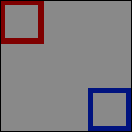
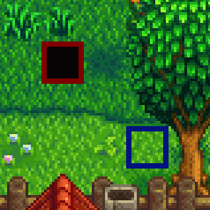
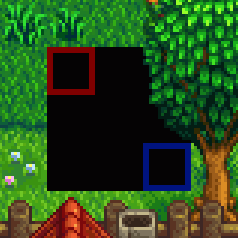
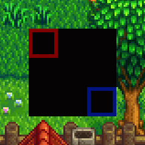

← [author guide](../author-guide.md)

A patch with **`"Action": "EditMap"`** changes part of a map loaded by the game. Any number of
content packs can edit the same asset. You can extend a map downwards or rightward by just patching
past the edge (Content Patcher will expand the map to fit).

## Contents
* [Introduction](#introduction)
  * [What is a map?](#what-is-a-map)
* [Usage](#usage)
  * [Overview](#overview)
  * [Common fields](#common-fields)
  * [Overlay a map](#overlay-a-map)
  * [Edit map properties](#edit-map-properties)
  * [Edit map tiles](#edit-map-tiles)
* [Known limitations](#known-limitations)
* [See also](#see-also)

## Introduction
### What is a map?
A _map_ asset describes the layout of the in-game terrain (like water, cliffs, and land), terrain
features (like bushes), buildings, paths, and triggers for a particular area. When you reach the
edge of an area or enter a building, and the screen fades to black during the transition, you're
moving between maps.

**See [Modding:Maps](https://stardewvalleywiki.com/Modding:Maps) on the wiki** for more information,
from the basic concepts to more advanced map features.

## Usage
### Overview
Each `EditMap` patch can make three types of change to a map: overlay a map, change map properties,
or change map tiles.

These are documented in separate sections below since they're distinct, but you can combine them
in the same patch. In that case the fields are applied in this order: `FromFile`, `MapTiles`,
`MapProperties`, `AddWarps`, and `TextOperations`.

### Common fields
An `EditMap` patch consists of a model under `Changes` (see examples below). These fields are
always used regardless of the edit type:

<dl>
<dt>Required fields:</dt>
<dd>

field     | purpose
--------- | -------
`Action`  | The kind of change to make. Set to `EditMap` for this action type.
`Target`  | The [game asset name](../author-guide.md#what-is-an-asset) to replace (or multiple comma-delimited asset names), like `Maps/Town`. This field supports [tokens](../author-guide.md#tokens), and capitalisation doesn't matter.

</dd>
<dt>Optional fields:</dt>
<dd>

field     | purpose
--------- | -------
`When`    | _(optional)_ Only apply the patch if the given [conditions](../author-guide.md#conditions) match.
`LogName` | _(optional)_ A name for this patch to show in log messages. This is useful for understanding errors; if not specified, it'll default to a name like `entry #14 (EditImage Animals/Dinosaurs)`.
`Update`  | _(optional)_ How often the patch fields should be updated for token changes. See [update rate](../author-guide.md#update-rate) for more info.

</dd>
<dt>Advanced fields:</dt>
<dd>

<table>
  <tr>
    <td>field</td>
    <td>purpose</td>
  </tr>
  <tr>
  <td><code>Priority</code></td>
  <td>

_(optional)_ When multiple patches or mods edit the same asset, the order in which they should be
applied. The possible values are `Early`, `Default`, and `Late`. The default value is `Default`.

The patches for an asset (across all mods) are applied in this order:

1. by earliest to latest priority;
2. then by mod load order (e.g. based on dependencies);
3. then by the order the patches are listed in your `content.json`.

If you need a more specific order, you can use a simple offset like `"Default + 2"` or `"Late - 10"`.
The default levels are -1000 (early), 0 (default), and 1000 (late).

This field does _not_ support tokens, and capitalization doesn't matter.

> [!TIP]  
> Priorities can make your changes harder to follow and troubleshoot. Suggested best practices:
> * Consider only using very general priorities when possible (like `Late` for a cosmetic overlay
>   meant to be applied over base edits from all mods).
> * There's no need to set priorities relative to _your own_ patches, since you can just list them
>   in the order they should be applied.

</td>
</table>

</dd>
</dl>

You can then add the fields from one or more sections below.

### Overlay a map
A 'map overlay' copies tiles, properties, and tilesheets from a source map into the target.
Matching layers in the target area will be fully overwritten with the source area.

The patch fields for this operation are:

<table>
<tr>
<th>field</th>
<th>purpose</th>
</tr>
<tr>
<td>&nbsp;</td>
<td>

See _[common fields](#common-fields)_ above.

</td>
</tr>
<tr>
<td>

`FromFile`

</td>
<td>

The relative path to the map in your content pack folder from which to copy (like `assets/town.tmx`),
or multiple comma-delimited paths. This can be a `.tbin`, `.tmx`, or `.xnb` file. This field
supports [tokens](../author-guide.md#tokens) and capitalisation doesn't matter.

Content Patcher will handle tilesheets referenced by the `FromFile` map for you:
* If a tilesheet isn't referenced by the target map, Content Patcher will add it for you (with a
  `z_` ID prefix to avoid conflicts with hardcoded game logic). If the source map has a custom
  version of a tilesheet that's already referenced, it'll be added as a separate tilesheet only
  used by your tiles.
* If you include the tilesheet file in your mod folder, Content Patcher will use that one
  automatically; otherwise it will be loaded from the game's `Content/Maps` folder.

</td>
</tr>
<tr>
<td>

`FromArea`

</td>
<td>

_(Optional)_ The part of the source map to copy. Defaults to the whole source map.

This is specified as an object with the X and Y tile coordinates of the top-left corner, and the
tile width and height of the area. Its fields may contain tokens.

</td>
</tr>
<tr>
<td>

`ToArea`

</td>
<td>

_(Optional)_ The part of the target map to replace. Defaults to the same size as `FromArea`,
positioned at the top-left corner of the map.

This is specified as an object with the X and Y tile coordinates of the top-left corner, and the
tile width and height of the area. Its fields may contain tokens.

If you specify an area past the bottom or right edges of the map, the map will be resized
automatically to fit.

</td>
</tr>
<tr>
<td>

`PatchMode`

</td>
<td>

_(Optional)_ How to merge tiles into the target map. The default is `ReplaceByLayer`.

For example, assume a mostly empty source map with two layers: `Back` (red) and `Buildings` (blue):



Here's how that would be merged with each patch mode (black areas are the empty void under the map):

* **`Overlay`**  
  Only matching tiles are replaced. The red tile replaces the ground on the `Back` layer, but the
  ground is visible under the blue `Buildings` tile.  
  

* **`ReplaceByLayer`** _(default)_  
  All tiles are replaced, but only on layers that exist in the source map.  
  

* **`Replace`**  
  All tiles are replaced.  
  

</td>
</tr>
</table>

For example, this replaces the town square with the one in another map:
```js
{
    "Format": "1.29.0",
    "Changes": [
        {
            "Action": "EditMap",
            "Target": "Maps/Town",
            "FromFile": "assets/town.tmx",
            "FromArea": { "X": 22, "Y": 61, "Width": 16, "Height": 13 },
            "ToArea": { "X": 22, "Y": 61, "Width": 16, "Height": 13 }
        },
    ]
}
```

### Edit map properties
The `MapProperties` field lets you add, replace, or remove map-level properties.

<table>
<tr>
<th>field</th>
<th>purpose</th>
</tr>
<tr>
<td>&nbsp;</td>
<td>

See _[common fields](#common-fields)_ above.

</td>
</tr>

<tr>
<td>

`MapProperties`

</td>
<td>

The map properties (not tile properties) to add, replace, or delete. To add an property, just
specify a key that doesn't exist; to delete an entry, set the value to `null` (like `"some key":
null`). This field supports [tokens](../author-guide.md#tokens) in property keys and
values.

</td>
</tr>

<tr>
<td>

`AddWarps`

</td>
<td>

Add warps to the map's `Warp` property, creating it if needed. This field supports
[tokens](../author-guide.md#tokens). If there are multiple warps from the same tile, the ones added
later win.

</td>
</tr>

<tr>
<td>

`TextOperations`

</td>
<td>

The `TextOperations` field lets you change the value for an existing map property (see _[text
operations](../author-guide.md#text-operations)_ for more info).

The only valid path format is `["MapProperties", "PropertyName"]` where `PropertyName` is the
name of the map property to change.

</td>
</tr>
</table>

For example, this changes the `Outdoors` tile for the farm cave and adds a warp (see
[map documentation](https://stardewvalleywiki.com/Modding:Maps) for the warp syntax):
```js
{
    "Format": "1.29.0",
    "Changes": [
        {
            "Action": "EditMap",
            "Target": "Maps/FarmCave",
            "MapProperties": {
                "Outdoors": "T"
            },
            "AddWarps": [
                "10 10 Town 0 30"
            ]
        },
    ]
}
```

### Edit map tiles
The `MapTiles` field lets you add, edit, or remove the map's individual tiles and tile properties.

<table>
<tr>
<th>field</th>
<th>purpose</th>
</tr>
<tr>
<td>&nbsp;</td>
<td>

See _[common fields](#common-fields)_ above.

</td>
</tr>

<tr>
<td>

`MapTiles`

</td>
<td>

The tiles to add, edit, or delete. All of the subfields below support [tokens](../author-guide.md#tokens).

This consists of an array of tiles (see examples below) with these properties:

field | purpose
----- | -------
`Layer` | (Required.) The [map layer](https://stardewvalleywiki.com/Modding:Maps#Basic_concepts) to change.
`Position` | (Required.) The [tile coordinates](https://stardewvalleywiki.com/Modding:Maps#Tile_coordinates) to change. You can use [Debug Mode](https://www.nexusmods.com/stardewvalley/mods/679) to see tile coordinates in-game.
`SetTilesheet` | (Required when adding a tile, else optional.) Sets the tilesheet ID for the tile index.
`SetIndex` | (Required when adding a tile, else optional.) Sets the tile index in the tilesheet.
`SetProperties` | The properties to set or remove. This is merged into the existing tile properties, if any. To remove a property, set its value to `null` (not `"null"` with quotes!).
`Remove` | (Optional, default false.) `true` to remove the current tile and all its properties on that layer. If combined with the other fields, a new tile is created from the other fields as if the tile didn't previously exist.

</td>
</tr>
</table>

For example, this extends the farm path one extra tile to the shipping bin:
```js
{
    "Format": "1.29.0",
    "Changes": [
        {
            "Action": "EditMap",
            "Target": "Maps/Farm",
            "MapTiles": [
                {
                    "Position": { "X": 72, "Y": 15 },
                    "Layer": "Back",
                    "SetIndex": "622"
                }
            ]
        },
    ]
}
```

You can use tokens in all of the fields. For example, this adds a warp in front of the shipping bin
that leads to a different location each day:
```js
{
    "Format": "1.29.0",
    "Changes": [
        {
            "Action": "EditMap",
            "Target": "Maps/Farm",
            "MapTiles": [
                {
                    "Position": { "X": 72, "Y": 15 },
                    "Layer": "Back",
                    "SetProperties": {
                        "TouchAction": "MagicWarp {{Random:BusStop, Farm, Town, Mountain}} 10 11"
                    }
                }
            ]
        },
    ]
}
```

## Known limitations
* Patching the farmhouse's `Back` layer may fail or cause strange effects, due to the game's floor
  decorating logic. This is a limitation in the game itself, not Content Patcher.

## See also
* [Author guide](../author-guide.md) for other actions and options
