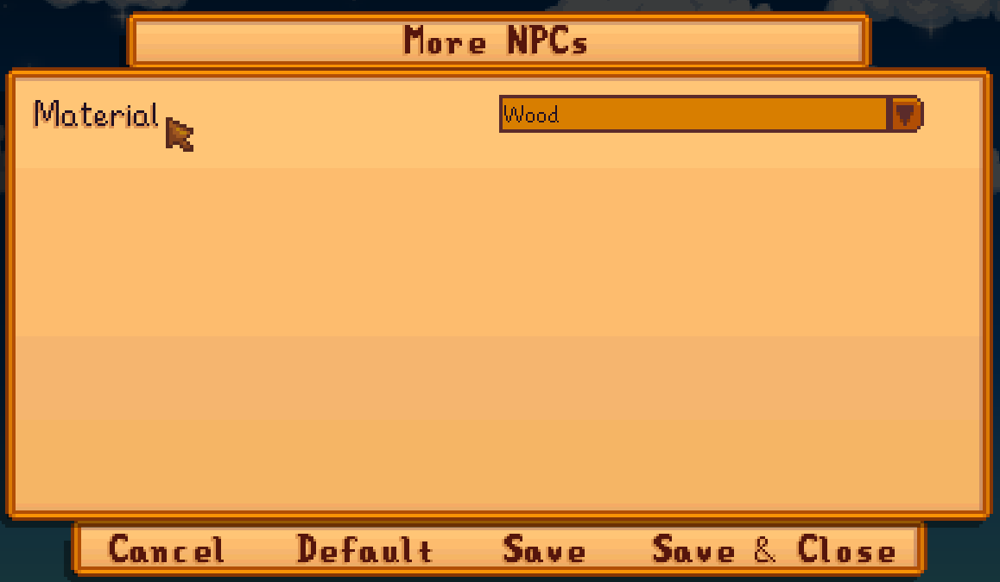

← [author guide](../author-guide.md)

The config feature lets you make dynamic changes in your content pack that depends on settings
selected by the player.

## Contents
* [Overview](#overview)
* [Usage](#usage)
  * [Define your config](#define-your-config)
  * [Examples](#examples)
* [Translations](#translations)
* [See also](#see-also)

## Overview
Once you've defined your config schema (explained below), Content Patcher will automatically add
a `config.json` file which players can edit. If the player has [Generic Mod Config
Menu](https://www.nexusmods.com/stardewvalley/mods/5098) installed, they'll also be able to
configure the mod through an in-game options menu.

In your content pack code, you can use config options as [tokens &
conditions](../author-guide.md#tokens) to make dynamic changes.

## Usage
### Define your config
Config fields are not case-sensitive.

First you need to describe your config options for Content Patcher. You do that by adding a
`ConfigSchema` field (outside the `Changes` field which has your patches). Each config option has
a key used as the token name, and a data model containing these fields:

field               | meaning
------------------- | -------
`AllowValues`       | _(optional)_ The values the player can provide, as a comma-delimited string. If omitted, any value is allowed.<br />**Tip:** use `"true, false"` for a field that can be enabled or disabled, and Content Patcher will recognize it as a boolean (e.g. to represent as a checkbox in Generic Mod Config Menu).
`AllowBlank`        | _(optional)_ Whether the field can be left blank. If false or omitted, blank fields will be replaced with the default value.
`AllowMultiple`     | _(optional)_ Whether the player can specify multiple comma-delimited values. Default false.
`Default`           | _(optional unless `AllowBlank` is false)_ The default values when the field is missing. Can contain multiple comma-delimited values if `AllowMultiple` is true. If omitted, blank fields are left blank.
`Description`       | _(optional)_ An explanation of the config option for the player. This is shown in UIs like Generic Mod Config Menu.

### Examples
This `content.json` defines a `BillboardMaterial` config field and uses it to change which patch is
applied:

```js
{
   "Format": "1.24.0",
   "ConfigSchema": {
      "Material": {
         "AllowValues": "Wood, Metal",
         "Default": "Wood"
      }
   },
   "Changes": [
      // as a token
      {
         "Action": "Load",
         "Target": "LooseSprites/Billboard",
         "FromFile": "assets/material_{{Material}}.png"
      },

      // as a condition
      {
         "Action": "Load",
         "Target": "LooseSprites/Billboard",
         "FromFile": "assets/material_wood.png",
         "When": {
            "Material": "Wood"
         }
      }
   ]
}
```

When you run the game, a `config.json` file will appear automatically with text like this:

```js
{
  "Material": "Wood"
}
```

Players can edit that file to configure your content pack, or use Generic Mod Config Menu to do it
in-game.

## Translations
Content Patcher will automatically register your mod with [Generic Mod Config
Menu](https://www.nexusmods.com/stardewvalley/mods/5098) (GMCM) based on your `ConfigSchema`.
However it'll show the token name as-is and not be translated into the player's language by
default:



You can add [translation files](https://stardewvalleywiki.com/Modding:Translations) for your config
to have a more user-friendly UI. To do that, create an `i18n/default.json` for your default text.
For each field, add any combination of these translation keys:

key format                     | description
:----------------------------- | :----------
`config.<name>.name`           | The field name.
`config.<name>.description`    | The field description (shown as a tooltip in GMCM).
`config.<name>.values.<value>` | The display text for an `AllowValues` value when shown in a dropdown or checkbox list.

All translation keys are optional, and they're not case-sensitive.

Let's add some translations for the previous example:

```js
// in i18n/default.json
{
   "config.Material.name": "Material",
   "config.Material.description": "The material style for the billboard background.",
   "config.Material.values.Wood": "wood",
   "config.Material.values.Metal": "metal"
}

// in i18n/fr.json
{
   "config.Material.name": "Matériel",
   "config.Material.description": "Le style du matériel pour l'arrière-plan du panneau d'affichage.",
   "config.Material.values.Wood": "bois",
   "config.Material.values.Metal": "métal"
}
```

And here's how the UI would look now for a French player:


See [_translations_ on the wiki](https://stardewvalleywiki.com/Modding:Translations) for more info.

## See also
* [Author guide](../author-guide.md) for other actions and options
