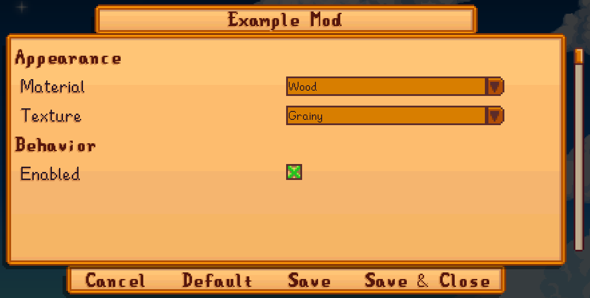
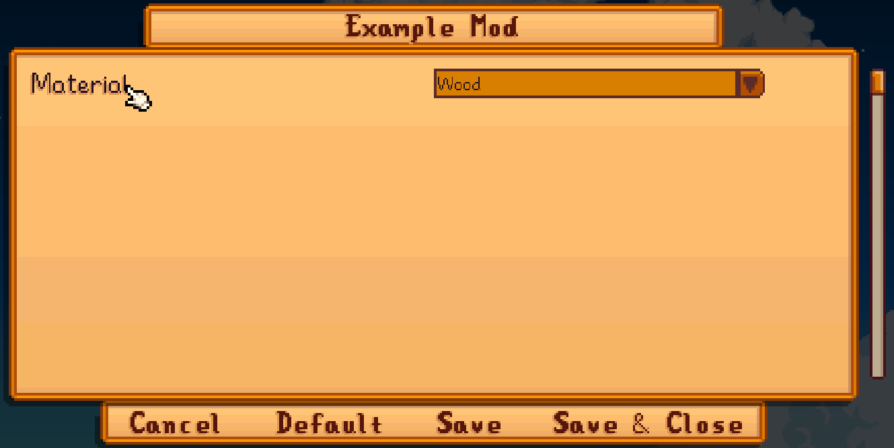
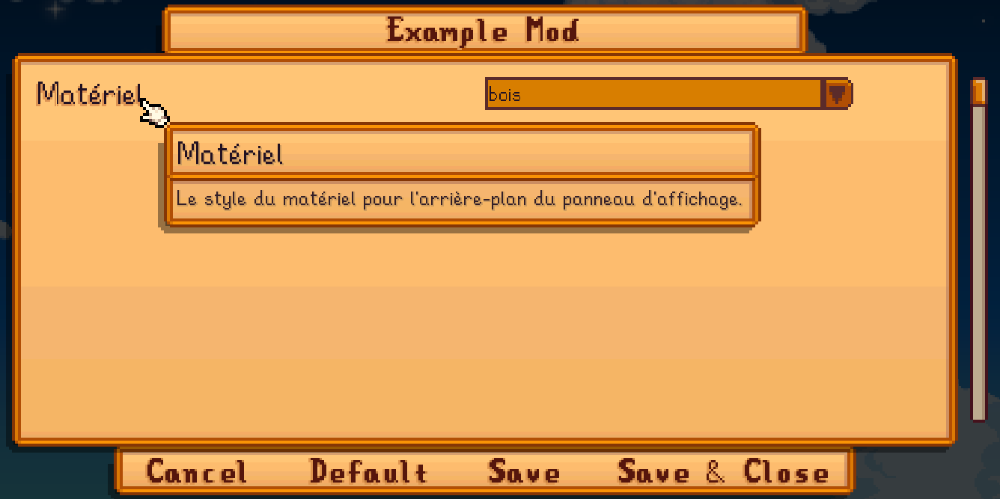

← [author guide](../author-guide.md)

The config feature lets you make dynamic changes in your content pack that depends on settings
selected by the player.

## Contents
* [Basic config](#basic-config)
  * [Overview](#overview)
  * [Define your config](#define-your-config)
  * [Examples](#examples)
* [Config UI](#config-ui)
  * [Display options](#display-options)
  * [Sections](#sections)
  * [Translations](#translations)
* [See also](#see-also)

## Basic config
## Overview
You can define your content pack's settings using the `ConfigSchema` field, then Content Patcher
will automatically add a `config.json` file and [in-game config UI](#config-ui) to let players edit
your options.

In your content pack code, you can then use config options as [tokens &
conditions](../author-guide.md#tokens) to make dynamic changes.

### Define your config
First you need to describe your config options for Content Patcher. You do that by adding a
`ConfigSchema` field (outside the `Changes` field which has your patches). Each config option has
a key used as the token name, and a data model containing these fields:

field               | meaning
------------------- | -------
`AllowValues`       | _(optional)_ The values the player can provide, as a comma-delimited string. If omitted, any value is allowed.<br />**Tip:** use `"true, false"` for a field that can be enabled or disabled, and Content Patcher will recognize it as a boolean (e.g. to represent as a checkbox in the [config UI](#config-ui)).
`AllowBlank`        | _(optional)_ Whether the field can be left blank. If false or omitted, blank fields will be replaced with the default value.
`AllowMultiple`     | _(optional)_ Whether the player can specify multiple comma-delimited values. Default false.
`Default`           | _(optional unless `AllowBlank` is false)_ The default values when the field is missing. Can contain multiple comma-delimited values if `AllowMultiple` is true. If omitted, blank fields are left blank.

Config names and fields are not case-sensitive.

### Examples
This `content.json` defines a `BillboardMaterial` config field and uses it to change which patch is
applied:

```js
{
   "Format": "2.0.0",
   "ConfigSchema": {
      "Material": {
         "AllowValues": "Wood, Metal",
         "Default": "Wood"
      }
   },
   "Changes": [
      // as a token
      {
         "Action": "Load",
         "Target": "LooseSprites/Billboard",
         "FromFile": "assets/material_{{Material}}.png"
      },

      // as a condition
      {
         "Action": "Load",
         "Target": "LooseSprites/Billboard",
         "FromFile": "assets/material_wood.png",
         "When": {
            "Material": "Wood"
         }
      }
   ]
}
```

When you run the game, a `config.json` file will appear automatically with text like this:

```js
{
  "Material": "Wood"
}
```

Players can edit that file to configure your content pack, or use the in-game
[config UI](#config-ui).

## Config UI
Content Patcher will automatically add an in-game UI to let players edit your settings, currently
using [Generic Mod Config Menu](https://www.nexusmods.com/stardewvalley/mods/5098). You can
optionally provide extra info to improve the config UI.

### Display options
There's two extra fields to customize how config UIs are rendered:

field         | meaning
------------- | -------
`Description` | _(optional)_ An explanation of the config option for the player, usually shown in the config UI as a tooltip.
`Section`     | _(optional)_ A section title to group related sections. See [_sections_](#sections) below.

### Sections
You can group your options into sections using the `Section` field. Options with no section are
always listed first, followed by sections in the order they first appeared in `ConfigSchema`.

For example, this adds two sections:

```js
{
    "Format": "2.0.0",
    "ConfigSchema": {
        // appearance section
        "Material": {
            "AllowValues": "Wood, Metal",
            "Default": "Wood",
            "Section": "Appearance"
        },
        "Texture": {
            "AllowValues": "Grainy, Smooth",
            "Default": "Grainy",
            "Section": "Appearance"
        },

        // behavior section
        "Enabled": {
            "AllowValues": "true, false",
            "Default": "true",
            "Section": "Behavior"
        }
    },
    "Changes": [ ]
}
```

Which would look something like this in-game:



### Translations
By default your config options are shown as-is in the config UI, with no display names or tooltips
or translations:



You can add [translation files](https://stardewvalleywiki.com/Modding:Translations) for your config
to have a more user-friendly UI. To do that, create an `i18n/default.json` for your default text.
For each field, add any combination of these translation keys:

key format                             | description
:------------------------------------- | :----------
`config.<name>.name`                   | The field name.
`config.<name>.description`            | The field description (usually shown as a tooltip).
`config.<name>.values.<value>`         | The display text for an `AllowValues` value when shown in a dropdown or checkbox list.
`config.section.<section>.name`        | The [section](#sections) name.
`config.section.<section>.description` | The [section](#sections) description (usually shown as a tooltip).

All translation keys are optional, and they're not case-sensitive.

For example, let's add some translations for the previous screenshot:

```js
// in i18n/default.json
{
    "config.Material.name": "Material",
    "config.Material.description": "The material style for the billboard background.",
    "config.Material.values.Wood": "wood",
    "config.Material.values.Metal": "metal"
}

// in i18n/fr.json
{
    "config.Material.name": "Matériel",
    "config.Material.description": "Le style du matériel pour l'arrière-plan du panneau d'affichage.",
    "config.Material.values.Wood": "bois",
    "config.Material.values.Metal": "métal"
}
```

And now the config UI would look something like this for a French player:



See [_translations_ on the wiki](https://stardewvalleywiki.com/Modding:Translations) for more info.

## See also
* [Author guide](../author-guide.md) for other actions and options
