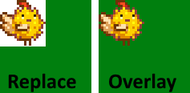

<<<<<<< HEAD
← [author guide](../author-guide.md)

A patch with **`"Action": "EditImage"`** changes part of an image loaded by the game. Any number of
content packs can edit the same asset. You can extend an image downwards by just patching past the
bottom (Content Patcher will expand the image to fit).

## Contents
* [Usage](#usage)
  * [Format](#format)
  * [Examples](#examples)
* [See also](#see-also)

## Usage
### Format
An `EditImage` patch consists of a model under `Changes` (see examples below) with these fields:

<dl>
<dt>Required fields:</dt>
<dd>

field     | purpose
--------- | -------
`Action`  | The kind of change to make. Set to `EditImage` for this action type.
`Target`  | The [game asset name](../author-guide.md#what-is-an-asset) to replace (or multiple comma-delimited asset names), like `Portraits/Abigail`. This field supports [tokens](../author-guide.md#tokens), and capitalisation doesn't matter.
`FromFile` | The relative path to the image in your content pack folder to patch into the target (like `assets/dinosaur.png`), or multiple comma-delimited paths. This can be a `.png` or `.xnb` file. This field supports [tokens](../author-guide.md#tokens) and capitalisation doesn't matter.

</dd>
<dt>Optional fields:</dt>
<dd>

field       | purpose
----------- | -------
`FromArea`  | <p>The part of the source image to copy. Defaults to the whole source image.</p><p>This is specified as an object with the X and Y pixel coordinates of the top-left corner, and the pixel width and height of the area. Its fields may contain tokens.</p>
`ToArea`    | <p>The part of the target image to replace. Defaults to the same size as `FromArea`, positioned at the top-left corner of the spritesheet.</p><p>This is specified as an object with the X and Y pixel coordinates of the top-left corner, and the pixel width and height of the area. Its fields may contain tokens.</p><p>If you specify an area past the bottom or right edges of the image, the image will be resized automatically to fit.</p>
`PatchMode` | <p>How to apply `FromArea` to `ToArea`. Defaults to `Replace`.</p> Possible values: <ul><li><code>Replace</code>: replace every pixel in the target area with your source image. If the source image has transparent pixels, the target image will become transparent there.</li><li><code>Overlay</code>: draw your source image over the target area. If the source image has transparent or semi-transparent pixels, the target image will 'show through' those pixels. Opaque pixels will replace the target pixels.</li></ul>For example, let's say your source image is a pufferchick with a transparent background, and the target image is a solid green square. Here's how they'll be combined with different `PatchMode` values:<br />
`When`      | _(optional)_ Only apply the patch if the given [conditions](../author-guide.md#conditions) match.
`LogName`   | _(optional)_ A name for this patch to show in log messages. This can be useful for understanding errors. If omitted, it defaults to a name like `EditImage Animals/Dinosaur`.
`Update`    | _(optional)_ How often the patch fields should be updated for token changes. See [update rate](../author-guide.md#update-rate) for more info.
`LocalTokens` | _(Optional)_ A set of [local tokens](../author-guide/tokens.md#local-tokens) which can be used within this patch's field.

</dd>
<dt>Advanced fields:</dt>
=======
← [模组作者指南](../author-guide.md)

一个含有 **`"Action": "EditImage"`** 的补丁会更改游戏已加载的图像的一部分。任意数量的内容包都可以编辑同一素材。你可以用补丁向下延伸图像（Content Patcher将扩展图像以适应新图像）。

## 目录<a name="contents"></a>
* [用法](#usage)
  * [格式](#format)
  * [示例](#examples)
* [参见](#see-also)

## 使用<a name="usage"></a>
### 格式<a name="format"></a>

一个`EditImage`补丁是`Changes`下含有此字段的模型 ([下文有例子](#examples))

<dl>
<dt>必填字段：</dt>
<dd>

字段       | 用途
--------- | -------
`Action`  | 要进行的更改类型。此操作类型设置为`EditImage`。
`Target`  | 需编辑的[游戏素材名](../author-guide.md#what-is-an-asset)（或多个由逗号分隔的素材名），比如`Portraits/Abigail`。该字段支持[tokens](../author-guide.md#tokens)，不区分大小写。
`FromFile` | 内容包文件夹中要修补到目标中的图像的相对路径（例如`assets/dinosaur.png`），或多个逗号分隔的路径。这可以是`.png`或`.xnb`文件。该字段支持[tokens](../author-guide.md#tokens)，不区分大小写。

</dd>
<dt>可选字段：</dt>
<dd>

字段         | 用途
----------- | -------
`FromArea`  | <p>源图片中需拷贝到目标的部分，默认整个源图片</p><p>此字段是一个对象，含有左上角点的X和Y像素坐标，和区域的像素大小，长（Width）与高（Height）。该对象的字段支持[tokens](../author-guide.md#tokens)。</p>
`ToArea`    | <p>目标图片中要替换的部分。默认大小与 `FromArea` 相同，位于贴图的左上角。</p><p>此字段是一个含有左上角点的X和Y像素坐标区域的长（Width）与高（Height）的对象。该对象的字段支持[tokens](../author-guide.md#tokens)。</p><p>如果你指定的区域超出了图像的底部，Content Patcher将自动调整图像大小以适应新图像。</p>
`PatchMode` | <p>如何将 `FromArea` 应用于 `ToArea`。默认为 `Replace`。</p> 可使用的值: <ul><li><code>Replace</code>: 用源图像替换目标区域中的每个像素。如果源图像有透明像素，则目标图像将在那里变为透明。</li><li><code>Overlay</code>: 在目标区域上绘制源图像。如果源图像有透明或半透明像素，则目标图像将“显示”这些像素。不透明像素将替换目标像素。</li></ul>例如，假设你的源图像是具有透明背景的河豚，而目标图像是实心绿色正方形。 以下是它们在不同`PatchMode`下的组合：<br />
`When`      | _(可选)_ 使此补丁只有在指定[条件](../author-guide.md#conditions)下生效.
`LogName`   | _(可选)_ 此补丁在日志里显示的名字，有助于理解报错。默认为类似`EditImage Animals/Dinosaur`的名字。
`Update`    | _(可选)_ 此补丁字条的更新频率，详见[update rate](../author-guide.md#update-rate)。
`LocalTokens` | _(可选)_ 一组仅在此补丁中生效的[本地token](../author-guide/tokens.md#local-tokens)。

</dd>
<dt>进阶字段：</dt>
>>>>>>> c036414e8861adc25a9c6a2a7c1fac76501d9f05
<dd>

<table>
  <tr>
<<<<<<< HEAD
    <td>field</td>
    <td>purpose</td>
=======
    <td>字段</td>
    <td>用途</td>
>>>>>>> c036414e8861adc25a9c6a2a7c1fac76501d9f05
  </tr>
  <tr>
  <td><code>Priority</code></td>
  <td>

<<<<<<< HEAD
_(optional)_ When multiple patches or mods edit the same asset, the order in which they should be
applied. The possible values are `Early`, `Default`, and `Late`. The default value is `Default`.

The patches for an asset (across all mods) are applied in this order:

1. by earliest to latest priority;
2. then by mod load order (e.g. based on dependencies);
3. then by the order the patches are listed in your `content.json`.

If you need a more specific order, you can use a simple offset like `"Default + 2"` or `"Late - 10"`.
The default levels are -1000 (early), 0 (default), and 1000 (late).

This field does _not_ support tokens, and capitalization doesn't matter.

> [!TIP]  
> Priorities can make your changes harder to follow and troubleshoot. Suggested best practices:
> * Consider only using very general priorities when possible (like `Late` for a cosmetic overlay
>   meant to be applied over base edits from all mods).
> * There's no need to set priorities relative to _your own_ patches, since you can just list them
>   in the order they should be applied.
=======
 _（可选）_ 当多个补丁编辑同一数据素材时，此字段控制它们应用的顺序。可用的值有`Early`（更早），`Default`（默认），还有`Late`（更晚）。默认值为`Default`。

补丁（包括所有模组）按以下顺序生效：

1. 优先级从早到晚；
2. 按照模组加载顺序（基于依赖关系）；
3. 按照补丁在`content.json`中列出的顺序。

如果需要更具体的顺序，可以使用简单的偏移量，如`"Default + 2"`或者`"Late - 10"`。
默认值为-1000 （`Early`），0（`Default`）和1000（`Late`）。

此字段 _不_ 支持tokens，不区分大小写。

> [!TIP]
> 优先级会让你的更改难以排除故障。推荐做法：
> * 如果可以的话，只使用上述无偏移的优先级（比如外观覆盖设为`Late`）
> * 在 _你自己_ 的补丁里不需要用优先级，因为你可以自己在content.json排列好补丁应用的顺序。
>>>>>>> c036414e8861adc25a9c6a2a7c1fac76501d9f05

  </tr>
  <tr>
  <td><code>TargetLocale</code></td>
  <td>

<<<<<<< HEAD
_(optional)_ The locale code to match in the asset name. For example, setting `"TargetLocale": "fr-FR"`
will only edit the French localized form of the asset (e.g. `Animals/Dinosaur.fr-FR`). This can be
an empty string to only edit the base unlocalized asset.

If omitted, it's applied to all localized and unlocalized variants of the asset.
=======
 _（可选）_ 素材名称中要匹配的地区代码，比如设置`"TargetLocale": "fr-FR"`只编辑法语形式的素材（比如`Data/Achievements.fr-FR`）。可以为空，只有只编辑没有地域区分的基本素材。

如果省略，它将应用于所有素材，不管有没有本地化。
>>>>>>> c036414e8861adc25a9c6a2a7c1fac76501d9f05

</td>
</table>
</dd>
</dl>

<<<<<<< HEAD
### Examples
This changes the in-game sprite for one item:
```js
{
   "Format": "2.5.0",
=======
### 示例<a name="examples"></a>

这个例子改变某一物品的图标

```js
{
   "Format": "2.6.0",
>>>>>>> c036414e8861adc25a9c6a2a7c1fac76501d9f05
   "Changes": [
      {
         "Action": "EditImage",
         "Target": "Maps/springobjects",
         "FromFile": "assets/fish-object.png",
<<<<<<< HEAD
         "FromArea": { "X": 0, "Y": 0, "Width": 16, "Height": 16 }, // optional, defaults to entire FromFile
         "ToArea": { "X": 256, "Y": 96, "Width": 16, "Height": 16 } // optional, defaults to source size from top-left
=======
         "FromArea": { "X": 0, "Y": 0, "Width": 16, "Height": 16 }, // 可选，默认整个图片
         "ToArea": { "X": 256, "Y": 96, "Width": 16, "Height": 16 } // 可选，默认与FromArea大小相同
>>>>>>> c036414e8861adc25a9c6a2a7c1fac76501d9f05
      },
   ]
}
```

<<<<<<< HEAD
## See also
* [Author guide](../author-guide.md) for other actions and options
=======
## 参见<a name="see-also"></a>
* 其他操作和选项请参考[模组作者指南](../author-guide.md)
>>>>>>> c036414e8861adc25a9c6a2a7c1fac76501d9f05
