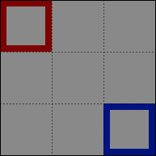

<<<<<<< HEAD
← [author guide](../author-guide.md)

A patch with **`"Action": "EditMap"`** changes part of a map loaded by the game. Any number of
content packs can edit the same asset. You can extend a map downwards or rightward by just patching
past the edge (Content Patcher will expand the map to fit).

## Contents
* [Introduction](#introduction)
  * [What is a map?](#what-is-a-map)
* [Usage](#usage)
  * [Overview](#overview)
  * [Common fields](#common-fields)
  * [Overlay a map](#overlay-a-map)
  * [Edit map properties](#edit-map-properties)
  * [Edit map tiles](#edit-map-tiles)
* [Known limitations](#known-limitations)
* [See also](#see-also)

## Introduction
### What is a map?
A _map_ asset describes the layout of the in-game terrain (like water, cliffs, and land), terrain
features (like bushes), buildings, paths, and triggers for a particular area. When you reach the
edge of an area or enter a building, and the screen fades to black during the transition, you're
moving between maps.

**See [Modding:Maps](https://stardewvalleywiki.com/Modding:Maps) on the wiki** for more information,
from the basic concepts to more advanced map features.

## Usage
### Overview
Each `EditMap` patch can make three types of change to a map: overlay a map, change map properties,
or change map tiles.

These are documented in separate sections below since they're distinct, but you can combine them
in the same patch. In that case the fields are applied in this order: `FromFile`, `MapTiles`,
`MapProperties`, `AddWarps`, and `TextOperations`.

### Common fields
An `EditMap` patch consists of a model under `Changes` (see examples below). These fields are
always used regardless of the edit type:

<dl>
<dt>Required fields:</dt>
<dd>

field     | purpose
--------- | -------
`Action`  | The kind of change to make. Set to `EditMap` for this action type.
`Target`  | The [game asset name](../author-guide.md#what-is-an-asset) to replace (or multiple comma-delimited asset names), like `Maps/Town`. This field supports [tokens](../author-guide.md#tokens), and capitalisation doesn't matter.

</dd>
<dt>Optional fields:</dt>
<dd>

field     | purpose
--------- | -------
`When`    | _(optional)_ Only apply the patch if the given [conditions](../author-guide.md#conditions) match.
`LogName` | _(optional)_ A name for this patch to show in log messages. This can be useful for understanding errors. If omitted, it defaults to a name like `EditMap Maps/Town`.
`Update`  | _(optional)_ How often the patch fields should be updated for token changes. See [update rate](../author-guide.md#update-rate) for more info.
`LocalTokens` | _(Optional)_ A set of [local tokens](../author-guide/tokens.md#local-tokens) which can be used within this patch's field.

</dd>
<dt>Advanced fields:</dt>
=======
← [模组作者指南](../author-guide.md)

一个含有 **`"Action": "EditMap"`** 的补丁会更改游戏已加载的地图的一部分。任意数量的内容包都可以编辑同一素材。你可以用补丁向下和向右延伸地图（Content Patcher将扩展地图以适应新地图）。

## Contents
* [介绍](#introduction)
  * [什么是地图？](#what-is-a-map)
* [用法](#usage)
  * [概述](#overview)
  * [公共字段](#common-fields)
  * [地图叠加](#overlay-a-map)
  * [编辑地图属性](#edit-map-properties)
  * [编辑地图图块](#edit-map-tiles)
* [已知限制](#known-limitations)
* [参见](#see-also)

## 介绍<a name="usage"></a>
### 什么是地图？<a name="what-is-a-map"></a>
一个地图素材描述游戏内某个区域的的地形（水，悬崖，地面），地形特征（灌木），建筑，路径，和触发点。当屏幕在你到达某个区域的边缘或进入建筑物时变黑时，你正在从一个地图移动到另一个地图。

**维基上的[模组:地图](https://zh.stardewvalleywiki.com/%E6%A8%A1%E7%BB%84:%E5%9C%B0%E5%9B%BE)**有更详细的介绍地图的入门和进阶概念。

## 用法<a name="usage"></a>
### 概述<a name="overview"></a>
每一个`EditMap`补丁可以对某一地图进行三种类型的更改：叠加地图、更改地图属性或更改地图图块。

这三种类更改型的效果大相径庭，所以分段描述，但是它们可以同时出现在一个补丁。
一个补丁补丁中的字段以此顺序生效：`FromFile`，`MapTiles`，`MapProperties`，`AddWarps`，和`TextOperations`.

### 公共字段<a name="common-fields"></a>
一个`EditImage`补丁是`Changes`下含有此字段的模型 (见例子)。所有更改类型都需要这些字段。

<dl>
<dt>必填字段：</dt>
<dd>

字段       | 用途
--------- | -------
`Action`  | 要进行的更改类型。此操作类型设置为`EditMap`。
`Target`  | 需编辑的[游戏素材名](../author-guide.md#what-is-an-asset)（或多个由逗号分隔的素材名），比如`Maps/Town`。该字段支持[tokens](../author-guide.md#tokens)，不区分大小写。

</dd>
<dt>可选字段：</dt>
<dd>

字段       | 用途
--------- | -------
`When`      | _(可选)_ 使此补丁只有在指定[条件](../author-guide.md#conditions)下生效.
`LogName`   | _(可选)_ 此补丁在日志里显示的名字，有助于理解报错。默认为类似`EditImage Maps/Town`的名字。
`Update`    | _(可选)_ 此补丁字条的更新频率，详见[update rate](../author-guide.md#update-rate)。
`LocalTokens` | _(可选)_ 一组仅在此补丁中生效的[本地token](../author-guide/tokens.md#local-tokens)。


</dd>
<dt>进阶字段：</dt>
>>>>>>> c036414e8861adc25a9c6a2a7c1fac76501d9f05
<dd>

<table>
  <tr>
<<<<<<< HEAD
    <td>field</td>
    <td>purpose</td>
=======
    <td>字段</td>
    <td>用途</td>
>>>>>>> c036414e8861adc25a9c6a2a7c1fac76501d9f05
  </tr>
  <tr>
  <td><code>Priority</code></td>
  <td>

<<<<<<< HEAD
_(optional)_ When multiple patches or mods edit the same asset, the order in which they should be
applied. The possible values are `Early`, `Default`, and `Late`. The default value is `Default`.

The patches for an asset (across all mods) are applied in this order:

1. by earliest to latest priority;
2. then by mod load order (e.g. based on dependencies);
3. then by the order the patches are listed in your `content.json`.

If you need a more specific order, you can use a simple offset like `"Default + 2"` or `"Late - 10"`.
The default levels are -1000 (early), 0 (default), and 1000 (late).

This field does _not_ support tokens, and capitalization doesn't matter.

> [!TIP]  
> Priorities can make your changes harder to follow and troubleshoot. Suggested best practices:
> * Consider only using very general priorities when possible (like `Late` for a cosmetic overlay
>   meant to be applied over base edits from all mods).
> * There's no need to set priorities relative to _your own_ patches, since you can just list them
>   in the order they should be applied.
=======
 _（可选）_ 当多个补丁编辑同一数据素材时，此字段控制它们应用的顺序。可用的值有`Early`（更早），`Default`（默认），还有`Late`（更晚）。默认值为`Default`。

补丁（包括所有模组）按以下顺序生效：

1. 优先级从早到晚；
2. 按照模组加载顺序（基于依赖关系）；
3. 按照补丁在`content.json`中列出的顺序。

如果需要更具体的顺序，可以使用简单的偏移量，如`"Default + 2"`或者`"Late - 10"`。
默认值为-1000 （`Early`），0（`Default`）和1000（`Late`）。

此字段 _不_ 支持tokens，不区分大小写。

> [!TIP]
> 优先级会让你的更改难以排除故障。推荐做法：
> * 如果可以的话，只使用上述无偏移的优先级（比如外观覆盖设为`Late`）
> * 在 _你自己_ 的补丁里不需要用优先级，因为你可以自己在content.json排列好补丁应用的顺序。
>>>>>>> c036414e8861adc25a9c6a2a7c1fac76501d9f05

  </tr>
  <tr>
  <td><code>TargetLocale</code></td>
  <td>

<<<<<<< HEAD
_(optional)_ The locale code to match in the asset name. For example, setting `"TargetLocale": "fr-FR"`
will only edit the French localized form of the asset (e.g. `Maps/Town.fr-FR`). This can be
an empty string to only edit the base unlocalized asset.

If omitted, it's applied to all localized and unlocalized variants of the asset.
=======
 _（可选）_ 素材名称中要匹配的地区代码，比如设置`"TargetLocale": "fr-FR"`只编辑法语形式的素材（比如`Data/Achievements.fr-FR`）。可以为空，只有只编辑没有地域区分的基本素材。

如果省略，它将应用于所有素材，不管有没有本地化。
>>>>>>> c036414e8861adc25a9c6a2a7c1fac76501d9f05

</td>
</table>
</dd>
</dl>

<<<<<<< HEAD
You can then add the fields from one or more sections below.

### Overlay a map
A 'map overlay' copies tiles, properties, and tilesheets from a source map into the target.
Matching layers in the target area will be fully overwritten with the source area.

The patch fields for this operation are:

<table>
<tr>
<th>field</th>
<th>purpose</th>
=======
可选以下某一或多个段落的字段。

### 地图叠加<a name="overlay-a-map"></a>

一个‘地图叠加'型更改将图块，属性，和图块表从源地图拷贝到目标地图。目标区域下对应的图层将被源地图完全覆盖。

此补丁的字段为：

<table>
<tr>
<th>字段</th>
<th>用途</th>
>>>>>>> c036414e8861adc25a9c6a2a7c1fac76501d9f05
</tr>
<tr>
<td>&nbsp;</td>
<td>

<<<<<<< HEAD
See _[common fields](#common-fields)_ above.
=======
详见以上的_[公共字段](#common-fields)_
>>>>>>> c036414e8861adc25a9c6a2a7c1fac76501d9f05

</td>
</tr>
<tr>
<td>

`FromFile`

</td>
<td>

<<<<<<< HEAD
The relative path to the map in your content pack folder from which to copy (like `assets/town.tmx`),
or multiple comma-delimited paths. This can be a `.tbin`, `.tmx`, or `.xnb` file. This field
supports [tokens](../author-guide.md#tokens) and capitalisation doesn't matter.

Content Patcher will handle tilesheets referenced by the `FromFile` map for you:
* If a tilesheet isn't referenced by the target map, Content Patcher will add it for you (with a
  `z_` ID prefix to avoid conflicts with hardcoded game logic). If the source map has a custom
  version of a tilesheet that's already referenced, it'll be added as a separate tilesheet only
  used by your tiles.
* If you include the tilesheet file in your mod folder, Content Patcher will use that one
  automatically; otherwise it will be loaded from the game's `Content/Maps` folder.
=======
内容包文件夹中要修补到目标中的图像的相对路径（例如`assets/town.tmx`），或多个逗号分隔的路径。这可以是`.tbin`，`.tmx`，或`.xnb`文件。该字段支持[tokens](../author-guide.md#tokens)，不区分大小写。

Content Patcher会如下处理`FromFile`地图内引用的图块表：
* 若图块表没有被目标地图引用，Content Patcher会帮你添加此图块（并自动添加`z_` ID 前缀，以避免与硬编码的游戏逻辑冲突）。如果源地图具有已引用的图块表的自定义版本，则它将被添加为仅供你的图块使用的单独图块表。
* 如果你模组文件夹里包含你的图块表，Content Patcher会自动使用它；否则它将从游戏的`Content/Maps`文件夹中加载。
>>>>>>> c036414e8861adc25a9c6a2a7c1fac76501d9f05

</td>
</tr>
<tr>
<td>

`FromArea`

</td>
<td>

<<<<<<< HEAD
_(Optional)_ The part of the source map to copy. Defaults to the whole source map.

This is specified as an object with the X and Y tile coordinates of the top-left corner, and the
tile width and height of the area. Its fields may contain tokens.
=======
_（可选）_源地图中需拷贝到目标的部分，默认整个源地图

此字段是一个含有左上角点的X和Y像素坐标区域的长（`Width`）与高（`Height`）的对象。该对象的字段支持[tokens](../author-guide.md#tokens)。
>>>>>>> c036414e8861adc25a9c6a2a7c1fac76501d9f05

</td>
</tr>
<tr>
<td>

`ToArea`

</td>
<td>

<<<<<<< HEAD
_(Optional)_ The part of the target map to replace. Defaults to the same size as `FromArea`,
positioned at the top-left corner of the map.

This is specified as an object with the X and Y tile coordinates of the top-left corner, and the
tile width and height of the area. Its fields may contain tokens.

If you specify an area past the bottom or right edges of the map, the map will be resized
automatically to fit.
=======
_（可选）_ 目标地图中要替换的部分。默认大小与 `FromArea` 相同，位于地图的左上角。

此字段是一个含有左上角点的X和Y像素坐标区域的长（Width）与高（Height）的对象。该对象的字段支持[tokens](../author-guide.md#tokens)。

果你指定的区域超出了地图的底部或右部，Content Patcher将自动调整地图大小以适应新地图。
>>>>>>> c036414e8861adc25a9c6a2a7c1fac76501d9f05

</td>
</tr>
<tr>
<td>

`PatchMode`

</td>
<td>

<<<<<<< HEAD
_(Optional)_ How to merge tiles into the target map. The default is `ReplaceByLayer`.

For example, assume a mostly empty source map with two layers: `Back` (red) and `Buildings` (blue):



Here's how that would be merged with each patch mode (black areas are the empty void under the map):

* **`Overlay`**  
  Only matching tiles are replaced. The red tile replaces the ground on the `Back` layer, but the
  ground is visible under the blue `Buildings` tile.  
  

* **`ReplaceByLayer`** _(default)_  
  All tiles are replaced, but only on layers that exist in the source map.  
  

* **`Replace`**  
  All tiles are replaced.  
=======
_（可选）_ 何将 `FromArea` 应用于 `ToArea`。默认为 `ReplaceByLayer`。

例如，假设你有一个大部分为空的源地图，包含两个图层：`Back`（红）和`Buildings`（蓝）：


以下是它们在不同`PatchMode`下的组合（黑色区域代表地图背后的虚空，游戏内显示为黑）：

* **`Overlay`**  
  只替换对应的图块。`Back`图层的红图块代替了`Back`图层的地面，而`Buildings`图层的蓝图块没有替换任何图块，地面依旧可见。
  

* **`ReplaceByLayer`** _(default)_  
  替换所有图块，限于存在于源地图的图层。
  

* **`Replace`**  
  替换所有图块。
>>>>>>> c036414e8861adc25a9c6a2a7c1fac76501d9f05
  

</td>
</tr>
</table>

<<<<<<< HEAD
For example, this replaces the town square with the one in another map:
```js
{
    "Format": "2.5.0",
=======
例如，将城镇广场替换为另一个地图里的版本：
```js
{
    "Format": "2.6.0",
>>>>>>> c036414e8861adc25a9c6a2a7c1fac76501d9f05
    "Changes": [
        {
            "Action": "EditMap",
            "Target": "Maps/Town",
            "FromFile": "assets/town.tmx",
            "FromArea": { "X": 22, "Y": 61, "Width": 16, "Height": 13 },
            "ToArea": { "X": 22, "Y": 61, "Width": 16, "Height": 13 }
        },
    ]
}
```

<<<<<<< HEAD
### Edit map properties
The `MapProperties` field lets you add, replace, or remove map-level properties.

<table>
<tr>
<th>field</th>
<th>purpose</th>
=======
### 编辑地图属性<a name="edit-map-properties"></a>
`MapProperties`字段用于新增，替换，或移除地图属性。

<table>
<tr>
<th>字段</th>
<th>用途</th>
>>>>>>> c036414e8861adc25a9c6a2a7c1fac76501d9f05
</tr>
<tr>
<td>&nbsp;</td>
<td>

<<<<<<< HEAD
See _[common fields](#common-fields)_ above.
=======
详见以上的_[公共字段](#common-fields)_
>>>>>>> c036414e8861adc25a9c6a2a7c1fac76501d9f05

</td>
</tr>

<tr>
<td>

`MapProperties`

</td>
<td>

<<<<<<< HEAD
The map properties (not tile properties) to add, replace, or delete. To add an property, just
specify a key that doesn't exist; to delete an entry, set the value to `null` (like `"some key":
null`). This field supports [tokens](../author-guide.md#tokens) in property keys and
values.
=======
需新增，替换，或移除的地图属性（和图块属性不一样）。要添加属性，只需指定不存在的键；要删除条目，将值设置为 `null`（如 `"some key": null`）。此字段的属性键和值均支持[tokens](../author-guide.md#tokens)。
>>>>>>> c036414e8861adc25a9c6a2a7c1fac76501d9f05

</td>
</tr>

<tr>
<td>

<<<<<<< HEAD
=======
`AddNpcWarps`  
>>>>>>> c036414e8861adc25a9c6a2a7c1fac76501d9f05
`AddWarps`

</td>
<td>

<<<<<<< HEAD
Add warps to the map's `Warp` property, creating it if needed. This field supports
[tokens](../author-guide.md#tokens). If there are multiple warps from the same tile, the ones added
later win.
=======
在[`NPCWarp`或`Warp`地图属性](https://stardewvalleywiki.com/Modding:Maps#Warps_.26_map_positions)里添加新的传送（Warp），有需要时创建此条目。此字段支持[tokens](../author-guide.md#tokens)。如果多个传送出现在同一图块上，最晚添加的传送将会生效。
>>>>>>> c036414e8861adc25a9c6a2a7c1fac76501d9f05

</td>
</tr>

<tr>
<td>

`TextOperations`

</td>
<td>

<<<<<<< HEAD
The `TextOperations` field lets you change the value for an existing map property (see _[text
operations](../author-guide.md#text-operations)_ for more info).

The only valid path format is `["MapProperties", "PropertyName"]` where `PropertyName` is the
name of the map property to change.
=======
`TextOperations`字段可以编辑一个已存在的地图属性（详见[文本操作](../author-guide.md#text-operations)

此处`Target`只允许`["MapProperties", "PropertyName"]`，`PropertyName`为需要编辑的地图属性。
>>>>>>> c036414e8861adc25a9c6a2a7c1fac76501d9f05

</td>
</tr>
</table>

<<<<<<< HEAD
For example, this changes the `Outdoors` tile for the farm cave and adds a warp (see
[map documentation](https://stardewvalleywiki.com/Modding:Maps) for the warp syntax):
```js
{
    "Format": "2.5.0",
=======
例如，此补丁更改农场洞穴的`Outdoors`地图属性，并增加一个传送（传送格式详见维基上的[地图说明文档](https://zh.stardewvalleywiki.com/%E6%A8%A1%E7%BB%84:%E5%9C%B0%E5%9B%BE)）
```js
{
    "Format": "2.6.0",
>>>>>>> c036414e8861adc25a9c6a2a7c1fac76501d9f05
    "Changes": [
        {
            "Action": "EditMap",
            "Target": "Maps/FarmCave",
            "MapProperties": {
                "Outdoors": "T"
            },
            "AddWarps": [
                "10 10 Town 0 30"
            ]
        },
    ]
}
```

<<<<<<< HEAD
### Edit map tiles
The `MapTiles` field lets you add, edit, or remove the map's individual tiles and tile properties.

<table>
<tr>
<th>field</th>
<th>purpose</th>
=======
### 编辑地图图块<a name="edit-map-tiles"></a>
`MapTiles`用于新增，编辑，或移除图块和图块属性。

<table>
<tr>
<th>字段</th>
<th>用途</th>
>>>>>>> c036414e8861adc25a9c6a2a7c1fac76501d9f05
</tr>
<tr>
<td>&nbsp;</td>
<td>

<<<<<<< HEAD
See _[common fields](#common-fields)_ above.
=======
详见以上的_[公共字段](#common-fields)_
>>>>>>> c036414e8861adc25a9c6a2a7c1fac76501d9f05

</td>
</tr>

<tr>
<td>

`MapTiles`

</td>
<td>

<<<<<<< HEAD
The tiles to add, edit, or delete. All of the subfields below support [tokens](../author-guide.md#tokens).

This consists of an array of tiles (see examples below) with these properties:

field | purpose
----- | -------
`Layer` | (Required.) The [map layer](https://stardewvalleywiki.com/Modding:Maps#Basic_concepts) to change.
`Position` | (Required.) The [tile coordinates](https://stardewvalleywiki.com/Modding:Maps#Tile_coordinates) to change. You can use [Debug Mode](https://www.nexusmods.com/stardewvalley/mods/679) to see tile coordinates in-game.
`SetTilesheet` | (Required when adding a tile, else optional.) Sets the tilesheet ID for the tile index.
`SetIndex` | (Required when adding a tile, else optional.) Sets the tile index in the tilesheet.
`SetProperties` | The properties to set or remove. This is merged into the existing tile properties, if any. To remove a property, set its value to `null` (not `"null"` with quotes!).
`Remove` | (Optional, default false.) `true` to remove the current tile and all its properties on that layer. If combined with the other fields, a new tile is created from the other fields as if the tile didn't previously exist.
=======
需新增，编辑，或移除的图块。所有子字段支持[tokens](../author-guide.md#tokens)。

此字段是一个含有多个模型的列表。每一个模型对应一个图块，并含有一下字段。

字段 | 用途
----- | -------
`Layer` | (必填) 需更改的图块所在的[地图图层](https://zh.stardewvalleywiki.com/%E6%A8%A1%E7%BB%84:%E5%9C%B0%E5%9B%BE#.E5.9F.BA.E6.9C.AC.E6.A6.82.E5.BF.B5)。
`Position` | (必填) 需更改的图块所在的[图块坐标](https://zh.stardewvalleywiki.com/%E6%A8%A1%E7%BB%84:%E5%9C%B0%E5%9B%BE#.E5.9C.B0.E5.9D.97.E5.9D.90.E6.A0.87)。你可以用[Debug Mode模组](https://www.nexusmods.com/stardewvalley/mods/679)在游戏内查看坐标。
`SetTilesheet` | (新增图块时必填，已有图块时可选) 指定此图块的图块表ID。
`SetIndex` | (新增图块时必填，已有图块时可选) 指定此图块在图块表里的索引号。
`SetProperties` | 需新增或移除的图块属性，会和并到任何已存在的图块属性。需删除属性的话，将值设置为`null`(不能用带有双引号的`"null"`！).
`Remove` | (可选，默认`false`) 设置为`true`删除此图块和图块属性。如果和别的字段同时使用，原有图块会先被删除，然后一个新的图块会被创建。
>>>>>>> c036414e8861adc25a9c6a2a7c1fac76501d9f05

</td>
</tr>
</table>

<<<<<<< HEAD
For example, this extends the farm path one extra tile to the shipping bin:
```js
{
    "Format": "2.5.0",
=======
例如，此补丁延长农场里通向出货箱的路径，新增一个图块。
```js
{
    "Format": "2.6.0",
>>>>>>> c036414e8861adc25a9c6a2a7c1fac76501d9f05
    "Changes": [
        {
            "Action": "EditMap",
            "Target": "Maps/Farm",
            "MapTiles": [
                {
                    "Position": { "X": 72, "Y": 15 },
                    "Layer": "Back",
                    "SetIndex": "622"
                }
            ]
        },
    ]
}
```

<<<<<<< HEAD
You can use tokens in all of the fields. For example, this adds a warp in front of the shipping bin
that leads to a different location each day:
```js
{
    "Format": "2.5.0",
=======
`MapTiles`的所有子字段都支持[tokens](../author-guide.md#tokens)。例如，此补丁在出货箱前新增一个每天都会随机选择目的地的传送。
```js
{
    "Format": "2.6.0",
>>>>>>> c036414e8861adc25a9c6a2a7c1fac76501d9f05
    "Changes": [
        {
            "Action": "EditMap",
            "Target": "Maps/Farm",
            "MapTiles": [
                {
                    "Position": { "X": 72, "Y": 15 },
                    "Layer": "Back",
                    "SetProperties": {
                        "TouchAction": "MagicWarp {{Random:BusStop, Farm, Town, Mountain}} 10 11"
                    }
                }
            ]
        },
    ]
}
```

<<<<<<< HEAD
## Known limitations
* Patching the farmhouse's `Back` layer may fail or cause strange effects, due to the game's floor
  decorating logic. This is a limitation in the game itself, not Content Patcher.

## See also
* [Author guide](../author-guide.md) for other actions and options
=======
## 已知限制<a name="known-limitations"></a>
* 更改农舍的`Back`图层有可能失败或导致奇怪的效果。这是游戏本身的限制，不是Content Patcher的限制。

## 参见<a name="see-also"></a>
* 其他操作和选项请参考[模组作者指南](../author-guide.md)
>>>>>>> c036414e8861adc25a9c6a2a7c1fac76501d9f05
