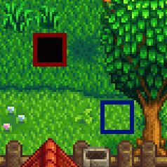
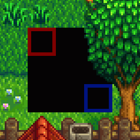
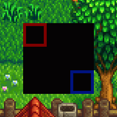

← [模组作者指南](../author-guide.md)

一个含有 **`"Action": "EditMap"`** 的补丁会更改游戏已加载的地图的一部分。任意数量的内容包都可以编辑同一素材。你可以用补丁向下和向右延伸地图（Content Patcher将扩展地图以适应新地图）。

**🌐 其他语言： [en (English)](../../author-guide/action-editmap.md)。**

## 目录
* [介绍](#introduction)
  * [什么是地图？](#what-is-a-map)
* [用法](#usage)
  * [概述](#overview)
  * [公共字段](#common-fields)
  * [地图叠加](#overlay-a-map)
  * [编辑地图属性](#edit-map-properties)
  * [编辑地图图块](#edit-map-tiles)
* [已知限制](#known-limitations)
* [参见](#see-also)

## 介绍<a name="introduction"></a>
### 什么是地图？<a name="what-is-a-map"></a>
一个地图素材描述游戏内某个区域的的地形（水，悬崖，地面），地形特征（灌木），建筑，路径，和触发点。当屏幕在你到达某个区域的边缘或进入建筑物时变黑时，你正在从一个地图移动到另一个地图。

**维基上的[模组:地图](https://zh.stardewvalleywiki.com/模组:地图)**有更详细的介绍地图的入门和进阶概念。

## 用法<a name="usage"></a>
### 概述<a name="overview"></a>
每一个`EditMap`补丁可以对某一地图进行三种类型的更改：叠加地图、更改地图属性或更改地图图块。

这三种类更改型的效果大相径庭，所以分段描述，但是它们可以同时出现在一个补丁。
一个补丁补丁中的字段以此顺序生效：`FromFile`，`MapTiles`，`MapProperties`，`AddNpcWarps`，`AddWarps`，和`TextOperations`.

### 公共字段<a name="common-fields"></a>
一个`EditImage`补丁是`Changes`下含有此字段的模型 (见例子)。所有更改类型都需要这些字段。

<dl>
<dt>必填字段：</dt>
<dd>

字段       | 用途
--------- | -------
`Action`  | 要进行的更改类型。此操作类型设置为`EditMap`。
`Target`  | 需编辑的[游戏素材名](../author-guide.md#what-is-an-asset)（或多个由逗号分隔的素材名），比如`Maps/Town`。该字段支持[令牌](../author-guide.md#tokens)，不区分大小写。

</dd>
<dt>可选字段：</dt>
<dd>

字段       | 用途
--------- | -------
`When`      | _(可选)_ 使此补丁只有在指定[条件](../author-guide.md#conditions)下生效.
`LogName`   | _(可选)_ 此补丁在日志里显示的名字，有助于理解报错。默认为类似`EditMap Maps/Town`的名字。
`Update`    | _(可选)_ 此补丁字条的更新频率，详见[update rate](../author-guide.md#update-rate)。
`LocalTokens` | _(可选)_ 一组仅在此补丁中生效的[局部令牌](../author-guide/tokens.md#local-tokens)。


</dd>
<dt>进阶字段：</dt>
<dd>

<table>
  <tr>
    <td>字段</td>
    <td>用途</td>
  </tr>
  <tr>
  <td><code>Priority</code></td>
  <td>

 _（可选）_ 当多个补丁编辑同一数据素材时，此字段控制它们应用的顺序。可用的值有`Early`（更早），`Default`（默认），还有`Late`（更晚）。默认值为`Default`。

补丁（包括所有模组）按以下顺序生效：

1. 优先级从早到晚；
2. 按照模组加载顺序（基于依赖关系等因素）；
3. 按照补丁在`content.json`中列出的顺序。

如果需要更具体的顺序，可以使用简单的偏移量，如`"Default + 2"`或者`"Late - 10"`。
默认值为-1000 （`Early`），0（`Default`）和1000（`Late`）。

此字段 _不_ 支持令牌，不区分大小写。

> [!TIP]
> 优先级会让你的更改难以排除故障。推荐做法：
> * 如果可以的话，只使用上述无偏移的优先级（比如外观覆盖设为`Late`）
> * 在 _你自己_ 的补丁里不需要用优先级，因为你可以自己在content.json排列好补丁应用的顺序。

  </tr>
  <tr>
  <td><code>TargetLocale</code></td>
  <td>

 _（可选）_ 素材名称中要匹配的地区代码，比如设置`"TargetLocale": "fr-FR"`只编辑法语形式的素材（比如`Maps/Town.fr-FR`）。可以为空，只有只编辑没有地域区分的基本素材。

如果省略，它将应用于所有素材，不管有没有本地化。

</td>
</table>
</dd>
</dl>

需要使用以下某一或多个段落的字段。

### 地图叠加<a name="overlay-a-map"></a>

一个‘地图叠加'型更改将图块，属性，和图块表从源地图拷贝到目标地图。目标区域下对应的图层将被源地图完全覆盖。

此补丁的字段为：

<table>
<tr>
<th>字段</th>
<th>用途</th>
</tr>
<tr>
<td>&nbsp;</td>
<td>

详见以上的 _[公共字段](#common-fields)_

</td>
</tr>
<tr>
<td>

`FromFile`

</td>
<td>

内容包文件夹中要修补到目标中的图像的相对路径（例如`assets/town.tmx`），或多个逗号分隔的路径。这可以是`.tbin`，`.tmx`，或`.xnb`文件。该字段支持[令牌](../author-guide.md#tokens)，不区分大小写。

Content Patcher会如下处理`FromFile`地图内引用的图块表：
* 若图块表没有被目标地图引用，Content Patcher会帮你添加此图块（并自动添加`z_` ID 前缀，以避免与硬编码的游戏逻辑冲突）。如果源地图具有已引用的图块表的自定义版本，则它将被添加为仅供你的图块使用的单独图块表。
* 如果你模组文件夹里包含你的图块表，Content Patcher会自动使用它；否则它将从游戏的`Content/Maps`文件夹中加载。

</td>
</tr>
<tr>
<td>

`FromArea`

</td>
<td>

_（可选）_ 源地图中需拷贝到目标的部分，默认整个源地图

此字段是一个含有左上角点的X和Y像素坐标区域的长（`Width`）与高（`Height`）的对象。该对象的字段支持[令牌](../author-guide.md#tokens)。

</td>
</tr>
<tr>
<td>

`ToArea`

</td>
<td>

_（可选）_ 目标地图中要替换的部分。默认大小与 `FromArea` 相同，位于地图的左上角。

此字段是一个含有左上角点的X和Y像素坐标区域的长（Width）与高（Height）的对象。该对象的字段支持[令牌](../author-guide.md#tokens)。

果你指定的区域超出了地图的底部或右部，Content Patcher将自动调整地图大小以适应新地图。

</td>
</tr>
<tr>
<td>

`PatchMode`

</td>
<td>

_（可选）_ 何将 `FromArea` 应用于 `ToArea`。默认为 `ReplaceByLayer`。

例如，假设你有一个大部分为空的源地图，包含两个图层：`Back`（红）和`Buildings`（蓝）：


以下是它们在不同`PatchMode`下的组合（黑色区域代表地图背后的虚空，游戏内显示为黑）：

* **`Overlay`**  
  只替换对应的图块。`Back`图层的红图块代替了`Back`图层的地面图块，而`Buildings`图层的蓝图块被添加到`Building`图层并没有替换任何`Back`图层的地面图块，所以地面依旧可见。
  

* **`ReplaceByLayer`** _(default)_  
  替换所有图块，限于存在于源地图的图层。
  

* **`Replace`**  
  替换所有图块。
  

</td>
</tr>
</table>

例如，将城镇广场替换为另一个地图里的版本：
```js
{
    "Format": "2.7.0",
    "Changes": [
        {
            "Action": "EditMap",
            "Target": "Maps/Town",
            "FromFile": "assets/town.tmx",
            "FromArea": { "X": 22, "Y": 61, "Width": 16, "Height": 13 },
            "ToArea": { "X": 22, "Y": 61, "Width": 16, "Height": 13 }
        },
    ]
}
```

### 编辑地图属性<a name="edit-map-properties"></a>
`MapProperties`字段用于新增，替换，或移除地图属性。

<table>
<tr>
<th>字段</th>
<th>用途</th>
</tr>
<tr>
<td>&nbsp;</td>
<td>

详见以上的 _[公共字段](#common-fields)_

</td>
</tr>

<tr>
<td>

`MapProperties`

</td>
<td>

需新增，替换，或移除的地图属性（和图块属性不一样）。要添加属性，只需指定不存在的键；要删除条目，将值设置为 `null`（如 `"some key": null`）。此字段的属性键和值均支持[令牌](../author-guide.md#tokens)。

</td>
</tr>

<tr>
<td>

`AddNpcWarps`  
`AddWarps`

</td>
<td>

在[`NPCWarp`或`Warp`地图属性](https://zh.stardewvalleywiki.com/模组:地图#传送和地图位置)里添加新的传送（Warp），有需要时创建此条目。此字段支持[令牌](../author-guide.md#tokens)。如果多个传送出现在同一图块上，最晚添加的传送将会生效。

</td>
</tr>

<tr>
<td>

`TextOperations`

</td>
<td>

`TextOperations`字段可以编辑一个已存在的地图属性（详见[文本操作](../author-guide.md#text-operations)

此处`Target`只允许`["MapProperties", "PropertyName"]`，`PropertyName`为需要编辑的地图属性。

</td>
</tr>
</table>

例如，此补丁更改农场洞穴的`Outdoors`地图属性，并增加一个传送（传送格式详见维基上的[地图说明文档](https://zh.stardewvalleywiki.com/模组:地图)）
```js
{
    "Format": "2.7.0",
    "Changes": [
        {
            "Action": "EditMap",
            "Target": "Maps/FarmCave",
            "MapProperties": {
                "Outdoors": "T"
            },
            "AddWarps": [
                "10 10 Town 0 30"
            ]
        },
    ]
}
```

### 编辑地图图块<a name="edit-map-tiles"></a>
`MapTiles`用于新增，编辑，或移除图块和图块属性。

<table>
<tr>
<th>字段</th>
<th>用途</th>
</tr>
<tr>
<td>&nbsp;</td>
<td>

详见以上的 _[公共字段](#common-fields)_

</td>
</tr>

<tr>
<td>

`MapTiles`

</td>
<td>

需新增，编辑，或移除的图块。所有子字段支持[令牌](../author-guide.md#tokens)。

此字段是一个含有多个模型的列表。每一个模型对应一个图块，并含有一下字段。

字段 | 用途
----- | -------
`Layer` | (必填) 需更改的图块所在的[地图图层](https://zh.stardewvalleywiki.com/模组:地图#基本概念)。
`Position` | (必填) 需更改的图块所在的[图块坐标](https://zh.stardewvalleywiki.com/模组:地图#地块坐标)。你可以用[Debug Mode模组](https://www.nexusmods.com/stardewvalley/mods/679)在游戏内查看坐标。
`SetTilesheet` | (新增图块时必填，已有图块时可选) 指定此图块的图块表ID。
`SetIndex` | (新增图块时必填，已有图块时可选) 指定此图块在图块表里的索引号。
`SetProperties` | 需新增或移除的图块属性，会和并到任何已存在的图块属性。需删除属性的话，将值设置为`null`(不能用带有双引号的`"null"`！).
`Remove` | (可选，默认`false`) 设置为`true`删除此图块和图块属性。如果和别的字段同时使用，原有图块会先被删除，然后一个新的图块会被创建。

</td>
</tr>
</table>

例如，此补丁延长农场里通向出货箱的路径，新增一个图块。
```js
{
    "Format": "2.7.0",
    "Changes": [
        {
            "Action": "EditMap",
            "Target": "Maps/Farm",
            "MapTiles": [
                {
                    "Position": { "X": 72, "Y": 15 },
                    "Layer": "Back",
                    "SetIndex": "622"
                }
            ]
        },
    ]
}
```

`MapTiles`的所有子字段都支持[令牌](../author-guide.md#tokens)。例如，此补丁在出货箱前新增一个每天都会随机选择目的地的传送。
```js
{
    "Format": "2.7.0",
    "Changes": [
        {
            "Action": "EditMap",
            "Target": "Maps/Farm",
            "MapTiles": [
                {
                    "Position": { "X": 72, "Y": 15 },
                    "Layer": "Back",
                    "SetProperties": {
                        "TouchAction": "MagicWarp {{Random:BusStop, Farm, Town, Mountain}} 10 11"
                    }
                }
            ]
        },
    ]
}
```

## 已知限制<a name="known-limitations"></a>
* 更改农舍的`Back`图层有可能失败或导致奇怪的效果。这是游戏本身的限制，不是Content Patcher的限制。

## 参见<a name="see-also"></a>
* 其他操作和选项请参考[模组作者指南](../author-guide.md)
