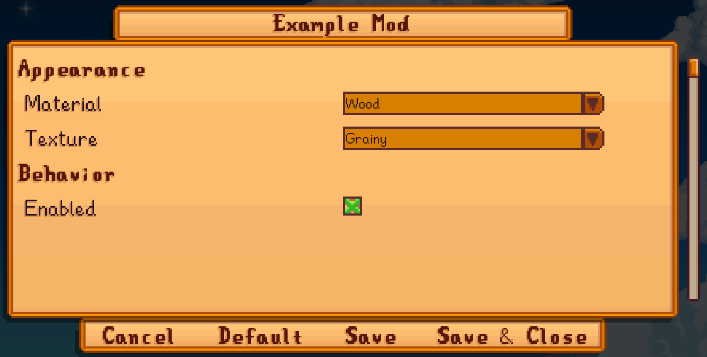
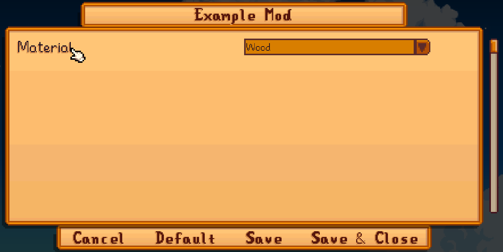
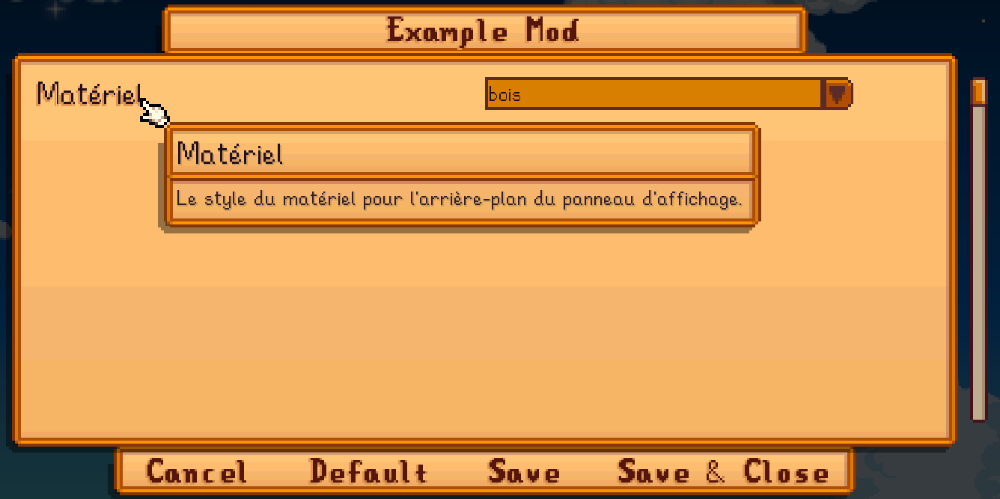

← [模组作者指南](../author-guide.md)

设置选项功能让你向玩家提供可更改的设置，并基于设置实现动态。

**🌐 其他语言： [en (English)](../../author-guide/config.md)。**

## 目录
* [基本设置](#basic-config)
  * [概述](#overview)
  * [设置定义](#define-your-config)
  * [示例](#examples)
* [设置菜单](#config-ui)
  * [显示选项](#display-options)
  * [分段](#sections)
  * [翻译](#translations)
* [参见](#see-also)

## 基本设置<a name="basic-config"></a>
## 概述<a name="overview"></a>

你可以使用`ConfigSchema`字段定义内容包的设置选项。Content Patcher将自动添加`config.json`文件和[游戏内设置菜单](#config-ui)并允许玩家更改你提供的设置。

在内容包内你可以把设置选项当作[令牌和条件](../author-guide.md#tokens)使用，从而实现动态改变。

### 设置定义<a name="define-your-config"></a>

使用设置选项的第一步用`ConfigSchema`字段来描述你的内容包所提供的选项。`ConfigSchema`是与`Format`和`Changes`同级的字段。每一个设置选项有一个作为令牌的键，和一个包含一下字段的模型：

类型                 | 作用
------------------- | -------
`AllowValues`       | _（可选）_ 一个以逗号分隔的字符串，代表玩家可选的值。如果省略，则允许任何值。<br />**提示:** 当你用`"true, false"`定义可启用/禁用的选项时，Content Patcher会认出它是布尔(并在[设置菜单](#config-ui)以复选框显示此设置).
`AllowBlank`        | _（可选）_ 该字段是否可以留空。如果false或省略，则将用默认值（`Default`）替换空白字段。
`AllowMultiple`     | _（可选）_ 玩家是否可以指定多个以逗号分隔的值。默认false。
`Default`           | _(可选，除非`AllowBlank`为false)_ 此设置的默认值。如果`AllowMultiple`为true的，则可以包含多个以逗号分隔的值。如果省略，默认值为空白。

设置选项的名称和字段不区分大小写。

### 示例<a name="examples"></a>

此`content.json`定义了一个名为`BillboardMaterial`的设置，并使用此设置令牌控制补丁效果。

```js
{
   "Format": "2.7.0",
   "ConfigSchema": {
      "Material": {
         "AllowValues": "Wood, Metal",
         "Default": "Wood"
      }
   },
   "Changes": [
      // 作为令牌
      {
         "Action": "Load",
         "Target": "LooseSprites/Billboard",
         "FromFile": "assets/material_{{Material}}.png"
      },

      // 作为条件
      {
         "Action": "Load",
         "Target": "LooseSprites/Billboard",
         "FromFile": "assets/material_wood.png",
         "When": {
            "Material": "Wood"
         }
      }
   ]
}
```

当你运行游戏时，Content Patcher会自动生成一个`config.json`文件：

```js
{
  "Material": "Wood"
}
```

玩家可以编辑此`config.json`文件来改变设置，或使用游戏内设置[设置菜单](#config-ui)。

## 设置菜单<a name="config-ui"></a>
当你的内容包有设置选项时，Content Patcher会为你的内容包自动添加一个游戏内的设置菜单（现在基于[Generic Mod Config Menu](https://www.nexusmods.com/stardewvalley/mods/5098)）。你可以为此设置菜单提供一些可选的字段来进一步优化它。

### 显示选项<a name="display-options"></a>
现有两个控制设置菜单的字段：

类型           | 作用
------------- | -------
`Description` | _（可选）_ 配置选项的说明，在配置UI中显示为工具提示。
`Section`     | _（可选）_ 一个分段的标题。 详见[_分段_](#sections) below.

### 分段<a name="sections"></a>

你可以用`Section`字段把你的设置选项分段。没有分段的选项会先显示，之后以`ConfigSchema`中出现顺序显示有分段的选项。

例如，这些选项分到两个分段下：

```js
{
    "Format": "2.7.0",
    "ConfigSchema": {
        // 外观分段
        "Material": {
            "AllowValues": "Wood, Metal",
            "Default": "Wood",
            "Section": "Appearance"
        },
        "Texture": {
            "AllowValues": "Grainy, Smooth",
            "Default": "Grainy",
            "Section": "Appearance"
        },

        // 行为分段
        "Enabled": {
            "AllowValues": "true, false",
            "Default": "true",
            "Section": "Behavior"
        }
    },
    "Changes": [ ]
}
```

游戏内显示如下：



### 翻译<a name="translations"></a>
默认情况下，你的配置选项会显示为内置名，没有工具提示或翻译。



你可以为设置添加[翻译文档](https://zh.stardewvalleywiki.com/模组:翻译模组)，从而实现更用户友好的UI。当你创建一个`i18n/default.json`后你可以给每一个设置提供这些翻译键（任何组合）：

键格式                             | 描述
:------------------------------------- | :----------
`config.<name>.name`                   | 设置选项名。
`config.<name>.description`            | 设置选项描述，一般在工具提示中显示。
`config.<name>.values.<value>`         | 对应每一个`AllowValues`的描述，显示于下拉列表或复选框列表中。
`config.section.<section>.name`        | [分段](#sections)名称。
`config.section.<section>.description` | [分段](#sections)描述，一般在工具提示中显示。

所有翻译键都是可选的，不区分大小写。

这个例子为以上的设置添加法语翻译：

```js
// i18n/default.json（默认语言，英文）
{
    "config.Material.name": "Material",
    "config.Material.description": "The material style for the billboard background.",
    "config.Material.values.Wood": "wood",
    "config.Material.values.Metal": "metal"
}

// i18n/fr.json（法语）
{
    "config.Material.name": "Matériel",
    "config.Material.description": "Le style du matériel pour l'arrière-plan du panneau d'affichage.",
    "config.Material.values.Wood": "bois",
    "config.Material.values.Metal": "métal"
}
```

添加后法语玩家会看到以下界面：



详见[维基上的 _翻译模组_ 页](https://zh.stardewvalleywiki.com/模组:翻译模组)。

## 参见<a name="see-also"></a>
* 其他操作和选项请参考[模组作者指南](../author-guide.md)
