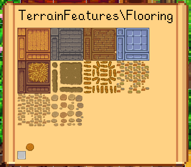

← [模组作者指南](../author-guide.md)

此页描述各种帮助你排查内容包问题的工具。

**🌐 其他语言： [en (English)](../../author-guide/troubleshooting.md)。**

## 目录
* [JSON模式验证](#schema-validator)
* [补丁(patch)命令](#patch-commands)
  * [`summary`](#summary)
  * [`update`](#update)
  * [`reload`](#reload)
  * [`export`](#export)
  * [`parse`](#parse)
  * [`dump`](#dump)
  * [`invalidate`](#invalidate)
* [调试模式](#debug-mode)
* [详细日志](#verbose-log)
* [参见](#see-also)

## JSON模式验证<a name="schema-validator"></a>
你可以验证你的`content.json`和`manifest.json`，并提前发现一些常见问题。
（但是你还是应该在游戏内测试你的内容包，验证不能发现所有问题）

网页上验证JSON：
1. 上[smapi.io/json](https://smapi.io/json)。
2. 将format（格式）设为'Manifest'（用于`manifest.json`）或'Content Patcher'（用于`content.json`）。
3. 将JSON文件拖放到文本框里，或将其粘贴到文本框里。
4. 点'save & validate file'查看验证结果。如果想给其他人看，你可以分享此结果页面的URL。

你可以在支持JSON模式的文本编辑软件自动验证你的JSON格式，详见网页JSON验证器的文档：
[_直接使用JSON模式文件_](https://github.com/Pathoschild/SMAPI/blob/develop/docs/technical/web.md#using-a-schema-file-directly)

<!-- Following content adapted from SMAPI docs 'Using a schema file directly' -->
------
译：以下内容改编自[_直接使用JSON模式文件_](https://github.com/Pathoschild/SMAPI/blob/develop/docs/technical/web.md#using-a-schema-file-directly)

你可以在支持JSON模式的文本编辑软件里直接使用SMAPI提供的JSON模式，例如：
```
{
   "$schema": "https://smapi.io/schemas/manifest.json",
   "Name": "Some mod",
   ...
}
```
可的JSON模式包括：

格式 | JSON模式URL
------ | ----------
[SMAPI: `manifest.json`](https://zh.stardewvalleywiki.com/模组:制作指南/APIs/Manifest) | https://smapi.io/schemas/manifest.json
[SMAPI: 翻译 (`i18n` 文件夹)](https://zh.stardewvalleywiki.com/模组:制作指南/APIs/Translation) | https://smapi.io/schemas/i18n.json
[Content Patcher: `content.json`](../README.md) | https://smapi.io/schemas/content-patcher.json

------
译：以上内容改编自[_直接使用JSON模式文件_](https://github.com/Pathoschild/SMAPI/blob/develop/docs/technical/web.md#using-a-schema-file-directly)
<!-- Above content adapted from SMAPI docs 'Using a schema file directly' -->


提示
* 每次更新模组时，你应该将你内容包的Format字段更新到最新版本，方便未来兼容。
* 如果你的内容包有`Unexpected character`的报错，这意味你的JSON语法有误。检查一下报错提到的行（或之前一行），看有没有缺少逗号，括号，等。
* 如果你需要帮助，请查看[主README的 _参见_](../README.md#see-also)所提供的连接。

## 补丁(patch)命令<a name="patch-commands"></a>
Content Patcher提供一系列助于测试和故障排除的控制台命令。在SMAPI控制台里输入`patch help`可查看帮助文档。

译：这些控制台命令反馈的信息均为英文，此文档会注释例子中的词汇意义，但实际使用时不会显示。

### `summary`

`patch summary` 提供内容包的全面概述，这包括：

* 全局令牌值；
* 每个内容包的专属令牌值；
* 每个内容包的`CustomLocations`；
* 和所有补丁，显示其现有值，更改对象，和（当未生效时）为何未生效。

例如

```
=====================
==  Global tokens （全局令牌）  ==
=====================
   Content Patcher:

      token name（令牌名）| value （值）
      ---------------- | -----
      Day              | [X] 5
      DayEvent         | [X]
      DayOfWeek        | [X] Friday
      DaysPlayed       | [X] 305
      FarmCave         | [X] Mushrooms
      FarmhouseUpgrade | [X] 1
      FarmName         | [X] River Coop
      FarmType         | [X] Riverland

      [省略]

=====================
== Content 补丁 ==
=====================
The following patches were loaded. For each patch:
以下补丁已加载，每一个补丁会显示：
  - 'loaded' shows whether the patch is loaded and enabled (see details for the reason if not).
  - 'loaded' 显示补丁是否生效（若未生效请查看详细原因）
  - 'conditions' shows whether the patch matches with the current conditions (see details for the reason if not). If this is unexpectedly false, check (a) the conditions above and (b) your Where field.
  - 'conditions' 显示补丁是否符合当下条件（若不符合请查看详细原因）。如果这意外为“否”请检查(a)以上条件(b)你的Where字段
  - 'applied' shows whether the target asset was loaded and patched. If you expected it to be loaded by this point but it's false, double-check (a) that the game has actually loaded the asset yet, and (b) your Targets field is correct.
  - 'applied' 显示目标素材有没有被加载并修改，如果你认为素材应该已经被加载了但在这里显示为否，请检查游戏是否真的加载了此素材，和你的Target字段是否正确。


Example Content Pack:
------------------------------

   Local tokens（专属令牌）:
      token name（令牌名）| value （值）
      ----------------- | -----
      WeatherVariant    | [X] Wet

   Patches （补丁）:
      loaded  | conditions | applied | name + details
      ------- | ---------- | ------- | --------------
      [X]     | [ ]        | [ ]     | Dry Palm Trees // conditions don't match: WeatherVariant
      [X]     | [X]        | [X]     | Wet Palm Trees

   Current changes（现有更改）:
      asset name （素材名）       | changes（现有更改）
      ------------------------- | -------
      TerrainFeatures/tree_palm | edited image
```

你可以提供一下参数，任意排列（如`patch summary "LemonEx.HobbitHouse" "Another.Content.Pack" full`）：

参数              | 效果
:-------------------- | :-----
`"<内容包ID>"` | 一个或多个可以显示数据的内容包ID。如果省略，将显示所有内容包。
`asset "<素材>"`     | 只显示对应某素材的更改。 这依据无语言后缀素材名称过滤，所以`Data/furniture`也会显示针对`Data/furniture.fr-FR`的素材名。 You can list multiple assets by repeating the flag (e.g. `asset Data/Crops asset Data/Objects`).
`full`                | 不截断很长的令牌值。
`unsorted`            | 不要对显示令牌值排序。这主要用于检查令牌值的实际排列，对应`valueAt`。

### `update`
`patch update`立马更新Content Patcher的条件上下文并重新检查所有补丁。当你更改某些条件时（如更改日期），你可以用这个命令来代替睡觉。

### `reload`
`patch reload`重新加载某一个内容包的补丁。使用此命令让你可以在游戏运行时更改内容包的JSON文件并加载这些更改。非补丁内容不会被更新，这包括设置菜单和动态令牌。

例如：

```
> patch reload "LemonEx.HobbitHouse"
Content pack reloaded.
```

有[`Include`补丁](action-include.md)的内容包可以用第二个参数提供相对路径，从而只重加载某一个`Include`。

例如：

```
> patch reload "LemonEx.HobbitHouse" "assets/some-include.json"
Content pack reloaded.
```

### `export`

`patch export`将某一素材保存到你的游戏文件夹啊里，你可以通过这个功能查看素材在补丁生效后的状态。此功能可使用在图像，数据，和地图类型的素材。

例如：

```
> patch export "Maps/springobjects"
Exported asset 'Maps/springobjects' to 'C:\Program Files (x86)\Steam\steamapps\common\Stardew Valley\patch export\Maps_springobjects.png'.
```

### `parse`
`patch parse`用当前的Content Patcher上下文解析一个可含有令牌的字符串，然后显示对应的元数据。

全局令牌默认可解析，而专属令牌值则需要用第二个参数提供模组ID才可解析。

例如：

```
> patch parse "assets/{{Variant}}.{{Language}}.png" "Pathoschild.ExampleContentPack"

Metadata （元数据）
----------------
   raw value（原始值）:   assets/{{Variant}}.{{Language}}.png
   ready（可用）:       True
   mutable（可变）:     True
   has tokens（包含令牌）:  True
   tokens used（令牌）: Language, Variant

Diagnostic state（诊断状态）
----------------
   valid（有效的）:    True
   in scope（范围内）: True
   ready（可用）:    True

Result （结果）
----------------
   The token string is valid and ready. Parsed value: "assets/wood.en.png"
   令牌字符串有效且可用，解析为: "assets/wood.en.png"
```

这可以用来排查令牌语法错误：

```
> patch parse "assets/{{Season}.png"
[ERROR] Can't parse that token value: Reached end of input, expected end of token ('}}').
```

### `dump`
`patch dump`提供Content Patcher的内在状态报告。这个主要用于排查技术问题；大部分时候使用`patch summary`更方便。

可使用的报告有：

* `patch dump order` 显示所有补丁的定义顺序。
* `patch dump applied` 显示所有补丁，以目标分类，并显示补丁是否已生效。

### `invalidate`
`patch invalidate` 立即将某个素材从游戏/SMAPI的缓存移除。如果这个素材是由SMAPI管理，那它会马上被重加载并得到修改。其他情况下一行加载此素材的代码会得到新的版本。

例如：

```
> patch invalidate "Buildings/houses"

[Content Patcher] Requested cache invalidation for 'Portraits\Abigail'.
[SMAPI]           Invalidated 1 asset names (Portraits\Abigail).
[SMAPI]           Propagated 1 core assets (Portraits\Abigail).
[Content Patcher] Invalidated asset 'Portraits/Abigail'.
```

## 调试模式<a name="debug-mode"></a>
Content Patcher有一个“调试模式”，允许你在游戏内查看任何已加载的图像。你可以通过编辑`config.json`把`EnableDebugFeatures`设为`true`来开启此功能。

启用以后按`F3`显示图像，左右`ctrl`循环查看图像。更新图像和图像列表需要关闭再开启调试UI。

> 

## 详细日志<a name="verbose-log"></a>
Content Patcher没有很多日志内容。你在`smapi-internal/StardewModdingAPI.config.json`里开启`VerboseLogging`来获得更多日志。
**这可能会大大减慢加载，不需要时不推荐启用**

启用后，日志会在以下三点显示更多内容：
1. 加载补丁时 (比如是否启用了每个补丁以及预加载哪些文件);
2. 当SMAPI检查Content Patcher是否可以加载/编辑资产时；
3. 当上下文变更时（任何可能影响条件的改变：不同天，季节，天气，等）。

如果你的补丁更改没有出现在游戏中，确保你有设`LogName`字段（详见[Action文档](../author-guide.md#actions)）然后在日志里搜索你设置的日志名。请在意以下问题：
* 补丁有被Content Patcher加载吗？
  _如果没有出现在日志里，检查你的`content.json`是否有效。如果日志里提到'skipped'，检查你的`Enabled`值或`config.json`。_
* 当上下文更新时，补丁名旁边的框框有没有勾号？
  _如果没有，检查你的`When`字段_
* 当SMAPI检查是否可加载内容时，旁边的框框有没有勾号？
  _如果没有，检查你的`When`和`Target`字段_

## 参见<a name="see-also"></a>
* 其他操作和选项请参考[模组作者指南](../author-guide.md)
