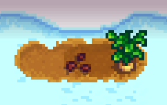

**Crops In Any Season** is a [Stardew Valley](http://stardewvalley.net/) mod that lets you grow
crops in any season, including winter:

## Contents
* [Install](#install)
* [Compatibility](#compatibility)
* [See also](#see-also)

## Install
1. [Install the latest version of SMAPI](https://smapi.io/).
2. ~~Install this mod from Nexus mods~~.
3. Run the game using SMAPI.

Note that the mod doesn't change store inventories, so you can only buy crop seeds during their
usual seasons.

## Compatibility
The mod is compatible with Stardew Valley 1.3+ on Linux/Mac/Windows, both single-player and
multiplayer. In multiplayer mode, it must be installed by the main player to work correctly.

## See also
* [Release notes](release-notes.md)
* ~~Nexus mod~~
* ~~Discussion thread~~
* Inspired by [All Crops All Seasons](https://www.nexusmods.com/stardewvalley/mods/170),
  which I maintained for a long time after its author left. (This mod uses a very different
  approach under the hood though.)
