**Data Layers** is a [Stardew Valley](http://stardewvalley.net/) mod that overlays the world with
visual data like accessibility, bee/Junimo/scarecrow/sprinkler coverage, etc. It automatically
includes data from other mods if applicable.

## Contents
* [Install](#install)
* [Use](#use)
* [Configure](#configure)
* [Compatibility](#compatibility)
* [Advanced](#advanced)
* [See also](#see-also)

## Install
1. [Install the latest version of SMAPI](https://smapi.io/).
2. [Install this mod from Nexus mods](https://www.nexusmods.com/stardewvalley/mods/1691).
3. Run the game using SMAPI.

## Use
Press `F2` to show the overlay, and then `left CTRL` and `right CTRL` to cycle between layers
(buttons configurable).

For coverage layers (e.g. scarecrows or sprinklers), point at one with the cursor to see a blue
border around that one's range and a green border around the coverage without it.

Below are the current data layers.

### Accessible
Shows where you can walk and highlights warp tiles; useful for finding hidden paths and nooks.
> 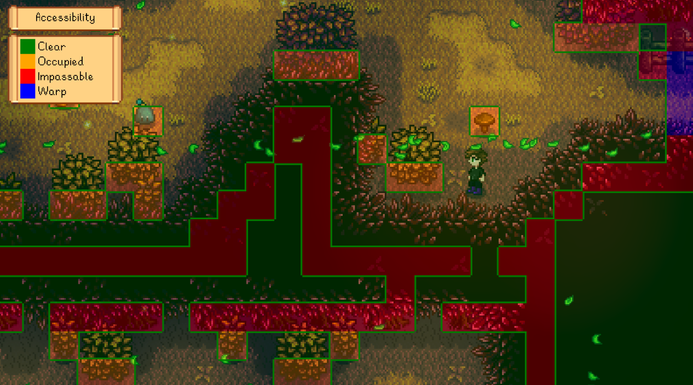

### Buildable
Shows where you can construct buildings on the farm. Useful for spotting issues before you try to
build at Robin's.
> 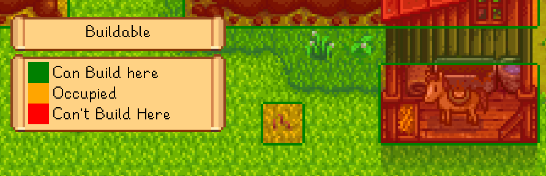

### Coverage: bee houses
Shows bee houses' flower search range.
> 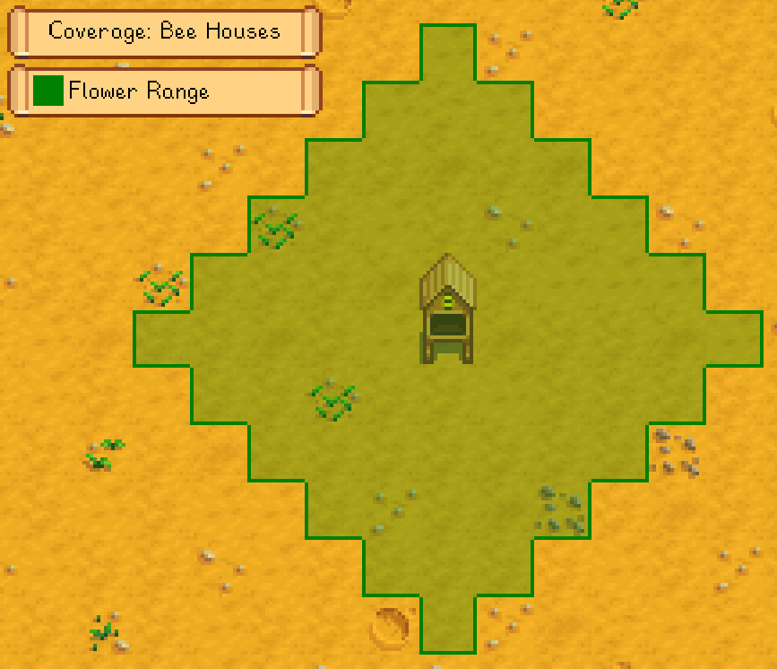

### Coverage: Junimo huts
Shows Junimo hut coverage, and highlights crops they won't reach. Also works when placing a Junimo
hut from the Wizard's build menu.
> 

### Coverage: scarecrows
Shows scarecrow coverage, and highlights unprotected crops. Also works on scarecrows being placed.
> 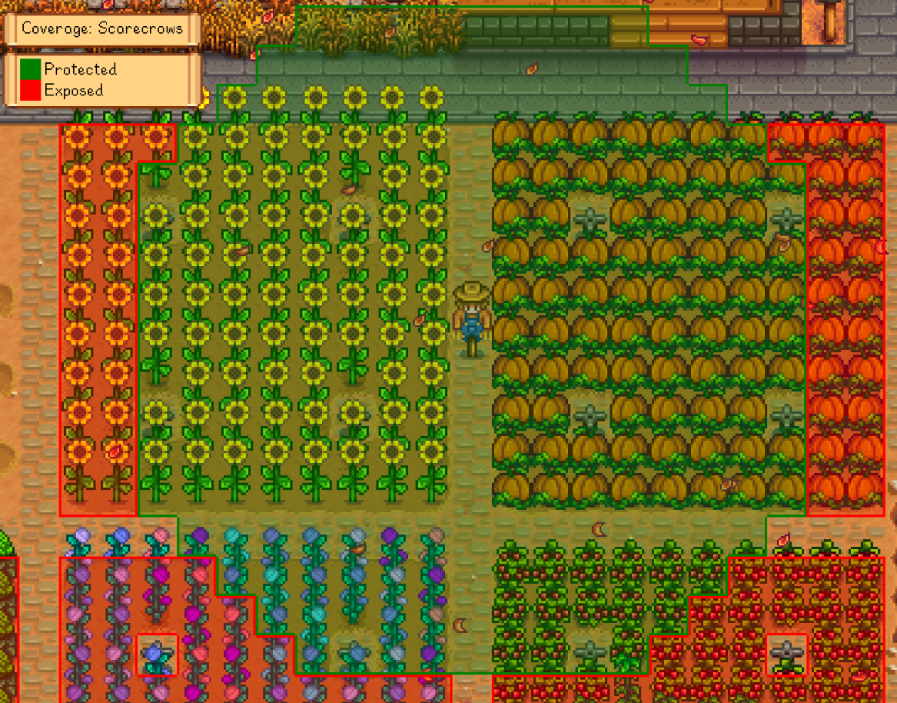

### Coverage: sprinklers
Shows sprinkler coverage, and highlights unsprinkled crops. Also works on sprinklers being placed.
> 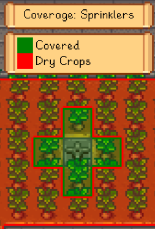

### Crops: fertilized
Shows which crops have fertilizer applied.
> 

### Crops: watered
Shows which crops have been watered today.
> 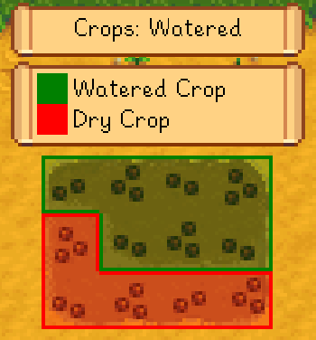

### Crops: ready for harvest
Shows which crops are ready to harvest, or which won't be ready before they die due to a season
change.
> 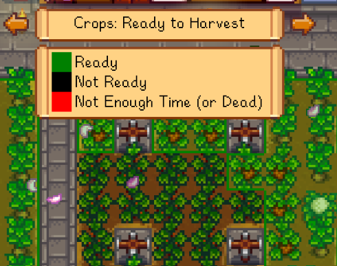

### Crops: water for paddy crops
Shows which tiles are close enough to water for paddy crops to get auto-watered and bonus growth.
> 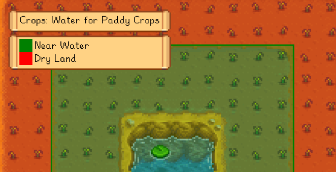

### Machine processing
Shows whether your machines are empty, processing, or finished. (You need to install
[Automate](https://www.nexusmods.com/stardewvalley/mods/1063) for this layer to appear, but it'll
work for machines that aren't being automated too.)
> 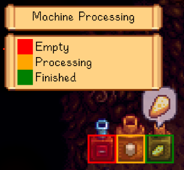

### Tillable
Shows where you can till dirt with your hoe. Useful for planning crop layouts.
> 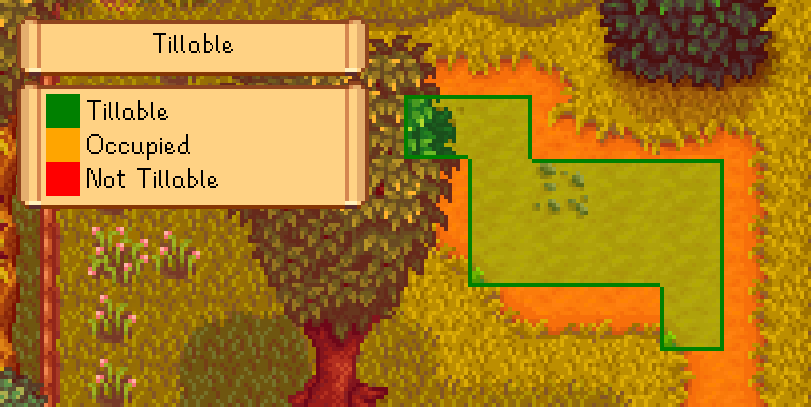

### Grid
The grid layer shows [tile borders](https://stardewvalleywiki.com/Modding:Modder_Guide/Game_Fundamentals#Tiles)
useful for planning layouts, calculating fishing distance, etc:
> 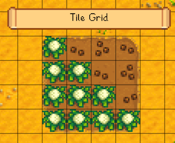

You can optionally [edit the `config.json` file](#configure) to enable the grid for all layers
instead:
> 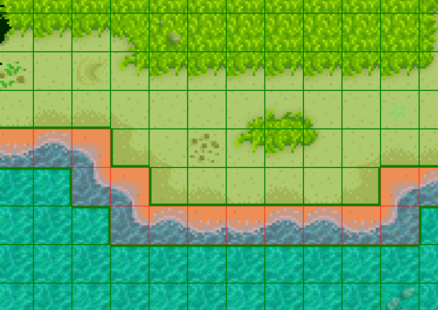

## Configure
The mod creates a `config.json` file in its mod folder the first time you run it. You can open that
file in a text editor to configure the mod.

These are the available settings:

<table>
<tr>
  <th>setting</th>
  <th>what it affects</th>
</tr>

<tr>
  <td><code>Controls</code></td>
  <td>

The configured controller, keyboard, and mouse buttons (see [key bindings](https://stardewvalleywiki.com/Modding:Key_bindings)).
The default values are...

* `F2` to toggle the overlay;
* left CTRL or left controller shoulder for the previous layer;
* right CTRL or right controller shoulder for the next layer.

You can separate bindings with commas (like `LeftControl, LeftShoulder` for either one), and set
multi-key bindings with plus signs (like `LeftShift + F2`).

  </td>
</tr>
<tr>
  <td><code>Layers</code></td>
  <td>

For each data layer, you can configure...

* `Enabled`: whether it should be available in-game.
* `UpdatesPerSecond`: how often the layer should update. The maximum is 60 per seconds, but can be
  less than 1 to update less than once per second (or zero to disable the data layer entirely).
* `UpdateWhenViewChange`: Whether to update when your viewpoint in the game changes, regardless of
  the `UpdatesPerSecond` value.
* `ShortcutKey`: While the overlay is open, press this key to switch to this layer (see above notes
  for `Controls`).

  </td>
</tr>
<tr>
  <td><code>ShowGrid</code></td>
  <td>

Default `false`. Whether to show a tile grid when a layer is open.

  </td>
</tr>
<tr>
  <td><code>CombineOverlappingBorders</code></td>
  <td>

Default `true`. When two groups of the same color overlap, draw one border around their edges
instead of their individual borders.

  </td>
</tr>
</table>

## Compatibility
Data Layers is compatible with Stardew Valley 1.4+ on Linux/Mac/Windows, both single-player and
multiplayer. There are no known issues in multiplayer (even if other players don't have it
installed).

Data Layers will automatically integrate with these mods if you they're installed:

mod installed     | effects
----------------- | ----------
Automate          | Shows whether your machines are empty, processing, or ready to harvest.
Better Junimos    | Shows custom Junimo hut coverage.
Better Sprinklers | Shows custom sprinkler coverage.
Cobalt            | Shows cobalt sprinkler coverage.
Line Sprinklers   | Shows line sprinkler coverage.
Pelican Fiber     | Shows coverage when building a Junimo hut or sprinkler through Pelican Fiber's menu.
Prismatic Tools   | Shows prismatic sprinkler coverage.
Simple Sprinkler  | Shows custom sprinkler coverage.

## Advanced
### Export to JSON
You can export a data layer to a JSON file (e.g. to use in another tool). Just go to the location
in-game you want to export, open a data layer, and enter `data-layers export` in the SMAPI console.
The layer data will be exported for the entire current location (not just the visible area).

## See also
* [Release notes](release-notes.md)
* [Nexus mod](https://www.nexusmods.com/stardewvalley/mods/1691)
