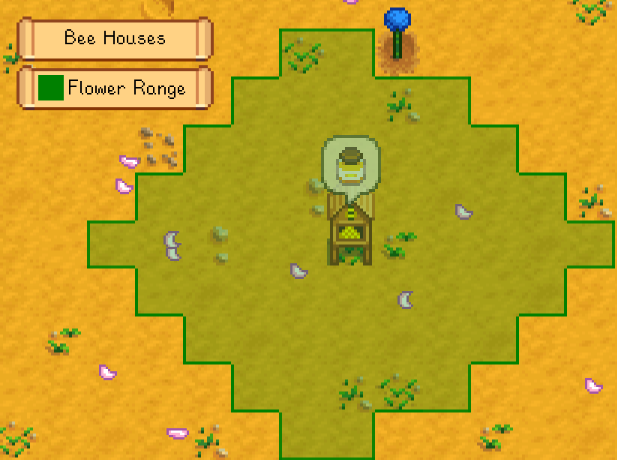
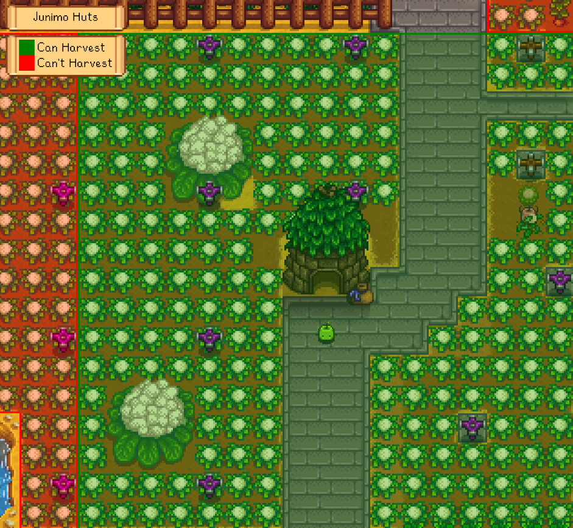
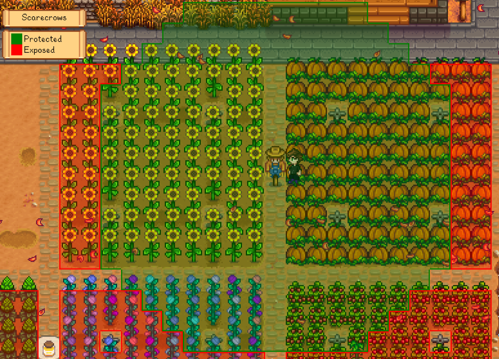
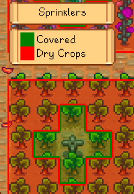
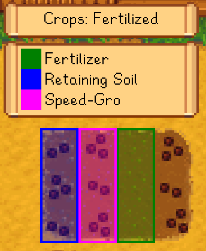

**Data Maps** is a [Stardew Valley](http://stardewvalley.net/) mod that overlays the world with
metadata maps.

## Contents
* [Install](#install)
* [Use](#use)
* [Configure](#configure)
* [See also](#see-also)

## Install
1. [Install the latest version of SMAPI](https://smapi.io/).
2. [Install this mod from Nexus mods](https://www.nexusmods.com/stardewvalley/mods/1691).
3. Run the game using SMAPI.

## Use
Press `F2` to show the overlay, and then `left CTRL` and `right CTRL` to cycle between data maps
(buttons configurable).

For coverage maps (e.g. scarecrows or sprinklers), point at one with the cursor to see a blue
border around that one's range and a green border around the coverage without it.

Below are the current data maps.

### Accessibility
Shows where you can walk and highlights warp tiles; useful for finding hidden paths and nooks.
> 

### Coverage: bee houses
Shows bee houses' flower search range. (The weird shape isn't a bug, that's the game's
actual range.)
> 

### Coverage: Junimo huts
Shows Junimo hut coverage, and highlights crops they won't reach. Also works when placing a Junimo
hut from the Wizard's build menu. Compatible with Pelican Fiber.
> 

### Coverage: scarecrows
Shows scarecrow coverage, and highlights unprotected crops. Also works on scarecrows being placed.
> 

### Coverage: sprinklers
Shows sprinkler coverage, and highlights unsprinkled crops. Also works on sprinklers being placed.
Compatible with custom sprinkler coverage from Better Sprinklers, Cobalt, and Simple Sprinkler.
> 

### Crops: watered
Shows which crops have been watered today.
> 

### Crops: fertilised
Shows which crops have fertiliser applied.
> 

## Configuration
The mod will work fine out of the box, but you can tweak its settings by editing the `config.json`
file if you want. These are the available settings:

setting    | what it affects
---------- | -------------------
`Controls` | The configured controller, keyboard, and mouse buttons (see [key bindings](https://stardewvalleywiki.com/Modding:Key_bindings)). You can separate multiple buttons with commas. The default values are `F2` to toggle the overlay, left `CTRL` or left controller shoulder for the previous map, and right `CTRL` or right controller shoulder for the next one.
`EnabledMaps` | Choose which maps you want to appear in-game. All maps are enabled by default.
`CombineOverlappingBorders` | Default `true`. When two groups of the same color overlap, draw one border around their edges instead of their individual borders.

## Versions
See [release notes](release-notes.md).

## See also
* [Nexus mod](https://www.nexusmods.com/stardewvalley/mods/1691)
* [Discussion thread](https://community.playstarbound.com/threads/data-maps.139625/)
