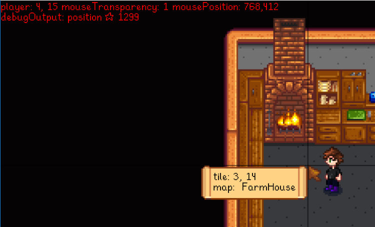
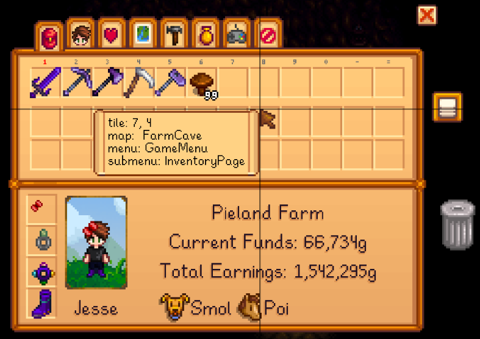
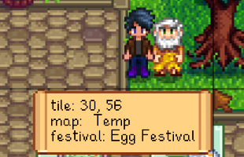
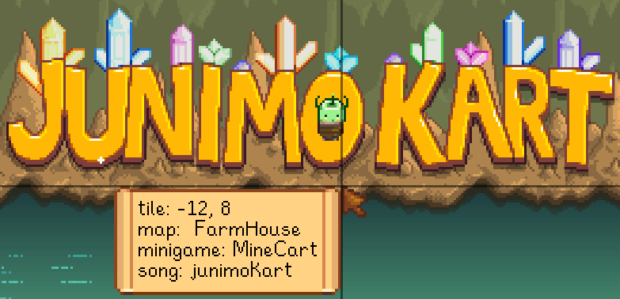

**Debug Mode** is an open-source [Stardew Valley](http://stardewvalley.net/) mod which shows a
useful debug info overlay when you press `~`, and optionally enables the game's debug hotkeys
(including teleportation and time manipulation).

## Contents
* [Install](#install)
* [Use](#use)
* [Configure](#configure)
* [Compatibility](#compatibility)
* [See also](#see-also)

## Install
1. [Install the latest version of SMAPI](https://smapi.io/).
2. [Install this mod from Nexus mods](http://www.nexusmods.com/stardewvalley/mods/679/).
3. Run the game using SMAPI.

## Use
Press the `~` key (configurable) to toggle the mod functionality.

### Info overlay
When enabled, the mod shows an overlay with debug info including...

* cursor crosshairs, tile position, map name, and background song name:  
  
* menu and submenu names:  
  
* event ID, current command, and progress:  
  
* festival name:  
  
* and minigame name:  
  

### Game debug mode
If you enable `AllowGameDebug` in the [configuration](#configuration) (disabled by default), the
mod will also enable the game's debug mode and hotkeys:

hotkey | action | multiplayer notes
:----- | :----- | -------------------
`T`    | Add one hour to the clock. | Main player only, affects all players.
`SHIFT` + `Y` | Subtract 10 minutes from the clock. | Main player only, affects all players.
`Y`    | Add 10 minutes to the clock. | Main player only, affects all players.
`1`    | Warp to the mountain (facing Robin's house). | Affects current player.
`2`    | Warp to the town (on the path between the town and community center). | Affects current player.
`3`    | Warp to the farm (at your farmhouse door). | Affects current player.
`4`    | Warp to the forest (near the traveling cart). | Affects current player.
`5`    | Warp to the beach (left of Elliott's house). | Affects current player.
`6`    | Warp to the mine (at the inside entrance). | Affects current player.
`7`    | Warp to the desert (in Sandy's shop). | Affects current player.
`K`    | Move down one mine level. If not currently in the mine, warp to it. | Affects current player.
`F5`   | Show or hide all player sprites. | Visible to current player.
`F7`   | Draw a tile grid. | Visible to current player.
`F8`   | Show a debug command input window (not currently documented). | Depends on the command used.
`B`    | Shift the toolbar to show the next higher inventory row. | Affects current player.
`N`    | Shift the toolbar to show the next lower inventory row. | Affects current player.

If you also enable `AllowDangerousCommands` in the configuration (disabled by default), you can
also use these debug hotkeys:

hotkey | action | multiplayer notes
:----- | :----- | -----------------
`P`    | Immediately go to bed and start the next day. | Affects current player. Will take effect when you change location.
`M`    | Immediately go to bed and start the next season. | Affects all players if used by main player; else equivalent to `P`. Will take effect when you change location.
`H`    | Randomize the player's hat. | Affects current player.
`I`    | Randomize the player's hair. | Affects current player.
`J`    | Randomize the player's shirt and pants. | **Affects all players!**
`L`    | Randomize the player. | **Affects all players!**
`U`    | Randomize the farmhouse wallpaper and floors. | Affects main player's farmhouse (even if used by another player).
`F10`  | Starts a multiplayer server for the current save (if not already started). | No meaningful effect.

## Configure
The mod creates a `config.json` file in its mod folder the first time you run it. You can open that
file in a text editor to configure the mod.

These are the available settings:

<table>
<tr>
  <th>setting</th>
  <th>what it affects</th>
</tr>

<tr>
  <td><code>Controls</code></td>
  <td>

The configured controller, keyboard, and mouse buttons (see [key bindings](https://stardewvalleywiki.com/Modding:Key_bindings)).
The default value is `OemTilde` (~) to toggle debug mode.

You can separate bindings with commas (like `OemTilde, LeftShoulder` for either one), and set
multi-key bindings with plus signs (like `LeftShift + OemTilde`).

  </td>
</tr>

<tr>
  <td><code>AllowGameDebug</code></td>
  <td>

Default `false`. Whether pressing the key also enables the [game's built-in debug mode](#game-debug-mode).

  </td>
</tr>

<tr>
  <td><code>AllowDangerousCommands</code></td>
  <td>

Default `false`. This allows game debug commands which end the current day/season & save, randomize
your player or farmhouse decorations, or crash the game. Only change this if you're aware of the
consequences.

  </td>
</tr>
</table>

## Compatibility
Debug Mode is compatible with Stardew Valley 1.4+ on Linux/Mac/Windows, both single-player and
multiplayer. Commands may have different effects in multiplayer; see multiplayer notes for each
command.

## See also
* [Release notes](release-notes.md)
* [Nexus mod](http://www.nexusmods.com/stardewvalley/mods/679)
