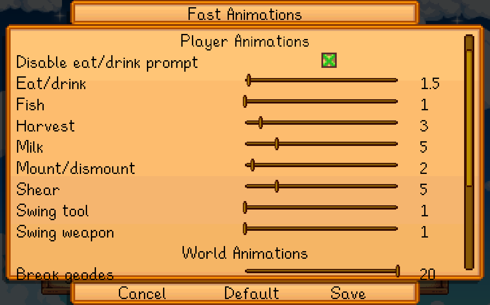

**Fast Animations** is a [Stardew Valley](http://stardewvalley.net/) mod that lets you selectively
speed up many animations like eating, breaking geodes, etc.

## Contents
* [Install](#install)
* [Configure](#configure)
* [Compatibility](#compatibility)
* [See also](#see-also)

## Install
1. [Install the latest version of SMAPI](https://smapi.io/).
2. [Install this mod from Nexus mods](http://www.nexusmods.com/stardewvalley/mods/1089/).
3. Run the game using SMAPI.

## Configure
### In-game settings
If you have [Generic Mod Config Menu](https://www.nexusmods.com/stardewvalley/mods/5098) installed,
you can click the cog button (⚙) on the title screen to configure the mod. Hover the cursor over
a field for details, or see the next section.

### `config.json` file
The mod creates a `config.json` file in its mod folder the first time you run it. You can open that
file in a text editor to configure the mod.

Here's what you can change:

* You can choose how fast each animation runs. Each value is a multiple of the original speed, like
  `1` for normal speed or `2` for double speed. This can also be a fractional value like `1.5`.

  Player animations:

  setting              | default | what it affects
  :------------------- | :------ | :------------------
  `EatAndDrinkSpeed`   | 10×     | How fast you eat and drink.
  `FishingSpeed`       | 1×      | How fast you cast and reel when fishing (doesn't affect the minigame). <small>(Suggested value: 2×.)</small>
  `HarvestSpeed`       | 3×      | How fast you harvest crops and forage by hand.
  `MilkSpeed`          | 5×      | How fast you use the milk pail.
  `MountOrDismountSpeed` | 2×    | How fast you mount/dismount horses (including custom mounts like Tractor Mod).
  `ShearSpeed`         | 5×      | How fast you use the shears.
  `ToolSwingSpeed`     | 1×      | How fast you swing your tools (except weapons & fishing rod). <small>(Suggested value: 2×.)</small>
  `WeaponSwingSpeed`   | 1×      | How fast you swing your weapons. <small>(Suggested value: 4×.)</small>

  World animations:

  setting              | default | what it affects
  :------------------- | :------ | :------------------
  `BreakGeodeSpeed`    | 20×     | How fast the blacksmith breaks geodes for you.
  `CasinoSlotsSpeed`   | 8×      | How fast the casino slots turn.
  `PamBusSpeed`        | 6×      | How fast Pam drives her bus to and from the desert.
  `TreeFallingSpeed`   | 1×      | How fast trees fall after you chop them down. <small>(Suggested value: 3×.)</small>

  UI animations:

  setting              | default | what it affects
  :------------------- | :------ | :------------------
  `TitleMenuTransitionSpeed` | 10× | How fast the title menu transitions between screens.
  `LoadGameBlinkSpeed` | 2×      | How fast the blinking-slot delay happens after you click a load-save slot.

* Other options:

  setting              | default | what it affects
  :------------------- | :------ | :------------------
  `DisableEatAndDrinkConfirmation` | `false` | If `true`, the confirmation prompt before eating or drinking won't be shown.

## Compatibility
Fast Animations is compatible with Stardew Valley 1.4+ on Linux/Mac/Windows, both single-player and
multiplayer.

Multiplayer notes:
* Animations will be sped up smoothly for you, but other players may see them skip frames.
* If multiple players have it installed, some animation speeds may stack.

## See also
* [Release notes](release-notes.md)
* [Nexus mod](http://www.nexusmods.com/stardewvalley/mods/1089/)
