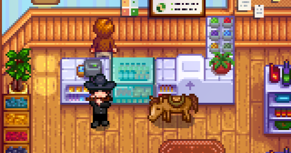

**Horse Flute Anywhere** is a [Stardew Valley](http://stardewvalley.net/) mod that lets you summon
your horse anywhere (even indoors or in caves/dungeons) at the press of a button or by using the
[horse flute](https://stardewvalleywiki.com/Horse_Flute).

  


## Contents
* [Install](#install)
* [Use](#use)
* [Configure](#configure)
* [Compatibility](#compatibility)
* [See also](#see-also)

## Install
1. [Install the latest version of SMAPI](https://smapi.io/).
2. [Install this mod from Nexus mods](https://www.nexusmods.com/stardewvalley/mods/7500).
3. Run the game using SMAPI.

## Use
You can summon your horse by...

* using the [horse flute](https://stardewvalleywiki.com/Horse_Flute) item;
* pressing `H` if you have a horse flute in your inventory;
* pressing `H` without a horse flute if `RequireHorseFlute` is disable in the [config](#configure).

This will work anywhere, even in the deepest mines.

## Configure
### In-game settings
If you have [Generic Mod Config Menu](https://www.nexusmods.com/stardewvalley/mods/5098) installed,
you can click the cog button (⚙) on the title screen to configure the mod. Hover the cursor over
a field for details, or see the next section.


### config.json
The mod creates a `config.json` file in its mod folder the first time you run it. You can open that
file in a text editor to configure the mod.

These are the available settings:

<table>
<tr>
  <th>setting</th>
  <th>what it affects</th>
</tr>
<tr>
  <td><code>RequireHorseFlute</code></td>
  <td>

Whether you must have a [horse flute](https://stardewvalleywiki.com/Horse_Flute) in your inventory
(not necessarily on the toolbar) to summon the horse. Default `false`.

  </td>
</tr>
<tr>
  <td><code>SummonHorseKey</code></td>
  <td>

The keybinding which plays the flute and summons the horse (if you have a
[horse flute](https://stardewvalleywiki.com/Horse_Flute) in your inventory or you disabled
`RequireHorseFlute`). The default value is `"H"`.

You can use any controller/keyboard/mouse [button codes](https://stardewvalleywiki.com/Modding:Key_bindings).
You can separate bindings with commas (like `"H, LeftShoulder"` for either one), set multi-key
bindings with plus signs (like `"LeftShift + H"`), and disable it with `"None"`.

  </td>
</tr>
</table>

## Compatibility
Horse Flute Anywhere is compatible with Stardew Valley 1.5+ on Linux/Mac/Windows, both
single-player and multiplayer.

## Troubleshooting
### "You do not own a horse"
That's an issue with the vanilla game, not Horse Flute Anywhere. Make sure you built a stable, and
that you were the first player to ride the new horse (which marks you as the owner).

You can also reset horse ownership if needed:

1. Run this command in the SMAPI console window:
   ```
   reset_horses
   ```
2. That will reset **all** horses in the game. Each player should then interact with their horse to
   name it and take ownership.

## See also
* [Release notes](release-notes.md)
* [Nexus mod](https://www.nexusmods.com/stardewvalley/mods/7500)
