**Lookup Anything** is a [Stardew Valley](http://stardewvalley.net/) mod that shows live info about
whatever's under your cursor when you press `F1`. Learn a villager's favourite gifts, when a crop
will be ready to harvest, how long a fence will last, why your farm animals are unhappy, and more.

For advanced users, the optional data mining mode also shows raw game values so you can see exactly
what the game is doing.

## Contents
* [Install](#install)
* [Use](#use)
* [Configure](#configure)
* [Showcase](#showcase)
* [Versions](#versions)
* [See also](#see-also)

## Install
1. [Install the latest version of SMAPI](https://smapi.io/).
2. [Install this mod from Nexus mods](http://www.nexusmods.com/stardewvalley/mods/541/).
3. Run the game using SMAPI.

## Use
Just point your cursor at something and press `F1`. The mod will show live info about that object.
You can do this in the world, your inventory, the calendar, or a shop.

## Configure
The mod will work fine out of the box, but you can tweak its settings by editing the `config.json`
file if you want. These are the available settings:

| setting           | what it affects
| ----------------- | -------------------
| `Controls`    | The configured controller, keyboard, and mouse buttons (see [key bindings](https://stardewvalleywiki.com/Modding:Key_bindings)). You can separate multiple buttons with commas. The default keyboard bindings are `F1` to lookup, and `Up`/`Down` to scroll the lookup results. Available inputs:<ul><li>`ToggleLookup`: lookup whatever's under the cursor.</li><li>`ToggleLookupInFrontOfPlayer`: lookup whatever's in front of the player.</li><li>`ScrollUp`/`ScrollDown`: scroll the displayed lookup results.</li><li>`ToggleDebug`: show information intended for developers.</li></ul>
| `HideOnKeyUp` | Default `false`. If enabled, the lookup window will be shown while you hold `F1` and disappear when you release it.
| `ShowDataMiningFields` | Default `false`. Whether to show raw data useful for data miners (as separate fields at the bottom of lookup results). This is an advanced feature not intended for most players.

## Showcase
### Sample lookups
* See a villager's social data, friendship with you, and the gifts they like. This will highlight
  the gifts you're carrying (green) or own (black).
  > 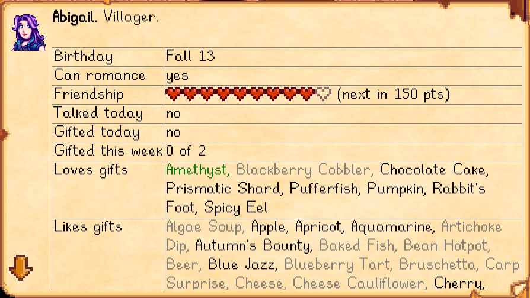
  > 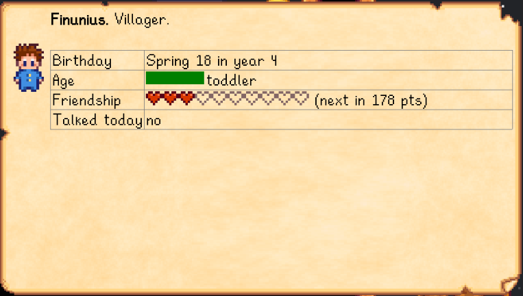

* See your farm animals' happiness, friendship, problems, and any produce ready for you.
  > 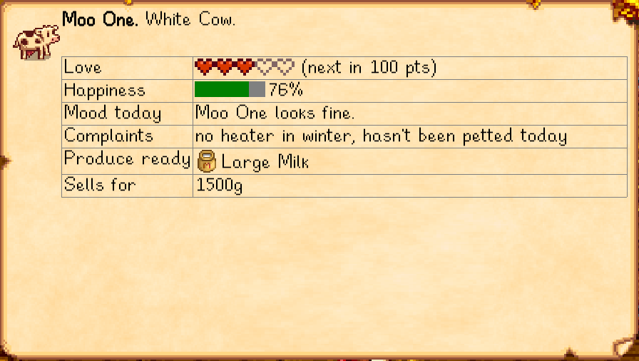

* See your own stats and skill progress. Each green bar represents your progress towards that level.
  > 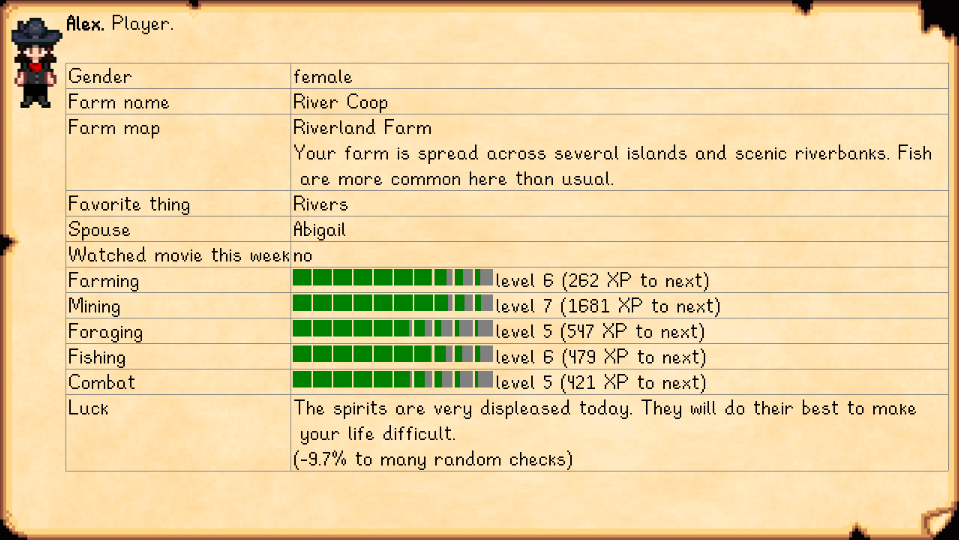

* See a monster's stats, your progress towards the Adventurer's Guild eradication goals, and what
  items the monster will drop when killed. The drop list will highlight which items will definitely
  drop (black), and which might drop because you have the [Burglar's Ring](http://stardewvalleywiki.com/Burglar%27s_Ring)
  (gray but not crossed out).
  > 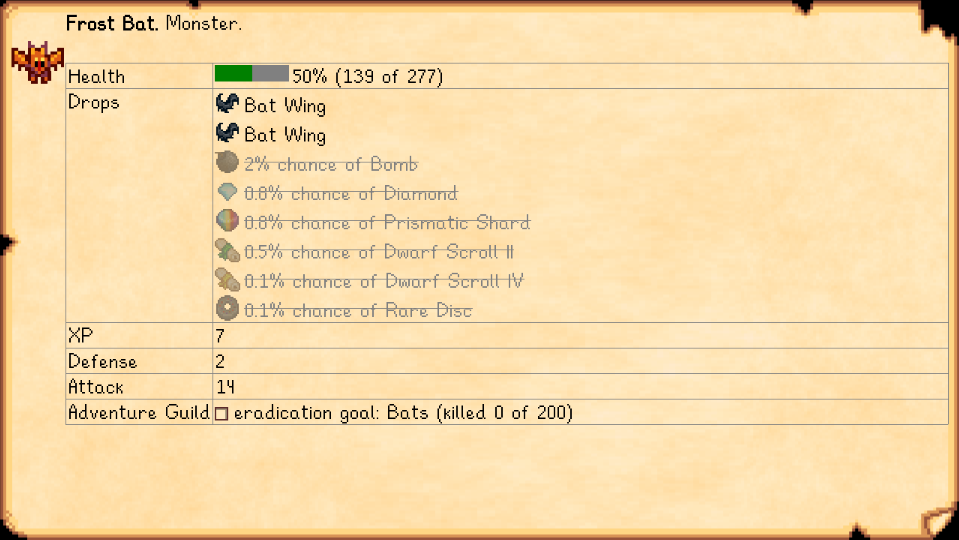

* See what an item is used for, and who likes getting it as a gift.
  > 

* See when a crop will be ready to harvest.
  > 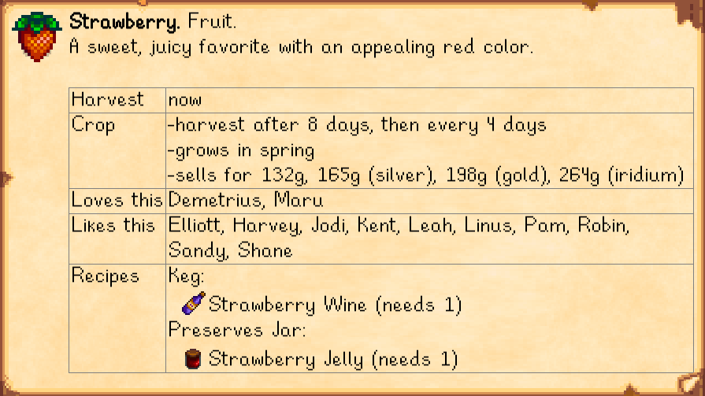

* See when a crafting station will be ready.
  > 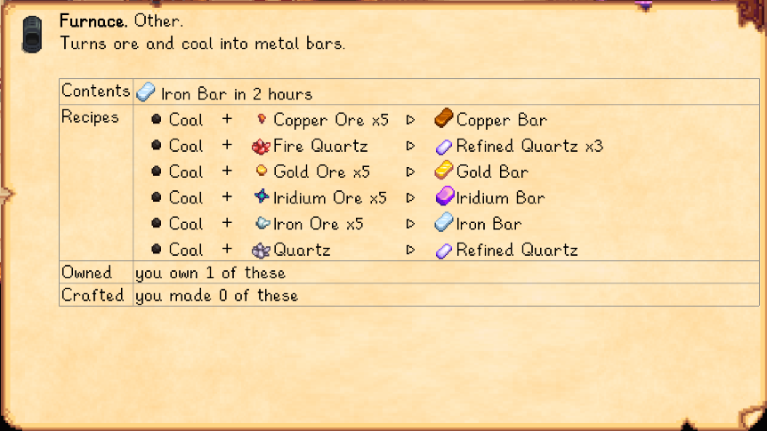
  > 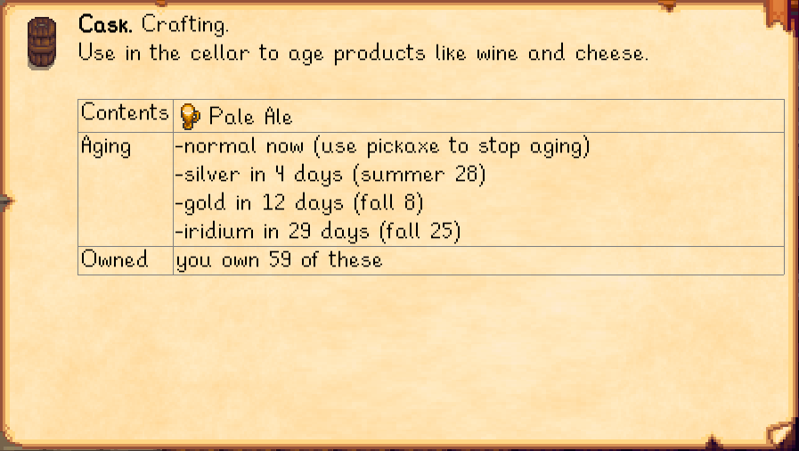

* See when a tree will bear fruit, how long until its fruit quality increases, and any
  problems preventing it from growing.
  > 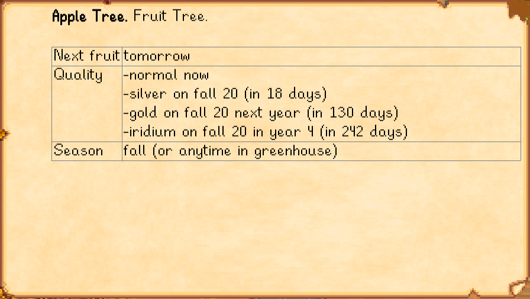
  > 

* See how long your fences will last.
  > 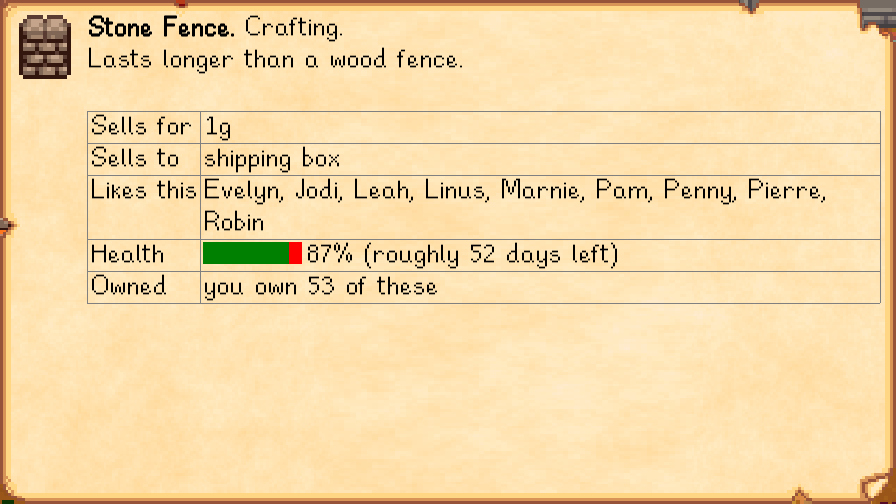

* See what those mine objects do.
  > 
  > 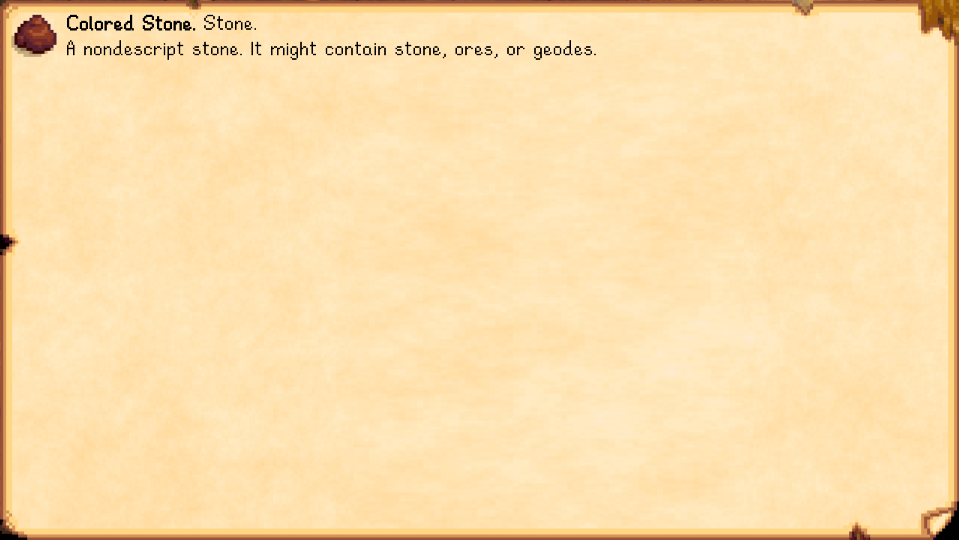
  > 
  > 

### Where you can look things up
You can look things up by pointing at them...

where | example
----- | -------
in the world | 
| on the toolbar | 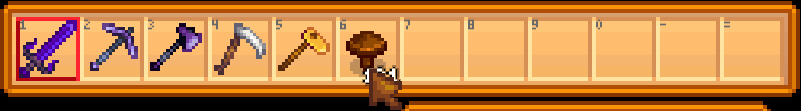
| in the calendar | 
| in the social menu | 
| in your inventory or chests | 
| in shops | 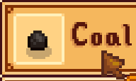
| in Community Center bundles <small>(any item shown)</small> | 

### Data mining fields (advanced)
Are you a data miner or trying to figure out the game mechanics? [Enable data mining fields](#configuration)
to see raw game data too. This will show 'pinned' data handpicked by Lookup Anything, along with a
full dynamic dump of the raw data:
> 
> 

Enable tile lookups to see information about map tiles:
> 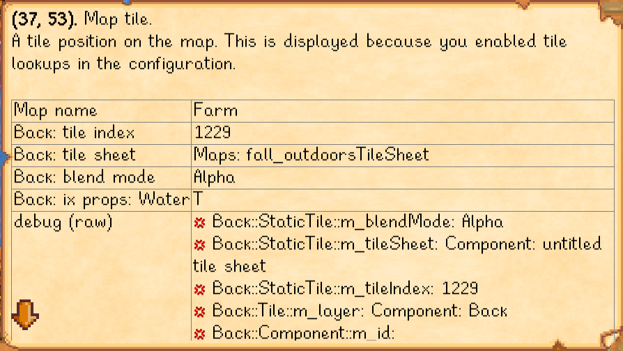

## Versions
See [release notes](release-notes.md).

## See also
* [Nexus mod](http://www.nexusmods.com/stardewvalley/mods/518)
* [Discussion thread](http://community.playstarbound.com/threads/smapi-lookup-anything.122929/)
* Useful tools when working on this mod:
  * Windows:
    * [dotPeek](https://www.jetbrains.com/decompiler/) to decompile the game into a Visual Studio
  project.
    * [ReSharper](https://www.jetbrains.com/resharper/) to analyse the game code (e.g. find usages).
    * [XNB Extract](http://community.playstarbound.com/threads/modding-guides-and-general-modding-discussion-redux.109131/)
  to extract the game's assets and data.
  * [YAML Analyzer](http://catox.free.fr/StardewTools/yaml_analyzer.html) to help figure out data
  files.
