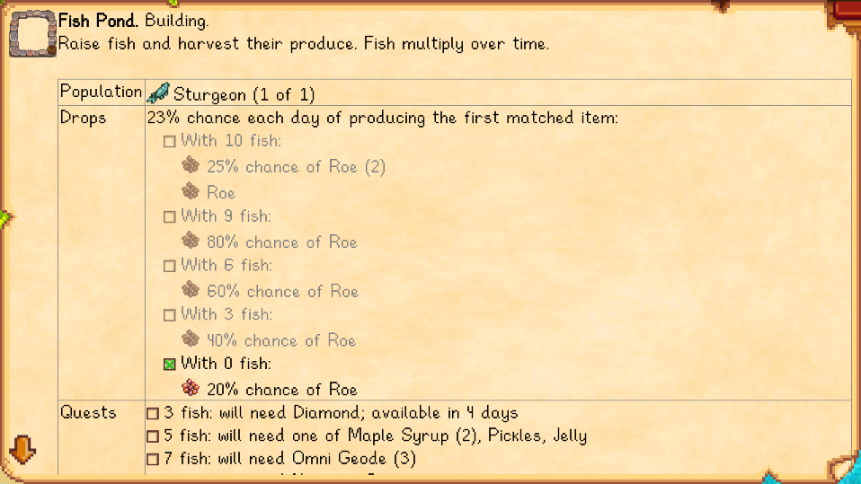

**Lookup Anything** is a [Stardew Valley](https://stardewvalley.net/) mod that shows live info about
whatever's under your cursor when you press `F1`. Learn a villager's favorite gifts, when a crop
will be ready to harvest, how long a fence will last, why your farm animals are unhappy, and more.

For advanced users, the optional data mining mode also shows raw game values so you can see exactly
what the game is doing.


## Contents
* [Install](#install)
* [Use](#use)
* [Configure](#configure)
* [Showcase](#showcase)
* [Compatibility](#compatibility)
* [Extensibility for modders](#extensibility-for-modders)
* [See also](#see-also)

## Install
1. [Install the latest version of SMAPI](https://smapi.io/).
2. [Install this mod from Nexus mods](https://www.nexusmods.com/stardewvalley/mods/541/).
3. Run the game using SMAPI.

## Use
Just point your cursor at something and press `F1`. The mod will show live info about that object.
You can do this in the world, your inventory, the calendar, a shop, the social menu, and more.

If there's no cursor (e.g. when playing with a controller or on mobile), the most relevant subject
is shown instead. That may be something in front of the player, the player on the skills menu, the
NPC on their profile page, etc.

You can also press `left shift` + `F1` to search for something by name.

## Configure
The mod creates a `config.json` file in its mod folder the first time you run it. You can open that
file in a text editor to configure the mod.

Common settings:

<table>
<tr>
  <th>setting</th>
  <th>what it affects</th>
</tr>

<tr>
  <td><code>Controls</code></td>
  <td>

The configured controller, keyboard, and mouse buttons (see [key bindings](https://stardewvalleywiki.com/Modding:Key_bindings)).
You can separate multiple buttons with commas. The default bindings are...

field | action | default
----- | ------ | -------
`ToggleLookup` | Look up a subject (see _use_ section). | `F1`
`ToggleSearch` | Show a search UI to find something by name. | `LeftShift + F1`
`ScrollUp`, `ScrollDown` | Scroll the displayed lookup results. | `Up`, `Down`
`ToggleDebug` | Show information intended for developers. | _none_

You can separate bindings with commas (like `F1, LeftShoulder` for either one), and set
multi-key bindings with plus signs (like `LeftShift + F1`).

  </td>
</tr>

<tr>
  <td><code>ProgressionMode</code></td>
  <td>

Default `false`. Whether to hide some content (current gift tastes) until you've discovered it
in-game.

  </td>
</tr>

<tr>
  <td><code>HighlightUnrevealedGiftTastes</code></td>
  <td>

Default `false`. Whether to highlight item gift tastes which haven't been revealed in the NPC
profile. When enabled, unrevealed gift tastes will be bold and lookups will also show
disliked/hated gifts.

  </td>
</tr>

<tr>
  <td><code>HideOnKeyUp</code></td>
  <td>

Default `false`. If enabled, the lookup window will be shown while you hold `F1` and disappear when
you release it.

  </td>
</tr>
</table>

Advanced settings:

setting           | what it affects
----------------- | -------------------
`EnableTileLookups` | Default `false`. Whether to include map tiles as lookup targets.
`ScrollAmount` | Default `160`. The number of pixels to shift content on each up/down scroll.
`ShowDataMiningFields` | Default `false`. Whether to show raw data useful for data miners (as separate fields at the bottom of lookup results). This is an advanced feature not intended for most players.

## Showcase
### Progression mode
The optional 'progression mode' hides spoilers until you've discovered them in-game ([disabled by
default](#Configure)). This currently affects gift tastes. Hidden content is indicated by
grayed-out text like this:
> 

The screenshots below are without progression mode, and may show spoilers.

### Sample lookups
* See a villager's social data, friendship with you, and the gifts they like. This will highlight
  the gifts you're carrying (green) or own (black).
  > 
  > 

  The optional progression mode hides gift tastes until you've learned them in-game.

* See your farm animals' happiness, friendship, problems, and any produce ready for you.
  > 

* See your own stats and skill progress. Each green bar represents your progress towards that level.
  This works from the load-game menu too.
  > 

* See a monster's stats, your progress towards the Adventurer's Guild eradication goals, and what
  items the monster will drop when killed. The drop list will highlight which items will definitely
  drop (black), and which might drop because you have the [Burglar's Ring](https://stardewvalleywiki.com/Burglar%27s_Ring)
  (gray but not crossed out).
  > 

* See what an item is used for, who likes getting it as a gift, and its dye color (and strength)
  when used in tailoring. Look up a movie ticket to see what's playing and who would like the movie.
  > 

* See where you can catch a fish:
  > 

* See when a crop will be ready to harvest.
  > 

* See when a crafting station will be ready, and what recipes it can produce. This works with
  most custom machines too.
  > 
  > 

* See useful info about your buildings (different for each building type). For example:
  > 
  > 

* See when a tree will bear fruit, how long until its fruit quality increases, and any
  problems preventing it from growing.
  > 
  > 

* See how long your fences will last.
  > 

* See what those mine objects do.
  > 
  > 
  > 
  > 

* And much more!

### Where you can look things up
You can look things up by pointing at them...

where | example
----- | -------
in the world | 
| on the toolbar | 
| in the calendar | 
| in the social menu | 
| in your inventory or chests | 
| in shops | 
| in Community Center bundles<br /><small>(any item shown)</small> | 

### Data mining fields (advanced)
Are you a data miner or trying to figure out the game mechanics? [Enable data mining fields](#configuration)
to see raw game data too. This will show 'pinned' data handpicked by Lookup Anything, along with a
full dynamic dump of the raw data:
> 
> 

Enable tile lookups to see information about map tiles:
> 

## Compatibility
Lookup Anything is compatible with Stardew Valley 1.4+ on Linux/Mac/Windows, both single-player and
multiplayer. There are no known issues in multiplayer (even if other players don't have it installed).

## Extensibility for modders
### Nested items
Lookup Anything scans the world to detect items for the 'number owned' and gift taste fields. It
scans inside standard items recursively; for example, if you have an `Object` with the `heldObject`
field set to a chest, Lookup Anything will look inside the chest too.

If you have a custom non-`Object` item (e.g. a tool) which contains items, you can add a custom
`heldObject` field or property with any `Item` type. For example:

```c#
// store one item
public Object heldObject;

// store many items
public Chest heldObject = new Chest();
```

Lookup Anything will detect the field and search inside it too.

### Hovered items in custom menus
Lookup Anything detects when the cursor is over an item in standard menus. For custom menus, create
a `HoveredItem` field with any `Item` type and Lookup Menu will detect it:

```c#
public Object HoveredItem;
```

## See also
* [Release notes](release-notes.md)
* [Nexus mod](https://www.nexusmods.com/stardewvalley/mods/518)
