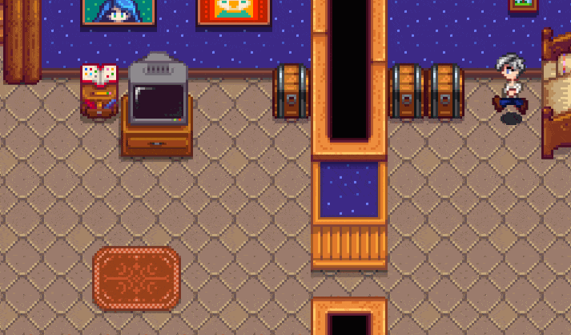

**Noclip Mode** is a [Stardew Valley](http://stardewvalley.net/) mod that toggles
[noclip mode](https://en.wikipedia.org/wiki/Noclip_mode) at the press of a button, letting you walk
through anything (even map boundaries).

## Contents
* [Install](#install)
* [Use](#use)
* [Configure](#configure)
* [Compatibility](#compatibility)
* [See also](#see-also)

## Install
1. [Install the latest version of SMAPI](https://smapi.io/).
2. [Install this mod from Nexus mods](https://www.nexusmods.com/stardewvalley/mods/3900).
3. Run the game using SMAPI.

## Use
Just press `F11` (configurable) to toggle noclip mode. When it's enabled, nothing can stop you.

## Configure
The mod creates a `config.json` file in its mod folder the first time you run it. You can open that
file in a text editor to configure the mod.

These are the available settings:

<table>
<tr>
  <th>setting</th>
  <th>what it affects</th>
</tr>

<tr>
  <td><code>ToggleKey</code></td>
  <td>

Default `F11`. The controller/keyboard/mouse button which toggles noclip mode (see
[key bindings](https://stardewvalleywiki.com/Modding:Key_bindings)).

You can separate bindings with commas (like `F1, LeftShoulder` for either one), and set
multi-key bindings with plus signs (like `LeftShift + F1`).

  </td>
</tr>
<tr>
  <td><code>ShowEnabledMessage</code></td>
  <td>

Default `true`. Whether to show a message when noclip is enabled, including the button to turn it
back off.

  </td>
</tr>
<tr>
  <td><code>ShowDisabledMessage</code>
  <td>

Default `false`. Whether to show a message when noclip is disabled, including the button to turn it
back on.

  </td>
</tr>
</table>

## Compatibility
Noclip Mode is compatible with Stardew Valley 1.4+ on Linux/Mac/Windows, both single-player and
multiplayer (even if other players don't have it). No known mod incompatibilities.

## See also
* [Release notes](release-notes.md)
* [Nexus mod](https://www.nexusmods.com/stardewvalley/mods/3900)
