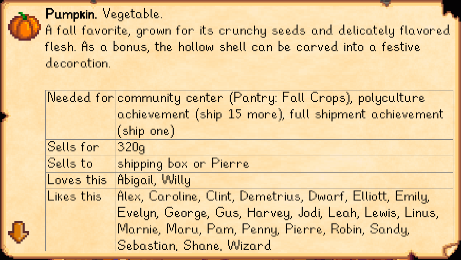

**Lookup Anything** is a [Stardew Valley](http://stardewvalley.net/) mod that shows live info about
whatever's under your cursor when you press `F1`. Learn a villager's favourite gifts, when a crop
will be ready to harvest, how long a fence will last, why your farm animals are unhappy, and more.


Compatible with Stardew Valley 1.11+ on Linux, Mac, and Windows.

## Contents
* [Installation](#installation)
* [Usage](#usage)
* [Examples](#examples)
* [Configuration](#configuration)
* [Versions](#versions)
* [Compiling the mod](#compiling-the-mod)
* [See also](#see-also)

## Installation
1. [Install the latest version of SMAPI](https://github.com/Pathoschild/SMAPI/releases).
2. [Install this mod from Nexus mods](http://www.nexusmods.com/stardewvalley/mods/541/).
3. Run the game using SMAPI.

## Usage
Just point your cursor at something and press `F1`. The mod will show live info about that object.
You can do this in the world, your inventory, the calendar, or a shop.

## Examples
Here are some representative screenshots (layout and values will change dynamically as needed).

### Items
| item        | screenshots |
| ----------- | ----------- |
| crop        |  |
| seeds       |  |
| inventory   |   |

### Characters
| character   | screenshots |
| ----------- | ----------- |
| villager    |  |
| pet         |  |
| farm animal |  |
| monster     |  |
| player      |  |

### Map objects
| object          | screenshots |
| --------------- | ----------- |
| crafting object |  |
| cask            |  |
| fence           |  |
| fruit tree      |   |
| wild tree       |  |

### Mine objects
| object  | screenshots |
| ------- | ----------- |
| gem     |  |
| ore     |  |
| stone   |  |
| ice     |  |

## Configuration
The mod will work fine out of the box, but you can tweak its settings by editing the `config.json`
file if you want. These are the available settings:

| setting           | what it affects
| ----------------- | -------------------
| `Controller`<br />`Keyboard` | Set the controller and keyboard buttons to use (see valid [keyboard buttons](https://msdn.microsoft.com/en-us/library/microsoft.xna.framework.input.keys.aspx) and [controller buttons](https://msdn.microsoft.com/en-us/library/microsoft.xna.framework.input.buttons.aspx)). The default values are `F1` to lookup, and `Up`/`Down` to scroll the lookup results. Available inputs:<ul><li>`ToggleLookup`: lookup whatever's under the cursor.</li><li>`ToggleLookupInFrontOfPlayer`: lookup whatever's in front of the player.</li><li>`ScrollUp`/`ScrollDown`: scroll the displayed lookup results.</li><li>`ToggleDebug`: show information intended for developers.</li></ul>
| `CheckForUpdates` | Default `true`. Whether the mod should check for a newer version when you load the game. If a new version is available, you'll see a small message at the bottom of the screen for a few seconds. This doesn't affect the load time even if your connection is offline or slow, because it happens in the background.
| `HideOnKeyUp`     | Default `false`. If enabled, the lookup window will be shown while you hold `F1` and disappear when you release it.

## Versions
1.0:
* Initial version.
* Added support for NPCs (villagers, pets, farm animals, monsters, and players), items (crops and
   inventory), and map objects (crafting objects, fences, trees, and mine objects).
* Added controller support and configurable bindings.
* Added hidden debug mode.
* Added version check on load.
* Let players lookup a target from any visible part of its sprite.

1.1:
* On item lookup:
  * removed crafting recipe;
  * added crafting, cooking, and furnace recipes which use this item as an ingredient.
* Added error if game or SMAPI are out of date.

1.2:
* On item lookup:
  * added crop info for seeds;
  * added recipes for the charcoal kiln, cheese press, keg, loom, mayonnaise machine, oil maker,
    preserves jar, recycling machine, and slime egg-press;
  * merged recipe fields;
  * fixed an error when displaying certain recipes.
* Added optional mode which hides the lookup UI when you release the button.
* `F1` now toggles the lookup UI (i.e. will close the lookup if it's already open).

1.3:
* Added possible drops and their probability to monster lookup.
* Added item icons to crafting output, farm animal produce, and monster drops.
* Fixed item gift tastes being wrong in some cases.
* Fixed monster drops showing 'error item' in rare cases.
* Fixed fields being shown for dead crops.
* Internal refactoring.

1.4:
* Updated for Stardew Valley 1.1:
  * added new fertile weeds (forest farm) and geode stones (hilltop farm);
  * added new recipes for coffee, mead, sugar, void mayonnaise, and wheat flour;
  * updated for Gold Clock preventing fence decay;
  * updated to latest binaries & increased minimum versions.
* Fixed a few missing stones & weeds.

1.5:
* You can now lookup a villager from the calendar.
* You can now lookup items from an open chest.
* Added cask aging schedule.
* Added better NPC friendship fields which account for dating and marriage.
* Added marriage stardrop to heart meter.
* Added support for new iridium quality.
* Added debug log.
* Added option to suppress SMAPI's `F2` debug hotkey, which can have unintended consequences like skipping an entire season or teleporting into walls.
* Fixed gift tastes not handling precedence when NPCs are conflicted about how they feel.
* Fixed error when screen resolution is too small to display lookup UI.
* Fixed error when calculating a day offset that wraps into the next year.
* Fixed errors crashing the game in rare cases.

1.6:
* Added support for Linux and Mac.
* Added item 'needed for' field for community center bundles, full shipment achievement, and polyculture achievement.
* Added item 'sells to' field.
* Added item number owned field.
* Added fruit tree quality schedule.
* Added support for looking up shop items.
* Added `data.json` validation on startup.
* Disabled lookups when game rendering mode breaks Lookup Anything (only known to happen in the Stardew Valley Fair).
* Fixed sale price shown for unsellable items.
* Fixed update-check error on startup adding scary error text in console.
* Fixed incorrect gift tastes by deferring more to the game code (slower but more accurate).
* Fixed error when looking up a villager you haven't met.
* Fixed error when looking up certain NPCs with no social data.

1.7:
* You can now lookup a villager from the social page.
* You can now lookup an item from the toolbar.
* Console logs are now less verbose.
* Updated to SMAPI 1.1.
* Fixed some cases where the item 'number owned' field was inacurate.
* Fixed iridium prices being shown for items that can't have iridium quality.
* `F2` debug mode is no longer suppressed (removed in latest version of SMAPI).

1.8:
* Added museum donations to item 'needed for' field.
* You can now lookup things behind trees when you're behind them.
* You can now close the lookup UI by clicking outside it.
* Updated to SMAPI 1.3.
* Fixed incorrect farmer luck message when the spirits are feeling neutral.
* Fixed social menu lookup sometimes showing the wrong villager.

1.9 (upcoming):
* When looking up a villager, the gift list now highlights items you're carrying or own.
* You can now lookup whatever's directly in front of you with a separate hotkey, for more intuitive controller use. (Not bound by default.)
* You can now click on the up/down arrows to scroll content.
* Fixed controller thumbsticks scrolling content too slowly.
* Fixed controller button conventions not used by lookup menu.
* Fixed a rare error caused by the game duplicating an NPC.
* Fixed fruit tree quality schedule being incorrect in some cases.
* Fixed invalid button bindings in `config.json` being silently discarded.

## Compiling the mod
[Installing a stable release from Nexus Mods](http://www.nexusmods.com/stardewvalley/mods/541/) is
recommended for most users. If you really want to compile the mod yourself, read on.

This mod uses the [crossplatform build config](https://github.com/Pathoschild/Stardew.ModBuildConfig#readme)
so it can be built on Linux, Mac, and Windows without changes. See [its documentation](https://github.com/Pathoschild/Stardew.ModBuildConfig#readme)
for troubleshooting.

### Compiling the mod for testing
To compile the mod and add it to the mods directory:

1. Rebuild the project in [Visual Studio](https://www.visualstudio.com/vs/community/) or [MonoDevelop](http://www.monodevelop.com/).  
   <small>This will compile the code and package it into the mod directory.</small>
2. Launch the project with debugging.  
   <small>This will start the game through SMAPI and attach the Visual Studio debugger.</small>

### Compiling the mod for release
To package the mod for release:

1. Delete the game's `Mods/LookupAnything` directory.  
   <small>(This ensures the package is clean and has default configuration.)</small>
2. Recompile the mod per the previous section.
3. Launch the game through SMAPI to generate the default `config.json`.
2. Create a zip file of the game's `Mods/LookupAnything` folder. The zip name should include the
   mod name and version. For example:

   ```
   LookupAnything-1.6.zip
      LookupAnything/
         LookupAnything.dll
         LookupAnything.pdb
         data.json
         config.json
         manifest.json
   ```

### Useful tools
These may be useful when working on this mod:

* Windows:
  * [dotPeek](https://www.jetbrains.com/decompiler/) to decompile the game into a Visual Studio
  project.
  * [ReSharper](https://www.jetbrains.com/resharper/) to analyse the game code (e.g. find usages).
  * [XNB Extract](http://community.playstarbound.com/threads/modding-guides-and-general-modding-discussion-redux.109131/)
  to extract the game's assets and data.
* [YAML Analyzer](http://catox.free.fr/StardewTools/yaml_analyzer.html) to help figure out data
  files.

## See also
* [Nexus mod](http://www.nexusmods.com/stardewvalley/mods/518)
* [Discussion thread](http://community.playstarbound.com/threads/smapi-lookup-anything.122929/)
* My other Stardew Valley mods: [Chests Anywhere](https://github.com/Pathoschild/ChestsAnywhere), [No Debug Mode](https://github.com/Pathoschild/Stardew.NoDebugMode), and [Skip Intro](https://github.com/Pathoschild/StardewValley.SkipIntro)
