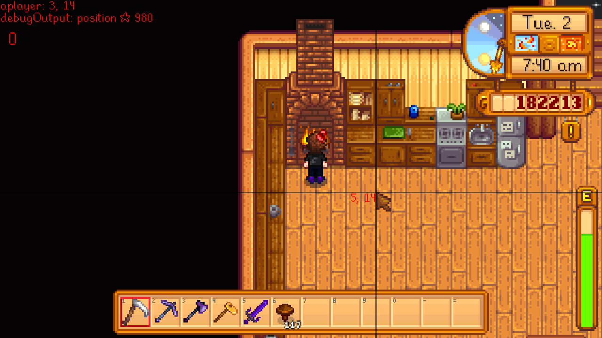

**Debug Mode** is an open-source [Stardew Valley](http://stardewvalley.net/) mod which draws debug
information to the screen and unlocks the game's built-in debug commands.

## Usage
Press the `~` key (configurable) to enable or disable debug mode. This will...

1. Add the game's built-in debug info in the top-left corner:

   

2. Unlock the game's built-in debug commands:

   hotkey | action
   :----- | :-----
   `T`    | Add one hour to the clock.
   `SHIFT` + `Y` | Subtract 10 minutes from the clock.
   `Y`    | Add 10 minutes to the clock.
   `1`    | Warp to the mountain.
   `2`    | Warp to the town.
   `3`    | Warp to the farm.
   `4`    | Warp to the forest.
   `5`    | Warp to the beach.
   `6`    | Warp to the mine.
   `7`    | Warp to the desert.
   `K`    | Move down one mine level. If not currently in the mine, warp to it.
   `F5`   | Toggle the player.
   `F7`   | Draw a tile grid.
   `B`    | Shift up the toolbar row (that is, show the next higher inventory row).
   `N`    | Shift down the toolbar row (that is, show the next higher inventory row).

3. If you set `AllowDangerousCommands: true` in the [configuration](#configuration) (disabled by
   default), also unlock these debug commands:

   hotkey | action
   :----- | :-----
   `P`    | Immediately go to bed and start the next day.
   `M`    | Immediately go to bed and start the next season.
   `H`    | Randomise the player's hat.
   `I`    | Randomise the player's hair.
   `J`    | Randomise the player's shirt and pants.
   `L`    | Randomise the player.
   `U`    | Randomise the farmhouse wallpaper and floors.
   `F10`  | **Broken.** Tries to launch a multiplayer server, and crashes.

## Configuration
The mod will work fine out of the box, but you can tweak its settings by editing the `config.json`
file if you want. These are the available settings:

setting           | what it affects
:---------------- | :------------------
`Keyboard`        | Set keyboard bindings. The default values are `~` to toggle debug mode. See [valid keys](https://msdn.microsoft.com/en-us/library/microsoft.xna.framework.input.keys.aspx).
`Controller`      | Set controller bindings. No buttons configured by default. See [valid buttons](https://msdn.microsoft.com/en-us/library/microsoft.xna.framework.input.buttons.aspx).
`AllowDangerousCommands` | Default `false`. This allows debug commands which end the current day/season & save, randomise your player or farmhouse decorations, or crash the game. Only change this if you're aware of the consequences.

## Versions
1.0:
* Initial version which unlocks debug mode.
* Suppress dangerous options by default.

## Compiling the mod
Installing a stable release from Nexus Mods is recommended for most users. If you really want to
compile the mod yourself, read on.

This mod uses the [crossplatform build config](https://github.com/Pathoschild/Stardew.ModBuildConfig#readme)
so it can be built on Linux, Mac, and Windows without changes. See [its documentation](https://github.com/Pathoschild/Stardew.ModBuildConfig#readme)
for troubleshooting.

### Compiling the mod for testing
On Windows:

1. Rebuild the project in [Visual Studio](https://www.visualstudio.com/vs/community/).  
   <small>This will compile the code and package it into the mod directory.</small>
2. Launch the project with debugging.  
   <small>This will start the game through SMAPI and attach the Visual Studio debugger.</small>

On Linux or Mac:

1. Rebuild the project in [MonoDevelop](http://www.monodevelop.com/).
2. Copy the following files from the `bin` directory:
   * `manifest.json`
   * `Pathoschild.Stardew.DebugMode.dll`
   * `Pathoschild.Stardew.DebugMode.pdb`
3. Paste the files into a `DebugMode` subdirectory under SMAPI's `Mods` directory.
4. Launch the game through SMAPI.

### Compiling the mod for release
To package the mod for release:

1. Delete the game's `Mods/DebugMode` directory.  
   <small>(This ensures the package will be clean and have default configuration.)</small>
2. Recompile the mod per the previous section.
3. Launch the game through SMAPI to generate the default `config.json`.
2. Create a zip file of the game's `Mods/DebugMode` folder. The zip name should include the
   mod name, version, and platform. For example:

   ```
   DebugMode-1.6-Windows.zip
      DebugMode/
         Pathoschild.Stardew.DebugMode.dll
         Pathoschild.Stardew.DebugMode.pdb
         config.json
         manifest.json
   ```

## See also
* <s>Nexus mod</s>
* <s>Discussion thread</s>
* My other Stardew Valley mods: [Chests Anywhere](https://github.com/Pathoschild/ChestsAnywhere), [Lookup Anything](https://github.com/Pathoschild/LookupAnything), [No Debug Mode](https://github.com/Pathoschild/Stardew.NoDebugMode), and [Skip Intro](https://github.com/Pathoschild/StardewValley.SkipIntro)
