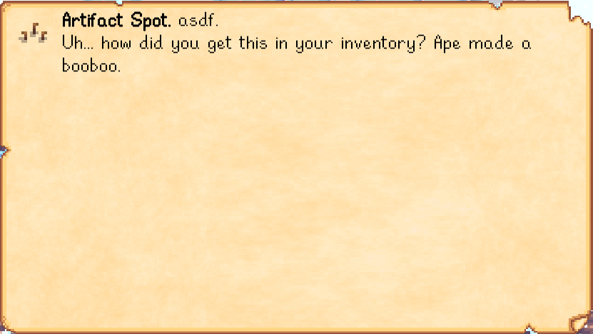

**Lookup Anything** is a [Stardew Valley](http://stardewvalley.net/) mod that shows live info about
whatever's under your cursor when you press `F1`.

This is a very early prototype and isn't ready for general use.

## Installation
1. Install [SMAPI](https://github.com/ClxS/SMAPI) (0.39.5+).
2. <s>Install this mod from Nexus mods.</s> This mod isn't released yet. If you know what you're
   doing, you can compile the mod yourself to use it.
3. Run the game using SMAPI.

## Usage
Just point your cursor at something and press `F1`. The mod will show live info about that object.

## Examples
Here are some representative screenshots (layout and values will change dynamically as needed).

### Characters
| character   | screenshots |
| ----------- | ----------- |
| villager    |  |
| pet         |  |
| farm animal |  |

### Items
| item        | screenshots |
| ----------- | ----------- |
| crop        |  |
| inventory   |  |

### Map objects
| object          | screenshots |
| --------------- | ----------- |
| crafting object |  |
| wild tree       |  |
| ...             |  |

## Changelog
* 1.0 (not yet released)
  * Initial version
  * Added support for crops, farm animals, inventory, NPCs, non-fruit trees, and some map objects.