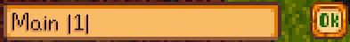

**Chests Anywhere** is a [Stardew Valley](http://stardewvalley.net/) mod which lets you access
your chests from anywhere. Transfer items without having to run around, from the comfort of your
bed to the deepest mine level.

## Installation
1. Install [SMAPI](https://github.com/ClxS/SMAPI) (0.39.5+).
3. Install [this mod from Nexus mods](http://www.nexusmods.com/stardewvalley/mods/518).
4. Run the game using SMAPI.

## Usage
* **Access chests:** press `B` to open the menu. This will show the chests on your farm and in
  your buildings. Click the top-left menu to change chest, or navigate using the left and right
  arrow keys.
* **Rename chests:** click the speech bubble next to the chest dropdown to rename the chest.
* **Sort chests:** your chests are sorted alphabetically by default. Just add a number between
  pipes in the chest name to change the order:

  

  The chests will be sorted by that number, _then_ alphabetically. (The number won't be shown in
  the list.)
* **Hide chests:** add `|ignore|` to a chest's name, and it won't appear when you press `B`. Careful! You won't be able to show it again until you reset the name (e.g. by picking up the chest and putting it back down).

## Configuration
The mod will work fine out of the box, but you can tweak its settings by editing the `config.json`
file if you want. These are the available settings:

| setting           | what it affects
| ----------------- | -------------------
| `Keyboard`        | Set keyboard bindings. The default values are `B` to toggle the chest UI, and `Left`/`Right` to switch chests. See [valid keys](https://msdn.microsoft.com/en-us/library/microsoft.xna.framework.input.keys.aspx).
| `Controller`      | Set controller bindings. No buttons configured by default. See [valid buttons](https://msdn.microsoft.com/en-us/library/microsoft.xna.framework.input.buttons.aspx).
| `CheckForUpdates` | Default `true`. Whether the mod should check for a newer version when you load the game. If a new version is available, you'll see a small message at the bottom of the screen for a few seconds. This doesn't affect the load time even if your connection is offline or slow, because it happens in the background.
| `GroupByLocation` | Default `false`. Whether to add a separate location tab to filter chests. This option may be removed in a future version. [Comment now if you want to keep it!](http://community.playstarbound.com/threads/smapi-chests-anywhere.122603/)

## Versions
1.0:
* Initial release.

1.1:
* Reworked UI.
* Added tabs for chests and locations.
* Added scrollable list for the two tabs.
* Chests can now be ignored.

1.2:
* Chests are now sorted alphabetically.
* Chests can now be sorted manually.
* Added item tooltips.
* Added organise button.
* Added controller support.
* Added support for rebinding keyboard/controller keys in `config.json`.
* Added hotkeys to navigate between chests.
* Fixed chests in constructed buildings (like barns) not showing up.
* Fixed farmhouse fridge not showing up.
* Location tab is now hidden if all your chests are in one place.
* Simplified default chest names (like "Chest #1" instead of "Chest(77,12)").

1.3 (upcoming):
* Added version check on load.
* Added organise button for inventory.
* Added button to rename a chest from the menu.
* Improved chest/location dropdowns:
  * They can now be closed by clicking away or pressing `ESC`.
  * They now show as many items as possible (instead of 10).
  * They now show up/down arrows when there are too many items to display at once.
* Pressing `ESC` will now close the chest UI.
* The location tab is no longer enabled by default, and may be removed in a future version. [Comment now if you want to keep it!](http://community.playstarbound.com/threads/smapi-chests-anywhere.122603/)

## Compiling the mod
[Installing a stable release from Nexus Mods](http://www.nexusmods.com/stardewvalley/mods/518/) is
recommended. If you really want to compile the mod yourself, just edit `ChestsAnywhere.csproj` and
set the `<GamePath>` setting to your Stardew Valley directory path. Launching the project in Visual
Studio will compile the code, package it into the mod directory, and start the game.

## See also
* [Nexus mod](http://www.nexusmods.com/stardewvalley/mods/518)
* [Discussion thread](http://community.playstarbound.com/threads/smapi-chests-anywhere.122603/)
* My other Stardew Valley mods: [Lookup Anything](https://github.com/Pathoschild/LookupAnything) and [Skip Intro](https://github.com/Pathoschild/StardewValley.SkipIntro)
* This is an open-source fork of [AccessChestAnywhere](https://github.com/VIspReaderUS/AccessChestAnywhere) (which is currently inactive), with the [author's blessing](https://github.com/VIspReaderUS/AccessChestAnywhere/issues/1). Versions 1.0 and 1.1 are from that mod.
