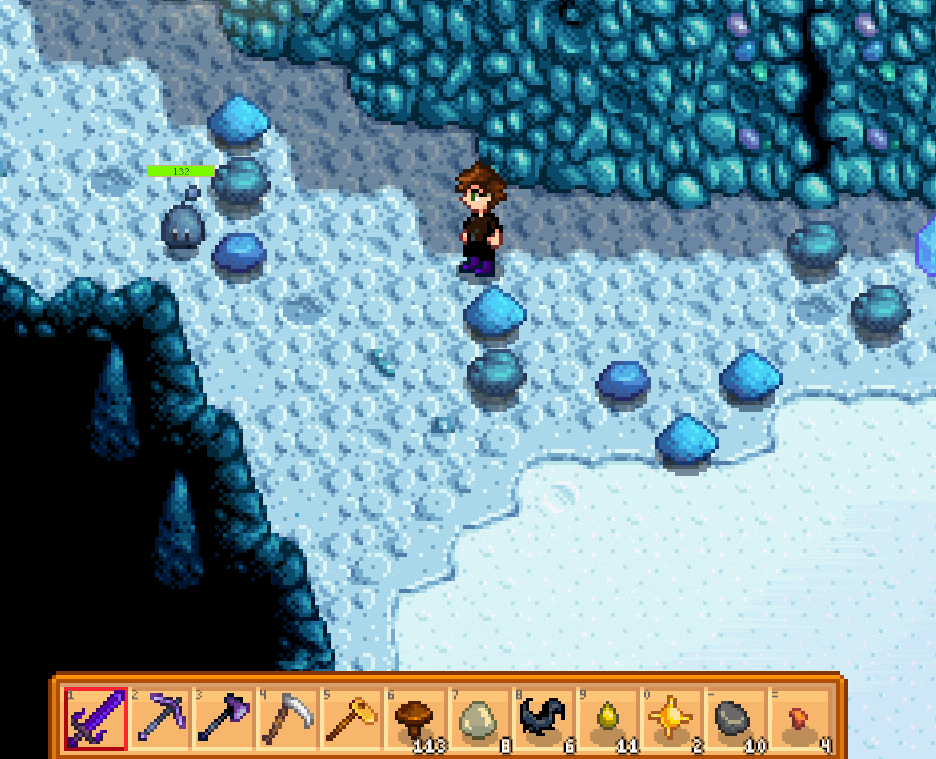

**Chests Anywhere** is a [Stardew Valley](http://stardewvalley.net/) mod which lets you access
your chests from anywhere and organise them your way. Transfer items without having to run around,
from the comfort of your bed to the deepest mine level.



Compatible with Stardew Valley 1.11+ on Linux, Mac, and Windows.

## Contents
* [Installation](#installation)
* [Usage](#usage)
* [Configuration](#configuration)
* [Versions](#versions)
* [Compiling the mod](#compiling-the-mod)
* [See also](#see-also)

## Installation
1. [Install the latest version of SMAPI](http://canimod.com/guides/using-mods#installing-smapi).
3. Install [this mod from Nexus mods](http://www.nexusmods.com/stardewvalley/mods/518).
4. Run the game using SMAPI.

## Usage
**Access chests** by pressing `B`. This will show your chests (and fridge) grouped by category.
Navigate by clicking the top dropdowns, or by pressing the `left` or `right` key.

**Edit chests** by clicking the edit icon after opening a chest ([see example](screenshots/animated-edit.gif)).
This will show a form where you can...
* set the chest name;
* set a category (which defaults to its location);
* set the sort order in the chest list;
* or hide the chest from the chest list.

**Point at a chest** in the world to see its name in a tooltip.

## Configuration
The mod will work fine out of the box, but you can tweak its settings by editing the `config.json`
file if you want. These are the available settings:

| setting           | what it affects
| ----------------- | -------------------
| `Keyboard`        | Set keyboard bindings. The default values are `B` to toggle the chest UI, `Left`/`Right` to switch chests, and `Up`/`Down` to switch categories. See [valid keys](https://msdn.microsoft.com/en-us/library/microsoft.xna.framework.input.keys.aspx).
| `Controller`      | Set controller bindings. The shoulder buttons are used to navigate chests when the menu is open, but there's no toggle by default. The toggle can be used from the inventory screen. See [valid buttons](https://msdn.microsoft.com/en-us/library/microsoft.xna.framework.input.buttons.aspx).
| `CheckForUpdates` | Default `true`. Whether the mod should check for a newer version when you load the game. If a new version is available, you'll see a small message at the bottom of the screen for a few seconds. This doesn't affect the load time even if your connection is offline or slow, because it happens in the background.
| `ShowHoverTooltips` | Default `true`. Whether to show the chest name in a tooltip when you point at a chest.

## Versions
1.0:
* Initial release.

1.1:
* Reworked UI.
* Added tabs for chests and locations.
* Added scrollable list for the two tabs.
* Chests can now be ignored.

1.2:
* Chests are now sorted alphabetically.
* Chests can now be sorted manually.
* Added item tooltips.
* Added organise button.
* Added controller support.
* Added support for rebinding keyboard/controller keys in `config.json`.
* Added hotkeys to navigate between chests.
* Fixed chests in constructed buildings (like barns) not showing up.
* Fixed farmhouse fridge not showing up.
* Location tab is now hidden if all your chests are in one place.
* Simplified default chest names (like "Chest #1" instead of "Chest(77,12)").

1.3:
* Added feature to rename a chest from the menu.
* Added organise button for inventory.
* Added update check on load.
* Added error if game or SMAPI are out of date.
* Improved chest/location dropdowns:
  * They can now be closed by clicking away or pressing `ESC`.
  * They now show as many items as possible (instead of 10).
  * They now show up/down arrows when there are too many items to display at once.
* Improved error handling.
* Pressing `ESC` will now close the chest UI.
* The location tab is no longer enabled by default, and may be removed in a future version.

1.4:
* Updated for Stardew Valley 1.1.
* Added chest category which lets you override the location grouping.
* Added fields to edit sort order and hide chests.
* Fixed edited chest name not saving correctly.

1.5:
* Added name tooltip when your cursor is over a chest.
* Added edit button when you open a chest directly.
* Added cancel button when editing a chest.
* Fixed fridge being accessible before you obtain it.
* Fixed error when you click an unavailable inventory slot.
* Fixed error when you open the menu but don't have any chests.
* Fixed UI not being resized when game window is resized.
* Fixed Lewis' giftbox when you start a new game being usable as a chest.
* Fixed visual issues.

1.6:
* Added Chests Anywhere UI when opening a chest directly.
* Added compatibility with most inventory mods.
* Added an option to disable hover tooltips.
* Fixed controller toggle button not closing the menu.
* Fixed chest menu behaving unpredictably after closing edit form in some cases.
* Major rewrite under the hood.

1.7:
* Added support for Linux and Mac.
* Added support for opening chest overlay from inventory (mostly to allow more controller bindings).
* Added hotkeys to navigate categories.
* Added hotkey to edit chest.
* Added default controller bindings for chest UI navigation.
* Added location tile on edit screen.
* Updated minimum game and SMAPI versions.
* Fixed `B` controller button not cancelling like `ESC` key.
* Fixed various controller issues in 1.6.
* Fixed list scrolling broken in 1.6.
* Fixed navigate-chest hotkeys ignoring category.
* Fixed group list being unsorted.
* Fixed update-check error on startup adding scary error text in console.

1.8 (upcoming):
* Updated to SMAPI 1.1.

## Compiling the mod
[Installing a stable release from Nexus Mods](http://www.nexusmods.com/stardewvalley/mods/518/) is
recommended for most users. If you really want to compile the mod yourself, read on.

This mod uses the [crossplatform build config](https://github.com/Pathoschild/Stardew.ModBuildConfig#readme)
so it can be built on Linux, Mac, and Windows without changes. See [its documentation](https://github.com/Pathoschild/Stardew.ModBuildConfig#readme)
for troubleshooting.

### Compiling the mod for testing
On Windows:

1. Rebuild the project in [Visual Studio](https://www.visualstudio.com/vs/community/).  
   <small>This will compile the code and package it into the mod directory.</small>
2. Launch the project with debugging.  
   <small>This will start the game through SMAPI and attach the Visual Studio debugger.</small>

On Linux or Mac:

1. Rebuild the project in [MonoDevelop](http://www.monodevelop.com/).
2. Copy the following files from the `bin` directory:
   * `manifest.json`
   * `ChestsAnywhere.dll`
   * `ChestsAnywhere.pdb`
3. Paste the files into a `ChestsAnywhere` subdirectory under SMAPI's `Mods` directory.
4. Launch the game through SMAPI.

### Compiling the mod for release
To package the mod for release:

1. Delete the game's `Mods/ChestsAnywhere` directory.  
   <small>(This ensures the package will be clean and have default configuration.)</small>
2. Recompile the mod per the previous section.
3. Launch the game through SMAPI to generate the default `config.json`.
2. Create a zip file of the game's `Mods/ChestsAnywhere` folder. The zip name should include the
   mod name, version, and platform. For example:

   ```
   ChestsAnywhere-1.7-Windows.zip
      ChestsAnywhere/
         ChestsAnywhere.dll
         ChestsAnywhere.pdb
         config.json
         manifest.json
   ```

## See also
* [Nexus mod](http://www.nexusmods.com/stardewvalley/mods/518)
* [Discussion thread](http://community.playstarbound.com/threads/smapi-chests-anywhere.122603/)
* My other Stardew Valley mods: [Lookup Anything](https://github.com/Pathoschild/LookupAnything), [No Debug Mode](https://github.com/Pathoschild/Stardew.NoDebugMode), and [Skip Intro](https://github.com/Pathoschild/StardewValley.SkipIntro)
* This is an [open-source fork](https://github.com/VIspReaderUS/AccessChestAnywhere/issues/1) of the inactive [AccessChestAnywhere](https://github.com/VIspReaderUS/AccessChestAnywhere) mod. Versions 1.0 and 1.1 are from that mod.
