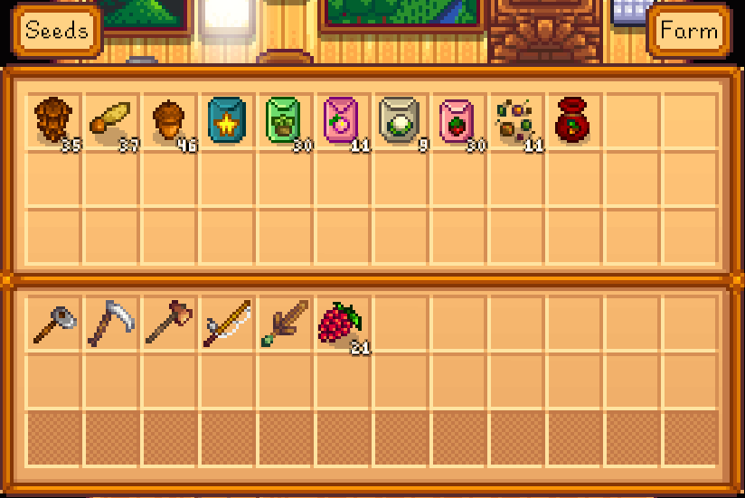

**AccessChestAnywhere** is a [Stardew Valley](http://stardewvalley.net/) mod which lets you access
your chests from anywhere. Transfer items without having to run around, from the comfort of your bed
to the deepest mine level.

**This is an experimental build. Use at your own risk.**

## Usage
### Installation
1. Install [SMAPI](https://github.com/ClxS/SMAPI) (0.39.5+).
2. Install [Chest Label System](http://www.nexusmods.com/stardewvalley/mods/242/) to name your chests. (Recommended but not required.)
3. Install [this mod from Nexus mods](http://www.nexusmods.com/stardewvalley/mods/257/).
3. Launch the game using SMAPI.

### When playing
Press `B` to open the menu:

This will show all chests on your farm and in your buildings (unless they have 'ignore' in the name).
You can click the top-right menu to change location, and the top-left menu to change chest:

## Changelog
* 1.2.0 (not released)
  * Added item tooltips
  * Sort chests by name
* 1.1.0
  * Reworked UI
  * Added tabs for chest and locations
  * Added scrollable list for the two tabs
  * Added blacklist feature
* 1.0.0
  * Initial release