**Lookup Anything** is a [Stardew Valley](http://stardewvalley.net/) mod that shows live info about
whatever's under your cursor when you press `F1`. Learn a villager's favourite gifts, when a crop
will be ready to harvest, how long a fence will last, why your farm animals are unhappy, and more.

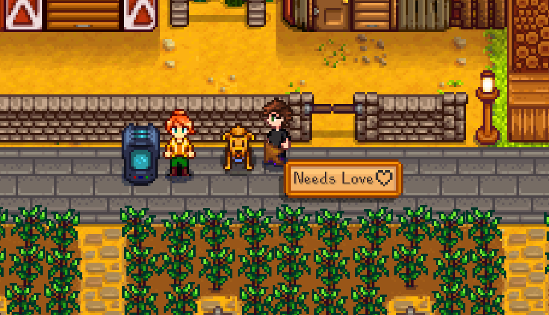

## Contents
* [Installation](#installation)
* [Usage](#usage)
* [Examples](#examples)
* [Configuration](#configuration)
* [Versions](#versions)
* [Compiling the mod](#compiling-the-mod)
* [See also](#see-also)

## Installation
1. Install [SMAPI](https://github.com/ClxS/SMAPI) (0.40+).
2. [Install this mod from Nexus mods](http://www.nexusmods.com/stardewvalley/mods/541/).
3. Run the game using SMAPI.

## Usage
Just point your cursor at something and press `F1`. The mod will show live info about that object.
You can do this to things you see in the world, in your inventory, or in the calendar.

## Examples
Here are some representative screenshots (layout and values will change dynamically as needed).

### Items
| item        | screenshots |
| ----------- | ----------- |
| crop        | 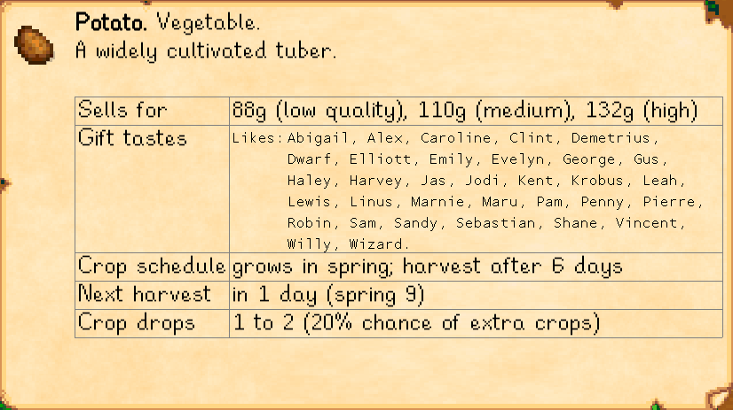 |
| seeds       | 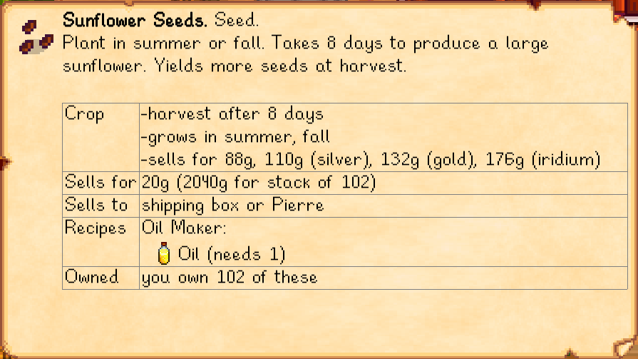 |
| inventory   | 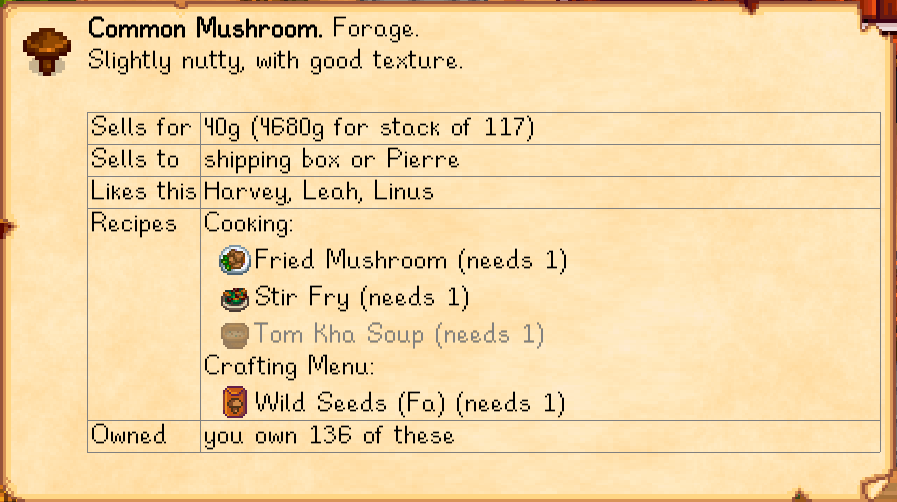 |

### Characters
| character   | screenshots |
| ----------- | ----------- |
| villager    | 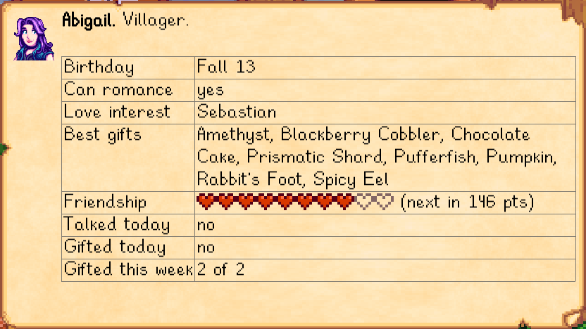 |
| pet         | 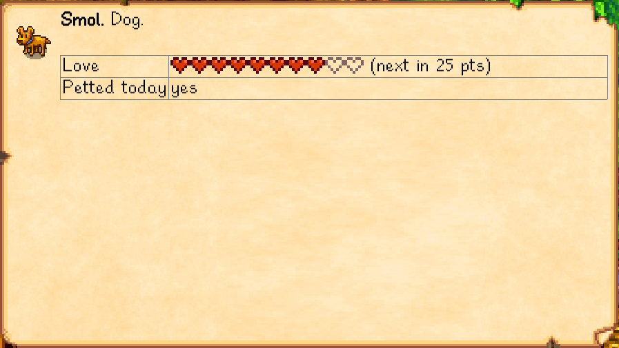 |
| farm animal | 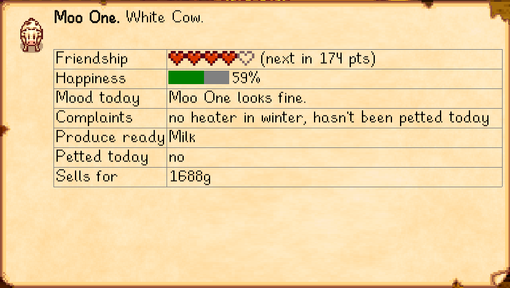 |
| monster     | 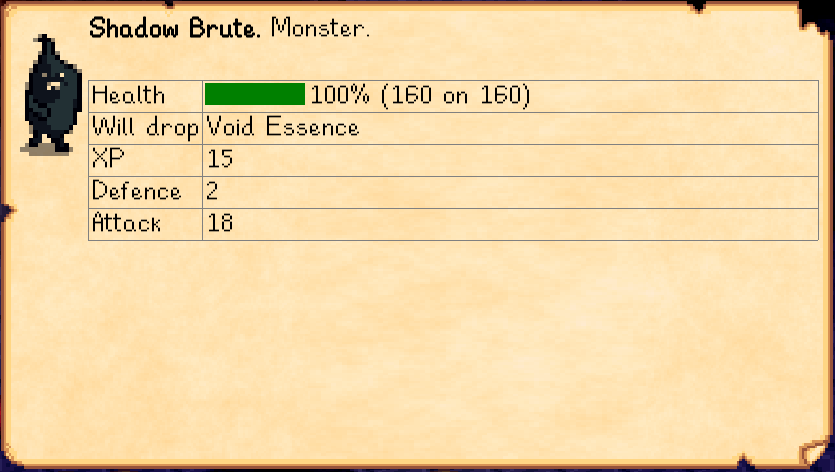 |
| player      |  |

### Map objects
| object          | screenshots |
| --------------- | ----------- |
| crafting object | 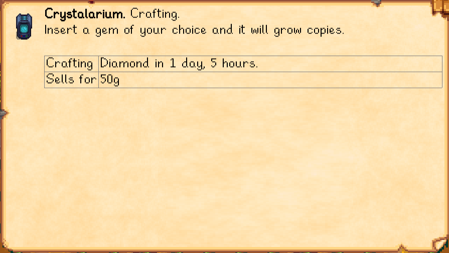 |
| cask            | 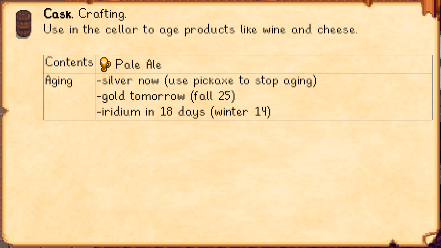 |
| fence           | 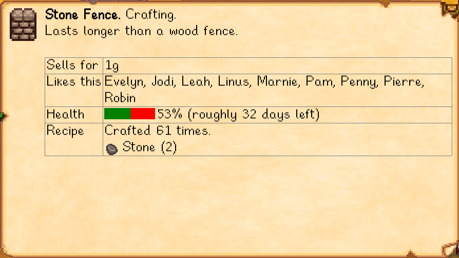 |
| fruit tree      | 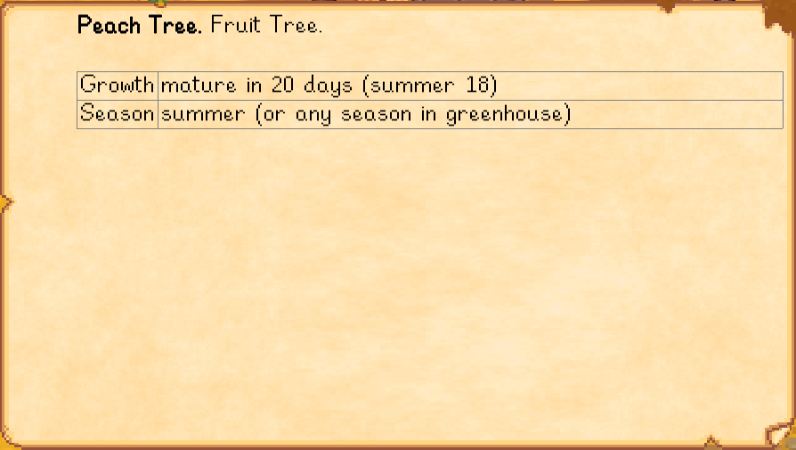 |
| wild tree       | 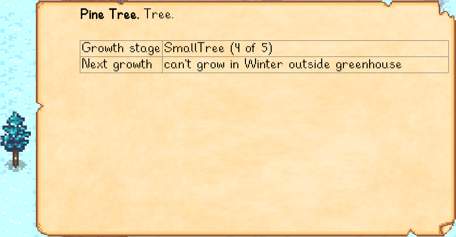 |

### Mine objects
| object  | screenshots |
| ------- | ----------- |
| gem     | 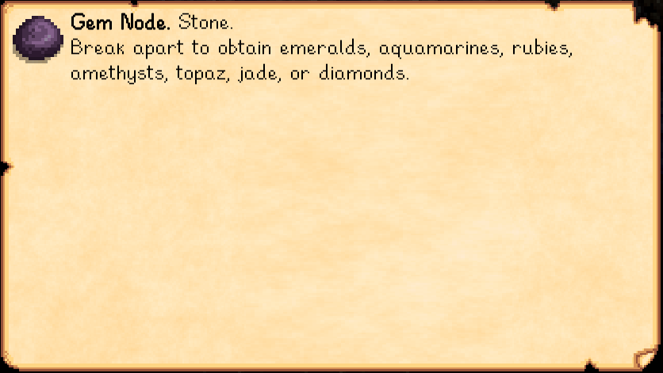 |
| ore     | 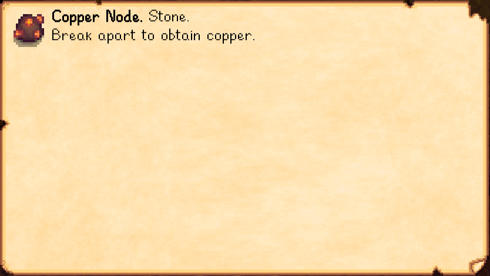 |
| stone   | 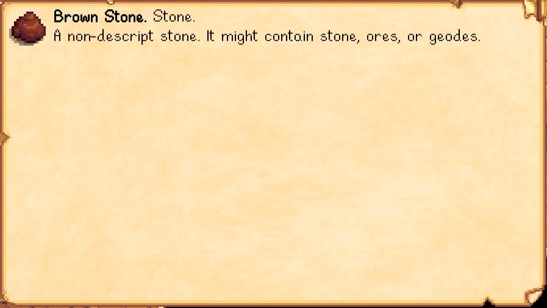 |
| ice     | 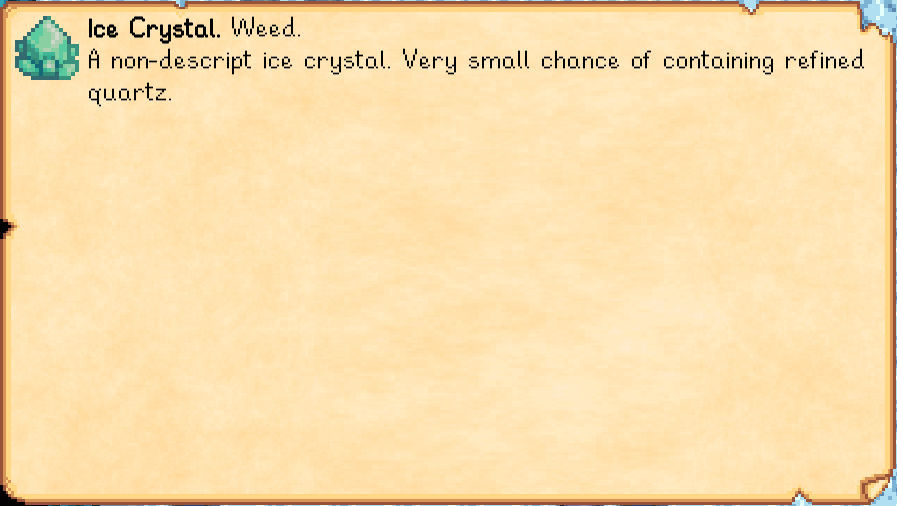 |

## Configuration
The mod will work fine out of the box, but you can tweak its settings by editing the `config.json`
file if you want. These are the available settings:

| setting           | what it affects
| ----------------- | -------------------
| `Keyboard`        | Set keyboard bindings. The default values are `F1` to lookup, and `Up`/`Down` to scroll. See [valid keys](https://msdn.microsoft.com/en-us/library/microsoft.xna.framework.input.keys.aspx).
| `Controller`      | Set controller bindings. No buttons configured by default. See [valid buttons](https://msdn.microsoft.com/en-us/library/microsoft.xna.framework.input.buttons.aspx).
| `CheckForUpdates` | Default `true`. Whether the mod should check for a newer version when you load the game. If a new version is available, you'll [see a small message at the bottom of the screen for a few seconds](screenshots/new-version-message.png). This doesn't affect the load time even if your connection is offline or slow, because it happens in the background.
| `HideOnKeyUp`     | Default `false`. If enabled, the lookup window will be shown while you hold `F1` and disappear when you release it.
| `DebugLog`        | Default `true`. Whether to log information to the console useful for troubleshooting issues.
| `SuppressGameDebug` | Default `true`. Disables SMAPI's `F2` debug hotkey, which can have unintended consequences like skipping an entire season or teleporting into walls. See [SMAPI issue #120](https://github.com/cjsu/SMAPI/issues/120).

## Versions
1.0:
* Initial version.
* Added support for NPCs (villagers, pets, farm animals, monsters, and players), items (crops and
   inventory), and map objects (crafting objects, fences, trees, and mine objects).
* Added controller support and configurable bindings.
* Added hidden debug mode.
* Added version check on load.
* Let players lookup a target from any visible part of its sprite.

1.1:
* On item lookup:
  * removed crafting recipe;
  * added crafting, cooking, and furnace recipes which use this item as an ingredient.
* Added error if game or SMAPI are out of date.

1.2:
* On item lookup:
  * added crop info for seeds;
  * added recipes for the charcoal kiln, cheese press, keg, loom, mayonnaise machine, oil maker,
    preserves jar, recycling machine, and slime egg-press;
  * merged recipe fields;
  * fixed an error when displaying certain recipes.
* Added optional mode which hides the lookup UI when you release the button.
* `F1` now toggles the lookup UI (i.e. will close the lookup if it's already open).

1.3:
* Added possible drops and their probability to monster lookup.
* Added item icons to crafting output, farm animal produce, and monster drops.
* Fixed item gift tastes being wrong in some cases.
* Fixed monster drops showing 'error item' in rare cases.
* Fixed fields being shown for dead crops.
* Internal refactoring.

1.4:
* Updated for Stardew Valley 1.1:
  * added new fertile weeds (forest farm) and geode stones (hilltop farm);
  * added new recipes for coffee, mead, sugar, void mayonnaise, and wheat flour;
  * updated for Gold Clock preventing fence decay;
  * updated to latest binaries & increased minimum versions.
* Fixed a few missing stones & weeds.

1.5:
* You can now lookup a villager from the calendar.
* You can now lookup items from an open chest.
* Added cask aging schedule.
* Added better NPC friendship fields which account for dating and marriage.
* Added marriage stardrop to heart meter.
* Added support for new iridium quality.
* Added debug log.
* Added option to suppress SMAPI's `F2` debug hotkey, which can have unintended consequences like skipping an entire season or teleporting into walls.
* Fixed gift tastes not handling precedence when NPCs are conflicted about how they feel.
* Fixed error when screen resolution is too small to display lookup UI.
* Fixed error when calculating a day offset that wraps into the next year.
* Fixed errors crashing the game in rare cases.

## Compiling the mod
[Installing a stable release from Nexus Mods](http://www.nexusmods.com/stardewvalley/mods/541/) is
recommended. If you really want to compile the mod yourself, just edit `LookupAnything.csproj` and
set the `<GamePath>` setting to your Stardew Valley directory path. Launching the project in Visual
Studio will compile the code, package it into the mod directory, and start the game.

Useful tools when working on this mod:
* [dotPeek](https://www.jetbrains.com/decompiler/) to decompile the game into a Visual Studio
  project.
* [ReSharper](https://www.jetbrains.com/resharper/) to analyse the game code (e.g. find usages).
* [XNB Extract](http://community.playstarbound.com/threads/modding-guides-and-general-modding-discussion-redux.109131/)
  to extract the game's assets and data.
* [YAML Analyzer](http://catox.free.fr/StardewTools/yaml_analyzer.html) to help figure out data
  files.

## See also
* [Nexus mod](http://www.nexusmods.com/stardewvalley/mods/518)
* [Discussion thread](http://community.playstarbound.com/threads/smapi-lookup-anything.122929/)
* My other Stardew Valley mods: [Chests Anywhere](https://github.com/Pathoschild/ChestsAnywhere) and [Skip Intro](https://github.com/Pathoschild/StardewValley.SkipIntro)