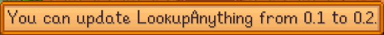

**Lookup Anything** is a [Stardew Valley](http://stardewvalley.net/) mod that shows live info about
whatever's under your cursor when you press `F1`. Learn a villager's favourite gifts, when a crop
will be ready to harvest, how long a fence will last, why your farm animals are unhappy, and more.

## Installation
1. Install [SMAPI](https://github.com/ClxS/SMAPI) (0.40+).
2. <s>Install this mod from Nexus mods.</s> See the [thread on the Stardew Valley forums for instructions](http://community.playstarbound.com/threads/smapi-lookup-anything.122929/#post-3019451).
3. Run the game using SMAPI.

## Usage
Just point your cursor at something and press `F1`. The mod will show live info about that object.

## Examples
Here are some representative screenshots (layout and values will change dynamically as needed).

### Items
| item        | screenshots |
| ----------- | ----------- |
| crop        |  |
| inventory   |  |

### Characters
| character   | screenshots |
| ----------- | ----------- |
| villager    |  |
| pet         |  |
| farm animal |  |
| monster     |  |
| player      |  |

### Map objects
| object          | screenshots |
| --------------- | ----------- |
| crafting object |  |
| fence           |  |
| fruit tree      |  |
| wild tree       |  |
| mine objects    |     |
| ...             |  |

## Configuration
### Change input
Don't want to lookup things with `F1`? You can change all of the key bindings in the
`config.json` (see [valid keys](https://msdn.microsoft.com/en-us/library/microsoft.xna.framework.input.keys.aspx)),
and add controller bindings if you have one (see [valid buttons](https://msdn.microsoft.com/en-us/library/microsoft.xna.framework.input.buttons.aspx)).

### Mod update check
The mod checks for a newer version when you load the game. If a new version is available, you'll
see a small message at the bottom of the screen for a few seconds:

This doesn't affect the load time even if your connection is offline or slow, because it happens in
the background. This is purely for convenience; you can disable the update check by setting
`CheckForUpdates: false` in the `config.json` file.

## Changelog
* 1.0 (not yet released)
  * Initial version.
  * Added support for NPCs (villagers, pets, farm animals, monsters, and players), items (crops and
    inventory), and map objects (crafting objects, fences, trees, and mine objects).
  * Added controller support and configurable bindings.
  * Added hidden debug mode.
  * Added version check on load.
  * Let players lookup a target from any visible part of its sprite.