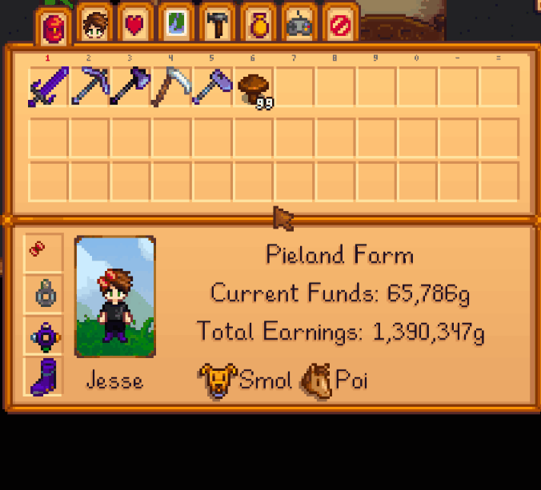

**Rotate Toolbar** is a [Stardew Valley](http://stardewvalley.net/) mod that lets you rotate the top
inventory row for the toolbar by pressing `Tab` (configurable):  

## Contents
* [Install](#install)
* [Configure](#configure)
* [Versions](#versions)
* [See also](#see-also)

## Install
1. [Install the latest version of SMAPI](https://smapi.io/).
2. [Install this mod from Nexus mods](http://www.nexusmods.com/stardewvalley/mods/1100).
3. Run the game using SMAPI.

## Configure
The mod will work fine out of the box, but you can tweak its settings by editing the `config.json`
file if you want. These are the available settings:

setting    | what it affects
---------- | -------------------
`Controls` | The configured controller, keyboard, and mouse buttons (see [key bindings](https://stardewvalleywiki.com/Modding:Key_bindings)). You can separate multiple buttons with commas. The default values are `Tab` to show the next row. Available inputs:<ul><li>`ShiftToPrevious`: show the previous inventory row.</li><li>`ShiftToNext`: show the next inventory row.</li></ul>

## Versions
See [release notes](release-notes.md).

## See also
* [Nexus mod](http://www.nexusmods.com/stardewvalley/mods/1100)
* [Discussion thread](http://community.playstarbound.com/threads/rotate-toolbar.132264)
