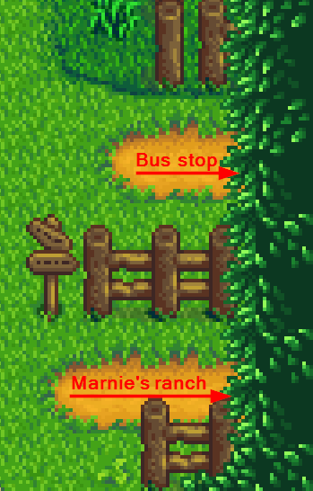

**Small Beach Farm** is a [Stardew Valley](http://stardewvalley.net/) mod which replaces the
riverlands farm with a fertile pocket beach suitable for slower/challenge runs, and lets you
catch both river and ocean fish.

> 

## Install
1. [Install the latest version of SMAPI](https://smapi.io/).
2. Install [this mod from Nexus Mods](http://www.nexusmods.com/stardewvalley/mods/3750).
3. Run the game using SMAPI.

## Usage
Just load a save with the riverlands farm, and you'll see the new map!

A few highlights:

* The beach is fertile, so you can plant crops in the grass and sand too:  
  > 
* The exit to Marnie's ranch is on the right:
  > 

* You can catch riverlands fish in the river and ocean fish in the ocean (for both fishing and
  crab pots):
  > 
* If you use [Automate](https://www.nexusmods.com/stardewvalley/mods/1063), there's plenty of spots
  to connect a chest to crab pots:
  > 

## FAQs
### Compatibility
Compatible with Stardew Valley 1.3+ on Linux/Mac/Windows, both single-player and multiplayer. Can't
be used with other mods that replace the riverlands farm.

### Can I use this with an existing save?
Yep! If you have things in the water due to the smaller map, see
[Saves#Change farm type](https://stardewvalleywiki.com/Saves#Change_farm_type)
for some suggested fixes (skip the part about editing the save file).

### Does this work with map recolors?
Yep! It currently adjusts automatically for these recolors:

* A Wittily Named Recolor
* Eemie's Just Another Map Recolor
* Starblue Valley

## See also
* Farm map commissioned from [Opalie](https://www.nexusmods.com/stardewvalley/users/38947035)!
* [release notes](release-notes.md)
* [Nexus mod](http://www.nexusmods.com/stardewvalley/mods/3750)
