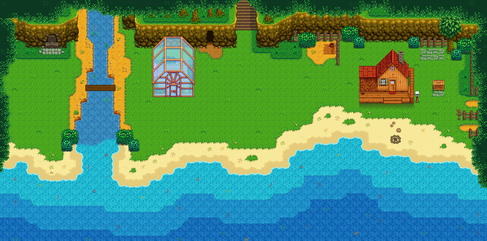
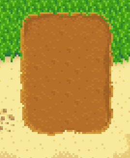
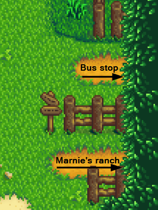
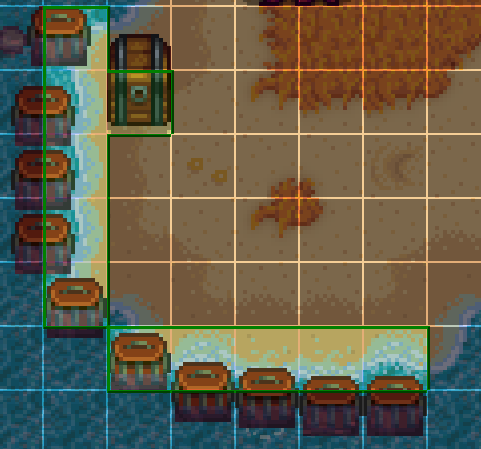

**Small Beach Farm** is a [Stardew Valley](http://stardewvalley.net/) mod which replaces the
riverlands farm with a fertile pocket beach suitable for slower/challenge runs, and lets you
catch both river and ocean fish. You can optionally enable islands and beach sounds.

> 

## Install
1. [Install the latest version of SMAPI](https://smapi.io/).
2. Install [this mod from Nexus Mods](http://www.nexusmods.com/stardewvalley/mods/3750).
3. Run the game using SMAPI.

## Usage
Just load a save with the riverlands farm, and you'll see the new map!

A few highlights:

* The beach is fertile, so you can plant crops in the grass and sand too:  
  > 
* You can catch riverlands fish in the river and ocean fish in the ocean (for both fishing and
  crab pots):
  > 
* The exit to Marnie's ranch is on the right:
  > 
* The beach has a functional campfire you can use (pairs well with
  [Campfire Cooking](https://mods.smapi.io/#Campfire_Cooking)):  
  > 

Tips:

* Fish quality depends on how far from shore the bobber is. The bottom-left area of the river
  mouth is wide enough to catch max-quality river fish:
  > 
* If you need more space, you can enable ocean islands for extra land area:
  > 
* If you use [Automate](https://www.nexusmods.com/stardewvalley/mods/1063), you can connect chests
  to crab pots all along the beach:
  > 

## Configure
The mod creates a `config.json` file in its mod folder the first time you run it. You can open that
file in a text editor to configure the mod.

Here's what you can change:

setting         | default | what it affects
:-------------- | :------ | :------------------
`AddCampfire`   | `true`  | Whether to add a functional campfire in front of the farmhouse.
`EnableIslands` | `false` | Whether to add ocean islands with extra land area.
`UseBeachMusic` | `false` | Use the beach's background music (i.e. wave sounds) on the beach farm.

## FAQs
### Can I use this with an existing save?
Yep! If you have things in the water due to the smaller map, see
[Saves#Change farm type](https://stardewvalleywiki.com/Saves#Change_farm_type)
for suggested fixes (skip the part about editing the save file).

### Compatibility
This is compatible with Stardew Valley 1.4+ on Linux/Mac/Windows, both single-player and
multiplayer. It can't be combined with other mods that replace the riverlands farm.

The farm map will recolor automatically if you have one of these installed:
* A Wittily Named Recolor;
* Eemie's Just Another Map Recolor;
* Starblue Valley.

### Can I add compatibility with a recolor mod?
Yep! There are two main approaches:

**Option A (recommended):**  
Other mods can patch Small Beach Farm's tilesheets directly. For example, in a Content Patcher pack:
```json
{
   "Action": "EditImage",
   "Target": "Mods/Pathoschild.SmallBeachFarm/{{season}}_smallBeachFarm",
   "FromFile": "assets/your-image.png",
   "PatchMode": "Overlay"
}
```

**Option B:**  
Compatibility files can be added to the Small Beach Farm folder instead.

1. Choose the compatibility folder you need:

   folder | purpose
   :----- | :------
   `assets/tilesheets` | Replace the entire tilesheet. If the player has multiple mods with a matching folder, only the first one alphabetically will be used.
   `assets/overlays` | Make changes to the tilesheet loaded from `assets/tilesheets` (recommended if you only change some of the colors). If the player has multiple mods with a matching folder, they'll be applied sequentially in alphabetical order. Transparent pixels won't change the tilesheet, so you can leave areas you don't need to change empty.

2. Create a subfolder whose name is the recolor mod's ID (from its `manifest.json`).
3. Add the modified `{season}_smallBeachFarm.png` files to the subfolder.

If you send me the files, I'll add official support for the recolor!

## Compiling from source
Installing stable releases from Nexus Mods is recommended for most users. If you really want to
compile the mod yourself, see the repository readme for the main instructions.

Special instructions for Small Beach Farm:

1. [Unpack your game's `Content` folder](https://stardewvalleywiki.com/Modding:Editing_XNB_files).
2. Copy `Maps/paths.png`, `Maps/spring_beach.png`, and `Maps/spring_town.png` directly into the `assets` folder (without the `Map` folder).
3. Compile as usual. See [Modding:Maps](https://stardewvalleywiki.com/Modding:Maps) for help editing the map file.

## See also
* Initial farm maps commissioned from [Opalie](https://www.nexusmods.com/stardewvalley/users/38947035)!
* [release notes](release-notes.md)
* [Nexus mod](http://www.nexusmods.com/stardewvalley/mods/3750)
