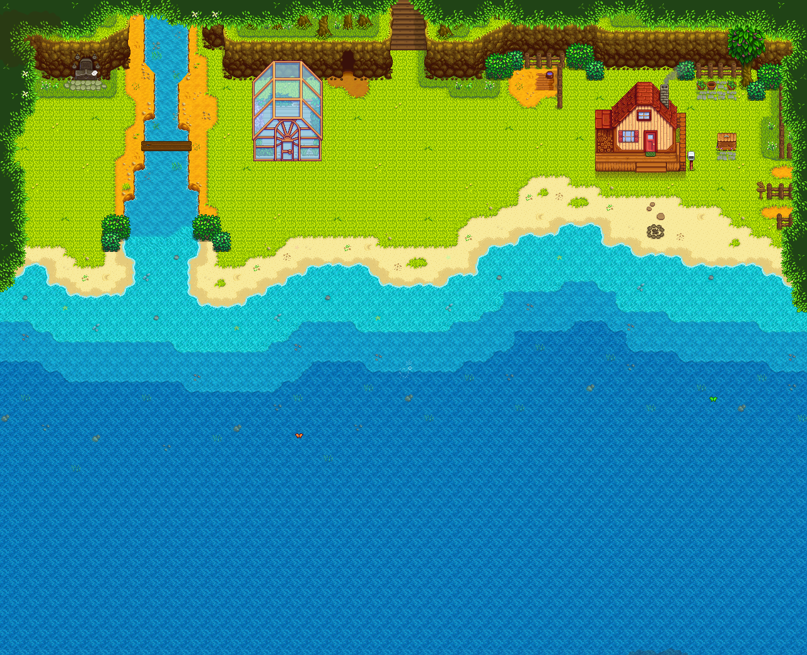
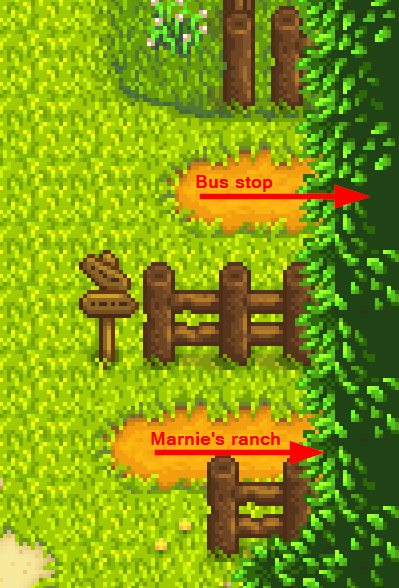

**Small Beach Farm** is a [Stardew Valley](http://stardewvalley.net/) mod which replaces the
riverlands farm with a fertile pocket beach, suitable for slower or challenge runs:

> 

## Install
**SMAPI version (recommended):**

1. [Install the latest version of SMAPI](https://smapi.io/).
2. Install [this mod from Nexus Mods](http://www.nexusmods.com/stardewvalley/mods/3750).
3. Run the game using SMAPI.

**Content Patcher version** (won't work with other content packs that replace Cindersnap Forest):
1. [Install the latest version of SMAPI](https://smapi.io/).
2. [Install Content Patcher](https://www.nexusmods.com/stardewvalley/mods/1915).
3. Unzip the file download [from Nexus Mods](http://www.nexusmods.com/stardewvalley/mods/3750) somewhere (not in your `Mods` folder!).
4. Move the `SmallBeachFarm/assets/[CP] SmallBeachFarm` folder into your `Mods` folder.
5. Run the game using SMAPI.

## Usage
Just load a save with the riverlands farm, and you'll see the new map! If you loaded an existing
save and you have things in the water, see [Saves#Change farm type](https://stardewvalleywiki.com/Saves#Change_farm_type)
for some suggested fixes.

The beach is fertile, so you can plant crops in the sandy areas too:  
> 

The exit to Marnie's ranch is on the right:
> 

## Compatibility
Compatible with Stardew Valley 1.3+ on Linux/Mac/Windows, both single-player and multiplayer. Can't
be used with other mods that replace the riverlands farm or (for the Content Patcher version) mods
that replace Cindernsap Forest.

## See also
* Farm map commissioned from [Opalie](https://www.nexusmods.com/stardewvalley/users/38947035)!
* [release notes](release-notes.md)
* [Nexus mod](http://www.nexusmods.com/stardewvalley/mods/3750)
