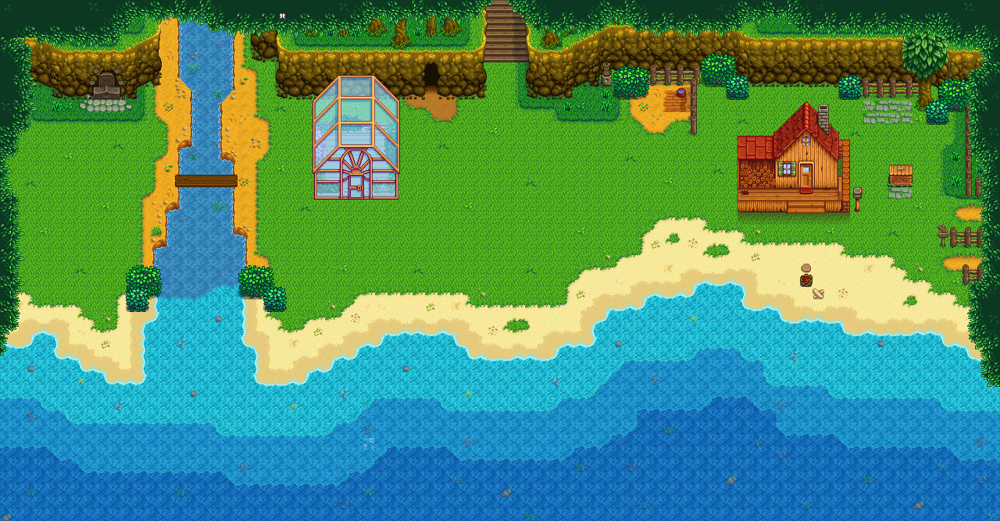
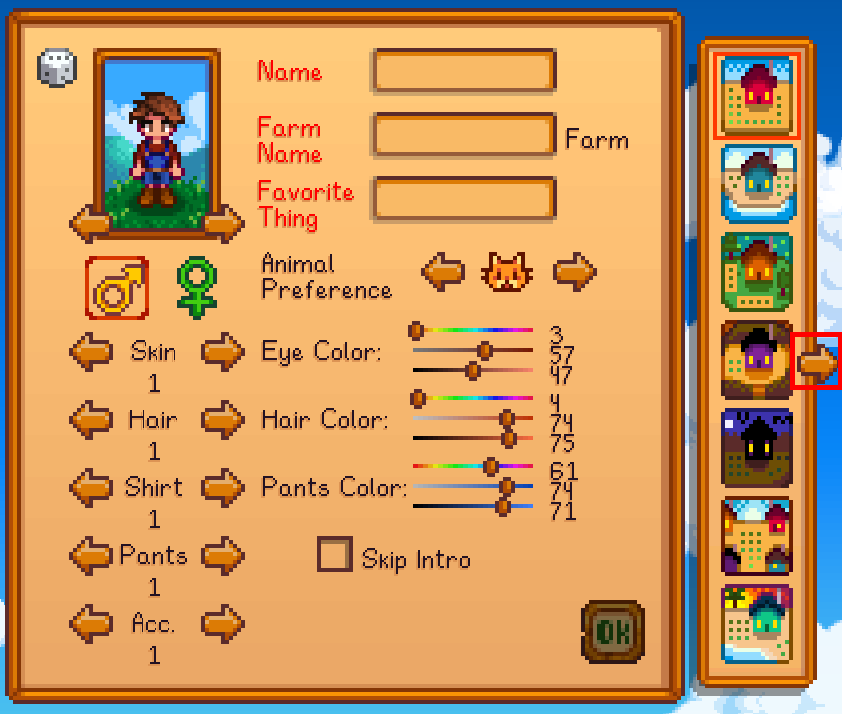
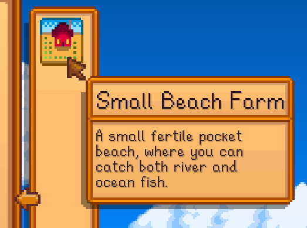
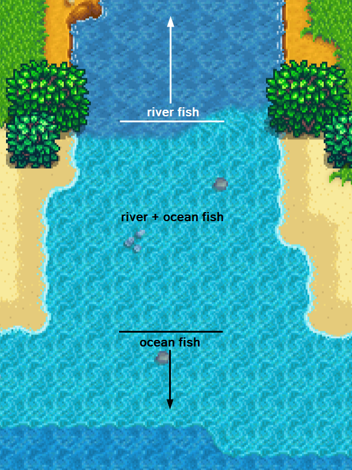
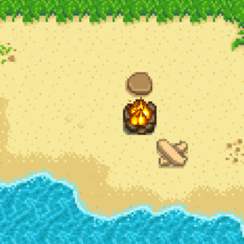
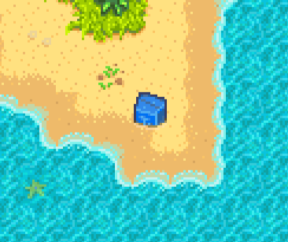
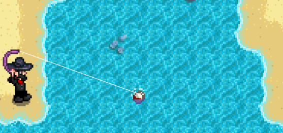
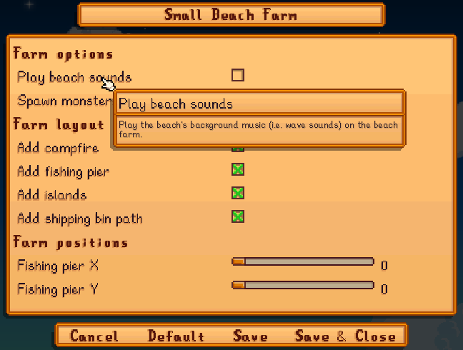

**Small Beach Farm** is a [Stardew Valley](http://stardewvalley.net/) mod which adds a fertile
pocket beach farm suitable for slower/challenge runs, and lets you catch both river and ocean fish.
You can optionally enable islands and beach sounds.

> 

## Contents
* [Install](#install)
* [Usage](#usage)
  * [Enable the farm type](#enable-the-farm-type)
  * [Highlights](#highlights)
* [Configure](#configure)
  * [In-game settings](#in-game-settings)
  * [`config.json` file](#configjson-file)
* [FAQs](#faqs)
* [Compiling from source](#compiling-from-source)
* [See also](#see-also)

## Install
1. [Install the latest version of SMAPI](https://smapi.io/).
2. Install [this mod from Nexus Mods](http://www.nexusmods.com/stardewvalley/mods/3750).
3. Run the game using SMAPI.

## Usage
### Enable the farm type
<dl>
<dt>For a new save:</dt>
<dd>

1. On the character creation screen, click the arrow next to the farm type list:
   > 
2. Choose Small Beach Farm in the list:
   > 

</dd>

<dt>For an existing save:</dt>
<dd>

You can convert your save to the small beach farm like this:

1. Load your save.
2. Enter this command in the SMAPI console window:
   ```
   set_farm_type Pathoschild.SmallBeachFarm
   ```

</dd>
</dl>

### Highlights
A few highlights:

* The beach is fertile, so you can plant crops in the grass and sand too:  
  > 
* You can catch riverlands fish in the river and ocean fish in the ocean (for both fishing and
  crab pots):
  > 
* The exit to Marnie's ranch is on the right:
  > 
* The beach has a functional campfire you can use (pairs well with [Limited Campfire
  Cooking](https://www.nexusmods.com/stardewvalley/mods/4971)):  
  > 
* Forage and [supply crates](https://stardewvalleywiki.com/Supply_Crate) can occasionally spawn
  along the shore:
  > 

Tips:

* Fish quality depends on how far from shore the bobber is. The bottom-left area of the river
  mouth is wide enough to catch max-quality river fish:
  > 
* If you need more space, you can enable ocean islands for extra land area:
  > 
* If you use [Automate](https://www.nexusmods.com/stardewvalley/mods/1063), you can connect chests
  to crab pots all along the beach:
  > 

## Configure
### In-game settings
If you have [Generic Mod Config Menu](https://www.nexusmods.com/stardewvalley/mods/5098) installed,
you can click the cog button (⚙) on the title screen to configure the mod. Hover the cursor over
a field for details, or see the next section.



### `config.json` file
The mod creates a `config.json` file in its mod folder the first time you run it. You can open that
file in a text editor to configure the mod.

Here's what you can change:

<dl>
<dt>farm options:</dt>
<dd>

setting                       | default | what it affects
:---------------------------- | :------ | :------------------
`UseBeachMusic`               | `false` | Whether to use the beach's background music (i.e. wave sounds) on the beach farm.
`DefaultSpawnMonstersAtNight` | `false` | The default value for the 'spawn monsters at night' option when creating a new save.

<dt>farm layout:</dt>
<dd>

setting           | default | what it affects
:---------------- | :------ | :------------------
`AddCampfire`     | `true`  | Whether to add a functional campfire in front of the farmhouse.
`AddFishingPier`  | `false`  | Whether to add a pier at the water's edge where you can fish.
`EnableIslands`   | `false` | Whether to add ocean islands with extra land area.
`ShippingBinPath` | `true`  | Whether to place the stone path tiles in front of the default shipping bin position.

</dd>
</dd>
<dt>farm positions:</dt>
<dd>

setting                     | default | what it affects
:-------------------------- | :------ | :------------------
`CustomFishingPierPosition` | `0, 0`  | The [tile position](https://stardewvalleywiki.com/Modding:Modder_Guide/Game_Fundamentals#Tiles) where the fishing pier should be added, if enabled. Set to `0, 0` to position it automatically.

</dd>
</dl>

## FAQs
### Compatibility
This is compatible with Stardew Valley 1.5+ on Linux/Mac/Windows, both single-player and
multiplayer. It can't be combined with other mods that replace the same farm.

The farm map will recolor automatically if you have one of these installed:
* A Wittily Named Recolor;
* Eemie's Just Another Map Recolor;
* Starblue Valley.

### Can I add compatibility with a recolor mod?
Yep! There are two main approaches:

**Option A (recommended):**  
Other mods can patch Small Beach Farm's tilesheets directly. For example, in a Content Patcher pack:
```json
{
   "Action": "EditImage",
   "Target": "Mods/Pathoschild.SmallBeachFarm/{{season}}_smallBeachFarm",
   "FromFile": "assets/your-image.png",
   "PatchMode": "Overlay"
}
```

**Option B:**  
Compatibility files can be added to the Small Beach Farm folder instead.

1. Create a subfolder in `assets/tilesheets` whose name is the recolor mod's ID (from its
   `manifest.json`).
2. Add the modified `{season}_smallBeachFarm.png` files to the subfolder.
3. If the player has multiple mods with a matching folder, only the first one alphabetically will be
   used.

## Compiling from source
Installing stable releases from Nexus Mods is recommended for most users. If you really want to
compile the mod yourself, see the repository readme for the main instructions.

Special instructions for Small Beach Farm:

1. [Unpack your game's `Content` folder](https://stardewvalleywiki.com/Modding:Editing_XNB_files).
2. Copy `Maps/paths.png`, `Maps/spring_beach.png`, and `Maps/spring_town.png` directly into the `assets` folder (without the `Map` folder).
3. Compile as usual. See [Modding:Maps](https://stardewvalleywiki.com/Modding:Maps) for help editing the map file.

## See also
* Initial farm maps commissioned from [Opalie](https://www.nexusmods.com/stardewvalley/users/38947035)!
* [release notes](release-notes.md)
* [Nexus mod](http://www.nexusmods.com/stardewvalley/mods/3750)
