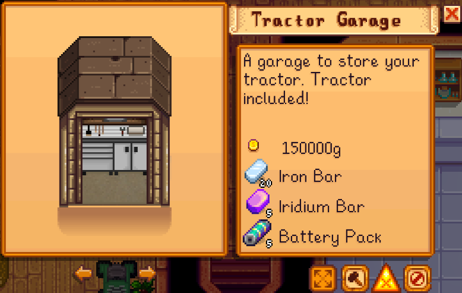
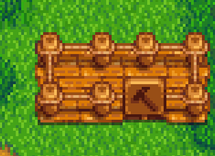
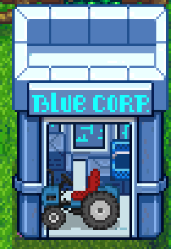
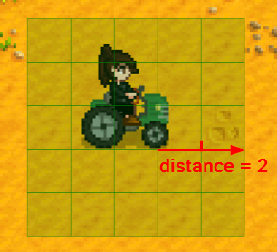

**Tractor Mod** is a [Stardew Valley](http://stardewvalley.net/) mod which lets you buy a tractor
(and tractor garage) to more efficiently till/fertilize/seed/water/harvest crops, clear rocks, etc.

## Contents
* [Install](#install)
* [Use](#use)
* [Configure](#configure)
* [Custom textures](#custom-textures)
* [Compatibility](#compatibility)
* [See also](#see-also)

## Install
1. [Install the latest version of SMAPI](https://smapi.io/).
2. Install [this mod from Nexus mods](http://www.nexusmods.com/stardewvalley/mods/1401).
3. Run the game using SMAPI.

## Use
Buy a tractor garage from Robin:
> 

...choose where you want it built:
> 

...and Robin will build your garage overnight:
> 

Now just get on a tractor, choose a tool or seeds or fertilizer, and drive:
> 

You can do these by default:

hold item  | default effects | optional effects (disabled by default)
---------- | --------------- | --------------------------------------
axe        | clear debris; clear dead crops; cut giant crops. | chop down bushes and trees; clear live crops.
fertilizer | fertilize crops and trees. | —
grass starter | plant grass. | —
hoe        | till dirt; clear weeds; dig artifact spots. | —
melee weapon | clear dead crops; break mine containers. | attack monsters.
milk pail  | collect milk from farm animals. | —
pickaxe    | break rocks; clear tilled dirt; clear dead crops. | break paths/flooring; break placed objects.
scythe     | harvest crops, flowers, bushes, fruit trees, forage; clear weeds and dead crops. | collect machine output.
seeds      | plant seeds in dirt. | —
shears     | shear wool from farm animals. | —
slingshot  | — | shoot one projectile/tile/second in the aimed direction.
watering can | water crops. | —

Tractors use no stamina when using tools, and the watering can won't run out of water. They will
consume fertilizer or seeds when you sow those, though.

## Configure
### In-game settings
If you have [Generic Mod Config Menu](https://www.nexusmods.com/stardewvalley/mods/5098) installed,
you can click the cog button (⚙) on the title screen to configure the mod. Hover the cursor over
a field for details, or see the next section.


### `config.json` file
The mod creates a `config.json` file in its mod folder the first time you run it. You can open that
file in a text editor to configure the mod.

<dl>
<dt>Global settings:<dt>
<dd>
<table>
<tr>
<th>setting</th>
<th>effect</th>
</tr>

<tr>
<td>

`Controls`

</td>
<td>

The configured controller, keyboard, and mouse buttons (see [key bindings](https://stardewvalleywiki.com/Modding:Key_bindings)).
The available controls are...

field | action | default
----- | ------ | -------
`SummonTractor` | warp an available tractor to your position. | `Backspace`
`DismissTractor` | return the tractor you're riding to its home. | `Backspace`
`HoldToActivate` | if specified, the tractor will only do something while you're holding this button. If nothing is specified, the tractor will work automatically while you're riding it. | _none_

You can separate bindings with commas (like `Backspace, LeftShoulder` for either one), and set
multi-key bindings with plus signs (like `LeftShift + Backspace`).

</td>
</tr>

<tr>
<td>

`BuildPrice`

</td>
<td>

The gold price to buy a tractor garage. Default 150,000g.

</td>
</tr>

<tr>
<td>

`BuildMaterials`

</td>
<td>

The materials needed to build a tractor garage (see [object IDs](https://stardewvalleywiki.com/Modding:Object_data)).
Default 20 iron bars, 5 iridium bars, and 5 battery packs.

</td>
</tr>

<tr>
<td>

`Distance`

</td>
<td>

The number of tiles in each direction around the tractor to affect (in addition to the tile under
it):
> 

Default 1, which is a 3 by 3 grid.

**Distance has an exponential impact on performance.** A distance of 15 covers most of the visible
screen; 78 covers the entire vanilla farm map and affects 25K tiles. A value of 15 or less is
recommended to avoid lag.

</td>
</tr>

<tr>
<td>

`TractorSpeed`

</td>
<td>

The speed modifier when riding a tractor. Default -2.

</td>
</tr>

<tr>
<td>

`MagneticRadius`

</td>
<td>

The item magnetism amount (higher values attract items from father away). Default 384.

</td>
</tr>

<tr>
<td>

`HighlightRadius`

</td>
<td>

Whether to highlight the tractor radius when riding one. Default `false`.

</td>
</tr>

<tr>
<td>

`InvincibleOnTractor`

</td>
<td>

Whether you should be immune to damage from any source when riding the tractor. Default `true`.

</td>
</tr>

<tr>
<td>

`CanSummonWithoutGarage`

</td>
<td>

Whether you can summon a temporary tractor without building a garage first. Default `false`.

</td>
</tr>
</table>
</dd>

<dt>Standard tool features:</dt>
<dd>
The `StandardAttachments` section lets you configure the tractor effects when holding a specific tool or item:

<table>
<tr>
<th>field</th>
<th>effect</th>
</tr>
<tr>
<td>

`Axe`

</td>
<td>

Configure the tractor effects when holding an axe:

field                    | default | effect
------------------------ | ------- | ------
`ClearFruitTreeSeed`     | false   | Whether to clear fruit tree seeds.
`ClearFruitTreeSaplings` | false   | Whether to clear fruit trees that aren't fully grown.
`CutGrownFruitTrees`     | false   | Whether to clear fully-grown fruit trees.
`ClearTreeSeeds`         | false   | Whether to clear non-fruit tree seeds.
`ClearTreeSaplings`      | false   | Whether to clear non-fruit trees that aren't fully grown.
`CutGrownTrees`          | false   | Whether to clear full-grown non-fruit trees.
`CutTappedTrees`         | false   | Whether to cut non-fruit trees that have a tapper.
`CutBushes`              | false   | Whether to cut choppable bushes.
`CutGiantCrops`          | true    | Whether to cut giant crops.
`ClearLiveCrops`         | false   | Whether to clear live crops.
`ClearDeadCrops`         | true    | Whether to clear dead crops.
`ClearDebris`            | true    | Whether to clear debris like weeds, twigs, giant stumps, and fallen logs.

</td>
</tr>

<tr>
<td>

`Fertilizer`

</td>
<td>

Configure the tractor effects when holding a fertilizer item:

field    | default | effect
-------- | ------- | ------
`Enable` | true    | Whether to apply the fertilizer to crops and tilled dirt.

</td>
</tr>

<tr>
<td>

`GrassStarter`

</td>
<td>

Configure the tractor effects when holding a grass starter item:

field    | default | effect
-------- | ------- | ------
`Enable` | true    | Whether to plant grass starters.

</td>
</tr>

<tr>
<td>

`Hoe`

</td>
<td>

Configure the tractor effects when holding a hoe:

field              | default | effect
------------------ | ------- | ------
`TillDirt`         | true    | Whether to till empty dirt.
`ClearWeeds`       | true    | Whether to clear weeds.
`DigArtifactSpots` | true    | Whether to dig artifact spots.

</td>
</tr>

<tr>
<td>

`MeleeWeapon`

</td>
<td>

Configure the tractor effects when holding a sword, hammer, or other melee weapon:

field                 | default | effect
--------------------- | ------- | ------
`AttackMonsters`      | false   | Whether to damage nearby monsters. (This is massively overpowered due to the tractor tool speed.)
`ClearDeadCrops`      | true    | Whether to clear dead crops.
`BreakMineContainers` | true    | Whether to break containers in the mine.

</td>
</tr>

<tr>
<td>

`MilkPail`

</td>
<td>

Configure the tractor effects when holding a milk pail:

field    | default | effect
-------- | ------- | ------
`Enable` | true    | Whether to collect milk from farm animals.

</td>
</tr>

<tr>
<td>

`PickAxe`

</td>
<td>

Configure the tractor effects when holding a pickaxe:

field                        | default | effect
---------------------------- | ------- | ------
`ClearDebris`                | true    | Whether to clear debris.
`ClearDeadCrops`             | true    | Whether to clear dead crops.
`ClearDirt`                  | true    | Whether to clear tilled dirt.
`ClearFlooring`              | false   | Whether to clear placed flooring.
`ClearBouldersAndMeteorites` | true    | Whether to clear boulders and meteorites.
`ClearObjects`               | false   | Whether to clear placed objects.
`BreakMineContainers`        | true    | Whether to break containers in the mine.
`ClearWeeds`                 | true    | Whether to clear weeds.

</td>
</tr>

<tr>
<td>

`Scythe`

</td>
<td>

Configure the tractor effects when holding a scythe:

field               | default | effect
------------------- | ------- | ------
`HarvestCrops`      | true    | Whether to harvest crops.
`HarvestFlowers`    | true    | Whether to harvest flowers.
`HarvestForage`     | true    | Whether to harvest forage.
`HarvestFruitTrees` | true    | Whether to harvest fruits on fruit trees.
`HarvestMachines`   | false   | Whether to collect machine output.
`HarvestGrass`      | true    | Whether to cut tall grass. If you have free silo space, this gives you hay as usual.
`ClearDeadCrops`    | true    | Whether to clear dead crops.
`ClearWeeds`        | true    | Whether to clear weeds.

</td>
</tr>

<tr>
<td>

`Seeds`

</td>
<td>

Configure the tractor effects when holding seeds or saplings:

field    | default | effect
-------- | ------- | ------
`Enable` | true    | Whether to plant the seeds in tilled dirt.

</td>
</tr>

<tr>
<td>

`Shears`

</td>
<td>

Configure the tractor effects when holding shears:

field    | default | effect
-------- | ------- | ------
`Enable` | true    | Whether to shear wool from farm animals.

</td>
</tr>

<tr>
<td>

`Slingshot`

</td>
<td>

Configure the tractor effects when holding a slingshot:

field    | default | effect
-------- | ------- | ------
`Enable` | false   | Whether to fire the slingshot towards the cursor. (This is massively overpowered and will consume ammo voraciously due to the tractor tool speed.)

</td>
</tr>

<tr>
<td>

`WateringCan`

</td>
<td>

Configure the tractor effects when holding a watering can:

field    | default | effect
-------- | ------- | ------
`Enable` | true    | Whether to water nearby tiles. This doesn't consume water in the watering can.

</td>
</tr>

<tr>
<td>

`SeedBagMod`

</td>
<td>

Configure the tractor effects when holding a seed bag from the [Seed Bag mod](https://www.nexusmods.com/stardewvalley/mods/1133):

field    | default | effect
-------- | ------- | ------
`Enable` | true    | Whether to plant seeds in nearby tiles.

</td>
</tr>
</table>
</dd>

<dt>Custom tools:</dt>
<dd>

The `CustomAttachments` enables custom items/tools while riding the tractor. Tools will be used on
each surrounding tile, while items will be put down. If you specify something that's already
supported (like the axe), this overrides all limitations on its use.

To add an item/tool, specify its exact internal name (not the translated display name). For
example:

```js
"CustomAttachments": ["Axe", "Mega Bomb"]
```

</dd>
</dl>


## Custom textures
You can drop new PNGs into the `assets` folder to change the appearance of tractors or garages.
For a seasonal texture, just prefix the name with the season (like `spring_tractor.png`). The mod
will load the seasonal texture if present, else it'll load the default name (like `tractor.png`).

## Compatibility
Tractor Mod is compatible with Stardew Valley 1.4+ on Linux/Mac/Windows, both single-player and
multiplayer.

In multiplayer mode it must be installed by the host player, plus any farmhands who
want to use its features. Farmhands who don't have it installed won't have any issues, they just
won't see the tractor/garage textures or be able to use its features.

## See also
* [Release notes](release-notes.md)
* [Nexus mod](http://www.nexusmods.com/stardewvalley/mods/1401)
* Derived from [TractorMod](https://github.com/lambui/StardewValleyMod_TractorMod) by PhthaloBlue (@lambui), rewritten with their permission.
